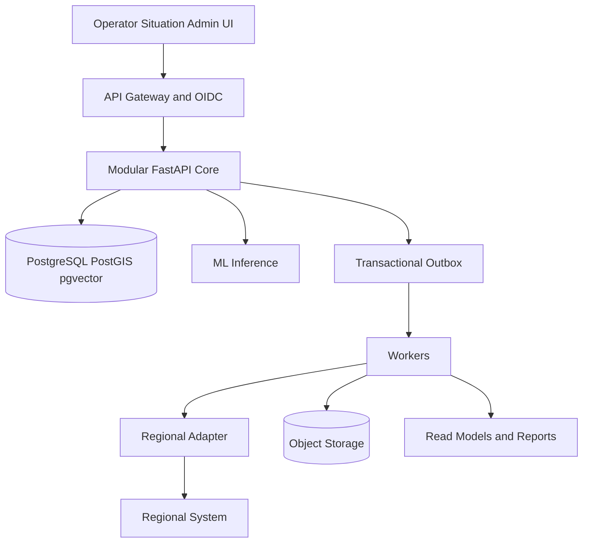

# Pulse 109 Codex Implementation Handoff

## 1 Purpose

This file translates the Pulse 109 specification into an implementation sequence for a coding agent. The intended result is a production-grade pilot in one month, not a national rollout disguised as a demo. The pilot must implement a real, auditable vertical slice with one regional integration when access is available and a contract-identical replay adapter when it is not.

The full system remains designed for twenty regions. Current evidence covers seven regions, raw appeal text is largely unavailable and several integration and policy decisions remain external blockers. The implementation must expose these limitations instead of filling them with invented data or protocols.

## 2 Target outcome

At the release candidate, a representative appeal must complete this path:

1. A source channel creates an appeal idempotently.
2. The system stores provenance and an immutable source reference before ML.
3. Privacy processing creates an approved redacted representation.
4. Routing returns top-three topic and service candidates, confidence, OOD state and version.
5. Retrieval returns similar resolved cases with evidence.
6. Duplicate detection proposes related appeals using text, geography, time and service.
7. An operator confirms or corrects the route and may confirm incident membership.
8. The decision, audit event and outbox record commit atomically.
9. An adapter delivers the assignment or records a visible pending state.
10. External statuses update the appeal timeline idempotently.
11. The situation center shows coverage, freshness, trends, SLA and approved alerts.
12. The same governed metric definition produces UI, PDF and spreadsheet values.

The flow must still accept, route manually, audit and synchronize later when ML or the external system is unavailable.

## 3 Architecture baseline



### 3.1 Deployable processes

| Process | Responsibility | Scaling and failure boundary |
| --- | --- | --- |
| `web` | Operator, situation center and administration UI | Stateless horizontal replicas |
| `core-api` | Appeals, triage decisions, incidents, catalog, audit and report orchestration | Critical transactional path |
| `worker` | Outbox delivery, reconciliation, reports, forecasts and scheduled jobs | Pools separated by workload |
| `ml-inference` | Routing, embeddings, reranking, OOD and optional drafts | GPU replicas with CPU fallback |
| `adapter-runtime` | Source-specific protocol, mapping and checkpoints | Isolated by source and partition |
| `ml-training` | Offline dataset building, training and evaluation | Never in the production critical path |

### 3.2 Business modules in the core

| Module | Owns | Public application operations |
| --- | --- | --- |
| `appeals` | Appeal snapshot and append-only lifecycle events | Create, read and append source event |
| `triage` | Recommendation references and human decisions | Classify, confirm, correct and reassign |
| `catalog` | Versioned topics, services, required fields and SLA policies | Resolve effective catalog and publish approved version |
| `incidents` | Incident record and versioned membership decisions | Propose, confirm, reject and remove membership |
| `integration` | Source registry, outbox, attempts, checkpoints and mappings | Deliver, reconcile, replay and inspect health |
| `analytics` | Metric definitions, governed queries and materialized read models | Query by Metric ID and cutoff |
| `reports` | Report templates, jobs, artifacts and hashes | Create, inspect and download export |
| `audit` | Immutable security and decision history | Append internally and read by authorized auditors |

Each module owns a PostgreSQL schema and repository interface. No module writes directly to another module's tables.

## 4 Repository layout

Create this layout unless an existing repository already has an equivalent convention:

```text
.
├── AGENTS.md
├── Makefile
├── README.md
├── IMPLEMENTATION_STATUS.md
├── pyproject.toml
├── pnpm-workspace.yaml
├── package.json
├── uv.lock
├── pnpm-lock.yaml
├── apps/
│   └── web/
├── services/
│   ├── core/
│   │   ├── src/pulse109/
│   │   │   ├── appeals/
│   │   │   ├── triage/
│   │   │   ├── catalog/
│   │   │   ├── incidents/
│   │   │   ├── integration/
│   │   │   ├── analytics/
│   │   │   ├── reports/
│   │   │   └── audit/
│   │   ├── migrations/
│   │   └── tests/
│   ├── inference/
│   │   ├── src/pulse109_inference/
│   │   ├── models/
│   │   └── tests/
│   └── worker/
├── adapters/
│   ├── sdk/
│   ├── replay/
│   └── first_region/
├── contracts/
│   ├── openapi.yaml
│   ├── canonical_request.schema.json
│   ├── event_catalog.md
│   └── adr/
├── data/
│   ├── README.md
│   ├── manifests/
│   ├── fixtures/
│   └── schemas/
├── ml/
│   ├── datasets/
│   ├── training/
│   ├── evaluation/
│   ├── model_cards/
│   └── registry/
├── infra/
│   ├── compose/
│   ├── helm/
│   ├── dashboards/
│   └── runbooks/
├── tests/
│   ├── contract/
│   ├── e2e/
│   ├── load/
│   └── resilience/
└── docs/
    ├── architecture/
    ├── DECISION_LOG.md
    └── security/
```

Use Python lockfiles and Node lockfiles. Do not depend on floating container tags or unpinned model revisions. If an existing repository already selects versions, preserve them unless a measured incompatibility requires an upgrade.

## 5 Technology baseline

### 5.1 Application

- Backend: Python, FastAPI, Pydantic v2, SQLAlchemy 2 and Alembic.
- Frontend: Next.js App Router, React and TypeScript with accessible server-backed forms and a small client state layer only where necessary.
- Database: PostgreSQL with PostGIS and pgvector extensions.
- Object storage: S3-compatible API with encrypted buckets and immutable artifact naming.
- Background work: a dedicated Python worker over PostgreSQL outbox and job tables. Do not introduce Kafka, Celery or another broker in M0 unless the repository already depends on it.
- Local runtime: Docker Compose.
- Target runtime: OCI images and Helm values for Kubernetes or OpenShift-compatible deployment.
- Observability: OpenTelemetry traces and metrics, Prometheus-compatible metrics and structured JSON logs without request bodies.
- Authentication: OIDC JWT validation in non-local environments. Local fake identity is allowed only under an explicit development profile.

### 5.2 Machine learning

- Routing candidate: fine-tuned XLM-RoBERTa base with hierarchical multi-label heads.
- Routing baseline: character TF-IDF plus calibrated linear classifier.
- Retrieval: BGE-M3 embeddings with hybrid BM25 and pgvector search.
- Reranking: BGE reranker v2 m3.
- Duplicates: calibrated pair model using retrieval scores, geography, time, topic and service; high-precision rules remain available.
- Draft and governed intent parsing: Qwen3 8B in four-bit form on GPU 1. It cannot execute arbitrary SQL or send a reply.
- Call transcription: Whisper large v3 turbo, asynchronous and disabled until audio processing is approved.
- PII: deterministic patterns and approved dictionaries first, fine-tuned XLM-R NER as an additional detector.
- Forecast: seasonal naive baseline plus CatBoost or LightGBM candidate.

The inference service must expose model-agnostic contracts. Model names and runtime libraries are configuration, not domain dependencies.

## 6 Domain invariants and data ownership

### 6.1 Appeal and incident

- `appeal_id` is a Pulse UUID and never changes.
- `source_system`, `source_request_id` and `source_payload_hash` provide idempotency and provenance.
- An incident is a separate aggregate. Membership is versioned and requires actor, reason and evidence.
- Linking appeals to an incident never collapses records, histories, assignments or SLA clocks.
- Current state is a projection derived from append-only events. Corrections add a new event.

### 6.2 Time

Store at least:

- `occurred_at`: business time asserted by the source; nullable;
- `observed_at`: time Pulse 109 received the record; required UTC;
- `source_timezone`: source timezone or null;
- `time_quality`: `exact`, `source_tz_assumed`, `date_only`, `missing` or approved extension;
- `effective_from` and `effective_to`: for catalog and policy versions;
- `data_cutoff`: for every analytic result and export.

When `occurred_at` cannot be established, keep it null. Operational lists may sort by `observed_at` while visibly labelling the time source. Temporal training, validation and backtesting must exclude events whose order cannot be recovered safely.

### 6.3 Suggested PostgreSQL schemas

| Schema | Key tables |
| --- | --- |
| `appeals` | `appeal`, `appeal_event`, `source_record`, `attachment_ref` |
| `triage` | `recommendation`, `recommendation_candidate`, `operator_decision`, `reassignment` |
| `catalog` | `topic_version`, `service_version`, `service_topic`, `required_field`, `sla_policy_version` |
| `incidents` | `incident`, `incident_member_version`, `duplicate_candidate`, `membership_decision` |
| `integration` | `source_system`, `source_schema_version`, `status_mapping`, `outbox`, `delivery_attempt`, `checkpoint`, `dead_letter` |
| `analytics` | `metric_definition`, `metric_result`, `alert`, `alert_review`, materialized read models |
| `reports` | `report_job`, `report_artifact` |
| `audit` | `audit_event` in append-only, restricted storage |
| `privacy` | identifier vault or token map when approved; never exposed to ordinary analytics |

Important indexes include unique source identity, event identity, idempotency key, outbox status and availability, appeal region and state, effective catalog windows, PostGIS geometry, vector HNSW after benchmark and full-text GIN indexes.

## 7 Contract rules

Implement `contracts/openapi.yaml` as the baseline. Do not alter request or response semantics silently.

- API versioning uses `/v1`; additive changes remain compatible and breaking changes require a new major version.
- All create operations require an idempotency key or source event identity.
- Every error uses stable machine code, human-safe message and trace ID. Never expose stack traces or secrets.
- Use RFC 3339 timestamps with explicit offset in APIs and UTC internally while preserving source timezone metadata.
- Pagination must be bounded and cursor-based for changing collections.
- Optimistic concurrency is required for human decisions, assignments and status transitions.
- Every recommendation includes `model_version`, `preprocess_version`, `taxonomy_version`, confidence, OOD state and evidence references.
- Analytics accepts allowlisted Metric IDs and typed filters. The LLM may produce a constrained intent object, which must be validated before execution.

Event delivery is at least once; business effects must be effectively once. Consumers deduplicate by event or command ID. An adapter must never acknowledge success before its source system provides the required confirmation.

## 8 Data pipeline

### 8.1 Layers

1. `raw`: immutable file or payload reference, bytes hash, source schema and acquisition metadata.
2. `private`: separated direct identifiers, full address, raw voice and approved access controls.
3. `silver`: canonical appeals and lifecycle events after schema validation; rejected rows go to quarantine.
4. `gold`: approved metrics, labelled training views, retrieval corpus and feature snapshots.
5. `registry`: dataset manifests, model artifacts, evaluations and approvals.

### 8.2 Import behavior

Every import run records source, region, file or stream identity, schema version, row count, accepted count, quarantined count, duplicate count, hash, parser version and cutoff.

Data-quality gates must detect:

- duplicate source identities with conflicting hashes;
- unknown or shifted columns;
- mixed status or channel families;
- impossible time ordering and missing timezone;
- unexpected PII in logs, exports or feature views;
- stale sources and absent regions;
- fields that appear only after routing or execution.

Quarantine is a first-class state with source row reference, error code and review outcome. Never discard a malformed record silently.

### 8.3 Training manifest

Every training run must bind:

- source and dataset versions;
- exact cutoff;
- feature allowlist;
- label policy;
- exclusions and leakage audit;
- split policy and random seed;
- preprocessing hashes;
- legal or approval reference;
- code commit and dependency lock hash.

Keep all snapshots of the same source appeal, duplicate group and incident cluster in one split. Prefer time-based test windows and add leave-one-region-out evaluation. Do not let Pavlodar's volume dominate the reported result; publish macro and per-region slices.

## 9 ML serving and evaluation

### 9.1 GPU placement

- GPU 0: XLM-R routing, BGE-M3 embeddings and BGE reranker with bounded batching.
- GPU 1: Qwen3 8B and Whisper on demand, challenger training outside peak, hot-spare behavior when practical.
- CPU: API, rules, address resolution, reports, forecast, lexical retrieval and ONNX routing fallback.

### 9.2 Serving response

Every inference returns a traceable envelope containing task, model alias, immutable artifact version, input contract version, preprocessing version, output, score or calibrated confidence, OOD state, latency and trace ID. Do not return raw model internals to the operator UI.

### 9.3 Promotion gates

The candidate may become champion only after:

1. Reproducible training from an immutable manifest.
2. Leakage and split audit.
3. Comparison with a simple approved baseline.
4. Evaluation by language, region, topic, channel, length, rare class and safety class.
5. Calibration on a set separate from the final test set.
6. Model card, license review and security approval.
7. Shadow evaluation followed by limited canary.
8. A tested rollback alias.

Proposed pilot gates remain provisional until the process owner approves them: routing should materially beat the linear baseline, critical recall should not regress, duplicate suggestions should prioritize high precision, retrieval should report Recall at 10 and latency, and generation should produce zero unsupported factual claims on the release set.

## 10 Frontend requirements

### 10.1 Operator workspace

The primary screen must show:

- appeal identity, source, region, channel and explicit time quality;
- citizen text or transcript only for authorized roles;
- required missing fields and one targeted clarification at a time;
- top-three topic and service candidates with concise evidence;
- OOD or low-confidence state and manual catalog access;
- similar resolved appeals and why each is relevant;
- duplicate candidates with text, distance, time and service evidence;
- confirm and correct actions with mandatory reason for correction;
- assignment synchronization state and retry visibility;
- append-only timeline.

Required states include loading, no recommendation, low confidence, ML unavailable, stale catalog, external sync pending, partial attachment failure, forbidden region and recovered session. Keyboard-first completion and KZ/RU localization are P0.

### 10.2 Situation center

Show coverage and freshness before operational numbers. Missing regions are missing, never zero. Every card includes Metric ID, cutoff and definitions access. Alerts require acknowledgement, disposition and evidence. Forecasts show baseline, candidate, uncertainty range and version.

### 10.3 Administration

Provide versioned taxonomy and mappings, source health, quarantine review, role and region scope, model registry view, promotion workflow, feature flags and audit search. Production configuration changes require actor, reviewer, effective time and rollback target.

## 11 Security and privacy

- Deny by default. RBAC defines action and ABAC restricts region, organization, service, purpose and data class.
- Validate OIDC issuer, audience, expiry, roles and region claims. Use mTLS or the approved gateway for system-to-system traffic.
- Encrypt database, object storage and backups at rest; use TLS in transit.
- Keep secrets in an approved secret store and out of source, images and logs.
- Log actor token identity, purpose, correlation ID and changed fields for sensitive actions without logging sensitive values.
- Treat appeal text as untrusted data. It cannot call tools, modify policy, reveal prompts, access SQL or choose authorization scope.
- Generated content uses approved evidence and templates. The operator sends it.
- Exports enforce role, region, row limit, masking, purpose, watermark metadata and audit.
- Produce an SBOM, dependency scan, secret scan and container scan in CI.
- Retention and deletion are configurable by data class. Do not invent binding periods before legal approval.

## 12 Reliability and observability

### 12.1 Failure behavior

| Failure | System behavior |
| --- | --- |
| One GPU fails | Keep core; use remaining GPU or CPU routing; disable drafts first |
| All ML fails | Keep intake, manual routing, status, audit and existing analytics; queue eligible inference |
| Regional system fails | Commit local decision; show sync pending; retry and reconcile |
| Object storage fails | Store metadata and pending attachment state only when policy permits |
| Unknown schema arrives | Quarantine and alert; preserve raw reference |
| Bad model release | Switch champion alias to approved prior version |
| Bad SLA policy | Stop new policy version and restore prior effective mapping |

### 12.2 Telemetry

Record stable metrics for API rate and latency, database saturation, outbox lag, adapter retries, dead letters, inference latency and error, confidence coverage, OOD, source freshness, schema failures and operator correction rate. Do not use raw text or unbounded IDs as metric labels.

Every request propagates a correlation ID across core, worker, adapter and inference. Logs must be structured and redacted. Traces must sample safely and never include request bodies by default.

## 13 Implementation milestones

### M0 Repository foundation

Deliver the repository tree, dependency locks, root commands, Compose services, health checks, CI, configuration model and architecture boundary tests. The local system should start with synthetic fixtures and no external credentials.

### M1 Contracts and data foundation

Wire OpenAPI and JSON Schema validation, create module schemas and initial migrations, implement raw references, source registry, import runs, canonicalization, quarantine, time-quality handling and source fixtures. Generate a reproducible DQ report.

### M2 Manual critical path

Implement appeal creation, idempotency, operator card, versioned catalog, manual decision, append-only lifecycle, audit and transactional outbox. Add the first complete browser E2E with ML disabled.

### M3 Routing assistance

Implement the inference contract, linear baseline, dataset manifest, feedback capture and mock model. Fine-tune XLM-R only when approved raw text and labels exist. Add confidence calibration and OOD behavior before exposing actionable recommendations.

### M4 Retrieval and duplicate suggestions

Implement PostgreSQL FTS, pgvector storage, BGE-M3 embeddings, hybrid rank fusion and optional reranking. Create a judged set workflow. Add duplicate proposals and human confirm or reject while preserving appeal identity.

### M5 Incidents and first adapter

Implement incident membership, source status mapping, adapter SDK, replay adapter, retries, dead-letter and reconciliation. Replace or supplement replay with the first real adapter only after the source contract is confirmed.

### M6 Situation center and reports

Implement metric catalog, read models, coverage, freshness, trends, SLA, alerts, forecast baseline, governed NL intent and consistent PDF or spreadsheet exports. No arbitrary SQL.

### M7 Release hardening

Complete identity integration, authorization tests, load tests, resilience tests, backup and restore, model rollback, dashboards, runbooks, accessibility and offline demo. Freeze contracts, model aliases and demo data before the final rehearsal.

## 14 Parallel work boundaries

Parallelize only along boundaries that minimize conflicting writes:

- Stream A: contracts, database and core modules.
- Stream B: data ingestion, DQ and ML datasets.
- Stream C: inference and evaluation.
- Stream D: operator and situation UI.
- Stream E: adapter SDK and replay integration.
- Stream F: infrastructure, CI, observability and security tests.

The root agent owns shared contracts, integration order and final verification. No subtask may change OpenAPI, canonical schema or shared migrations without coordinating with the root plan.

## 15 Agent stop conditions

Continue autonomously for routine, reversible implementation. Stop and ask for a decision only when:

- the requested behavior requires real PII or credentials that are not available;
- two authoritative contracts conflict on a public or stored field;
- a destructive migration or irreversible external write is required;
- the first real regional system must be selected;
- legal, retention, SLA or automatic-decision policy must be set;
- an existing user change cannot be preserved safely.

Before asking, complete all unaffected work and present the exact options, impact and recommended safe choice.

## 16 Handoff expected from Codex after every milestone

The final message and `IMPLEMENTATION_STATUS.md` must state:

- outcome delivered;
- files and contracts changed;
- migrations added;
- commands run and whether they passed;
- test and benchmark evidence;
- remaining external blockers;
- safety fallbacks that were exercised;
- next milestone and its first executable task.

Do not declare the platform complete while raw text, thirteen regions, the first real API, target identity or production approvals remain unresolved. Declare exactly which pilot capabilities are implemented and verified.

