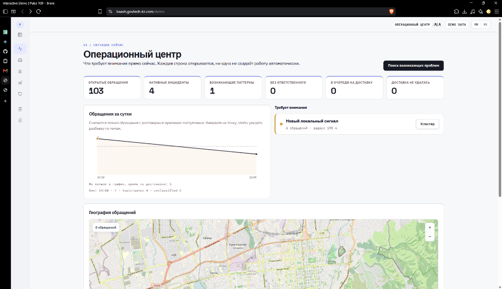
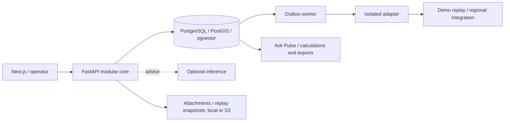

[Русский](README.md) | [English](README.en.md) | [Қазақша](README.kk.md)

# Pulse 109

> From individual appeals to a shared view of a city problem.

An intelligent layer for 109 services that connects appeals into city incidents, helps operators decide and gives managers verifiable analytics.

[Open demo](https://baash.govtech-kz.com/demo) · [Landing](https://baash.govtech-kz.com/) · [Golden Demo](docs/GOLDEN_DEMO.md) · [Architecture](docs/architecture/README.md)



**Team:** baash · **Project:** Pulse 109 · **Track:** Gov cases · **Case:** Case 2 — intelligent platform for citizen appeals to 109. The [Russian README](README.md) is canonical for submission.

### Public environment

The **[landing](https://baash.govtech-kz.com/)** and **[interactive demo](https://baash.govtech-kz.com/demo)** share a Next.js application behind the organizer HTTPS proxy. FastAPI, PostgreSQL, migrations, audit, outbox and worker run the application workflow. Golden World is a synthetic ALA city; a replay adapter reproduces external delivery. PostgreSQL stays inside the stack. Deployment details and checks are in the [runbook](infra/runbooks/PUBLIC_DEPLOYMENT.md).

## The task

The 109 case combines **Smart Intake and routing**, an **Operator Assistant** and a **Situation Center**: RU/KK interaction, similar appeals, surge detection, workload forecasts and natural-language questions about data.

Different reports about water, roads or lighting can describe one city problem. Separate queues obscure their connection. Pulse 109 surfaces the common signal and helps coordinate services while retaining independent handling of every appeal.

## What we built

- **Smart Intake and operator queue:** adaptive questions, similar open issues, topic/service suggestions and human-confirmed routing.
- **Emerging Issues Radar:** groups by location, time and topic, a MapLibre/OSM map and operator cluster review.
- **Incident War Room:** shared problem workspace with membership, history, ownership, evidence and confirmed merge/split.
- **Next Best Action and Outcome Memory:** advice with reason codes and comparable verified outcomes.
- **Operations Center and Data Lab:** workload, attention feed, data quality, handoffs and aggregate-to-appeal drill-down.
- **Ask Pulse:** RU/KK questions, PostgreSQL calculations, charts, provenance, drill-down, PDF/XLSX and forecasts.
- **Reliable platform:** durable decisions, audit, idempotency, outbox, worker and adapters; the manual path works when ML fails.

**AI proposes — a human confirms.** Each appeal retains its own ID, history and individual obligations. An incident connects several appeals into shared context for service coordination.

## Evolution during GovTech Camp

1. **Audited the supplied data.** We started with classification, routing and operator assistance. Seven regional exports revealed different catalogs and missing raw pre-decision text. This shaped the next step: a shared data layer and separate evaluation of ML candidates.
2. **Built a verifiable foundation.** Canonical ingestion preserves provenance, time quality and quarantine. Routing/retrieval/forecast experiments helped account for regional differences and exclude fields created after operator decisions.
3. **Expanded to a city situation.** Radar, Incident and War Room connected individual tickets. Ownership, human confirmation and handoff control connected detection to execution; Outcome Memory, Replay Lab and Data Lab added feedback.
4. **Made the product inspectable.** Ask Pulse, product UI, a map, Golden World with 120 days of history and a public VPS turned APIs into an end-to-end demo. The final phase focuses on stabilization, verification and presentation.

Decisions and commits: [development history](docs/DEVELOPMENT_HISTORY.md) · [Camp journal](docs/PROJECT_JOURNAL.md) · [Decision Log](docs/DECISION_LOG.md).

## Team and weekly work

| Period                         | Work                                                                                 | Main contributors            | Result                                                         |
| ------------------------------ | ------------------------------------------------------------------------------------ | ---------------------------- | -------------------------------------------------------------- |
| Week 1, before 12 September    | Case analysis, source audit and direction                                            | Team                         | Data picture and solution plan                                 |
| Week 2, 12–18 September        | Contracts, first workflows, canonical ingest, routing/retrieval/forecast             | Baktiyar, Arsen              | Executable foundation and research reports                     |
| Week 3, 19–25 September        | End-to-end scenario, PostgreSQL, outbox, ownership, Decision Gateway, closure/replay | Arsen, Baktiyar              | Manual path preserving decisions and delivery through failures |
| Week 4, 26 September–1 October | Incident, Radar, Ask Pulse, UI, storage, Golden Demo, VPS and docs                   | Baktiyar, Arsen, Shyngyskhan | Public environment and demo route                              |

| Member                                   | Main contribution                                                                                                           |
| ---------------------------------------- | --------------------------------------------------------------------------------------------------------------------------- |
| **Januzak Aspandiyar (@aspaAI)**         | Captain, architecture and defence — as recorded in the team journal                                                         |
| **Arsen Baktygaliev (@Arseniiiii-ai)**   | Regional data, routing/retrieval/forecast research, Radar/Operations, city world, deployment overlays and CI/demo fixes     |
| **Baktiyar Ablaikhan (@sronters)**       | Durable workflows, governance, ownership/Decision Gateway, Incident, Ask Pulse, UI/UX, Golden Demo, maps and VPS deployment |
| **Sagyt Shyngyskhan (@Shyngyskhan-333)** | Replay/War Room/storage, Hex UI and final judge-facing documentation                                                        |

Periods and roles follow the team journal and project history; contribution details and sources are in [PROJECT_JOURNAL](docs/PROJECT_JOURNAL.md).

## What works now

| Capability               | Current behavior                                                      | Where to inspect                                                                     |
| ------------------------ | --------------------------------------------------------------------- | ------------------------------------------------------------------------------------ |
| Public site              | Landing and interactive HTTPS demo                                    | [Landing](https://baash.govtech-kz.com/) → [demo](https://baash.govtech-kz.com/demo) |
| Smart Intake and routing | Intake, similar issues, suggestions and manual decisions              | Intake → queue → decision                                                            |
| Radar and map            | Spatial/time groups with topic information; cluster → Incident        | Operations → Radar → cluster                                                         |
| War Room                 | History, membership, ownership, Next Best Action and Outcome Memory   | Incidents → War Room                                                                 |
| Ask Pulse                | RU/KK questions, calculations, charts, source records, PDF/XLSX       | Operations → Ask Pulse                                                               |
| 30/60/90-day forecasts   | Transparent seasonal-naive baseline on 120 days of history            | Ask Pulse → one/two/three-month forecast                                             |
| Data Lab and Replay Lab  | Quality and drill-down; saved reports and aggregate policy comparison | Data Lab / Replay Lab                                                                |
| Platform                 | PostgreSQL, audit, outbox, worker, adapters and manual fallback       | Timeline, health, [architecture](docs/architecture/README.md)                        |

The complete capability matrix is in [FEATURE_STATUS](docs/FEATURE_STATUS.md); current verification results are in [DEVELOPMENT](docs/DEVELOPMENT.md).

## Why Pulse 109: the classifier trap

One water supply problem can be described in different words:

- _“The water is cloudy and smells of rust.”_
- _“Low pressure on the fifth floor.”_
- _“The water stopped after repairs near our building.”_
- _“The asphalt has been dug up beside the standpipe.”_

Classification helps route each report, but different topics and queues can hide their connection. **Routing every ticket correctly is still not enough to see the shared city situation.**

Pulse 109 adds the next layer: **Radar** compares location, time and topic → an operator reviews the cluster on a map → creates an **Incident War Room** → coordinates service actions. The connection remains a hypothesis for human review, and each appeal keeps its history.

### Product evidence for judges

| Criterion         | Pulse 109 response                               | Where it appears                            |
| ----------------- | ------------------------------------------------ | ------------------------------------------- |
| Civic value       | Shared problem view and service coordination     | Radar, War Room, separate appeal IDs        |
| Innovation and AI | Explainable advice and RU/KK analytics           | Ask Pulse, Next Best Action, Outcome Memory |
| Engineering       | Modular core, PostgreSQL, idempotency and outbox | Contracts, container-smoke, restore drill   |
| Trust and control | Human confirmation and a manual path without ML  | Decision Gateway, audit, fallback           |
| Reproducibility   | Golden World, API walkthrough and public HTTPS   | Golden Demo, CI, deployment runbook         |

## Golden Demo: one path in 4–5 minutes

```text
Citizen signal RU/KK
        ↓
Smart Intake: questions + similar open issues
        ↓
Radar: a group of reports on the map
        ↓
Incident War Room: shared context + Next Best Action
        ↓
Operator action → outbox → worker → adapter
        ↓
Ask Pulse: question → calculation → source records → PDF/XLSX
```

1. **Report water quality:** fill the presenter example, show similar issues and submit the appeal manually.
2. **Open Radar:** run a scan and inspect the map and reports in the prepared water cluster.
3. **Create an Incident:** open War Room and show history, the coordinator, Outcome Memory and Next Best Action.
4. **Confirm an action:** assign an appeal in the queue and show durable delivery through outbox/worker.
5. **Ask Pulse:** “Show appeals for the last seven days in Almaty” → count, chart, calculation details, source records and export.

[Full scenario](docs/GOLDEN_DEMO.md) · [Presenter runbook](docs/DEMO_RUNBOOK.md) · [Demo recording](docs/DEMO_RECORDING_SCRIPT.md). Prepare a current Golden World time window using the runbook before presenting.

[Operator queue](docs/screenshots/operator-queue.png) · [Incident register](docs/screenshots/incidents-list.png) · [Data Lab](docs/screenshots/data-lab.png) · [Replay Lab](docs/screenshots/replay-lab.png).

## Architecture and reliability



- **Fits existing processes:** regional systems connect through adapters and stable [contracts](contracts/README.md).
- **Preserves decisions and assignments:** transactional outbox, `FOR UPDATE SKIP LOCKED`, retries and idempotent commands.
- **Works without ML:** intake, manual routing, statuses and audit keep running if inference fails.
- **Provides verifiable numbers:** Ask Pulse uses approved analytical queries, core calculations and links to source records.

See [architecture](docs/architecture/README.md) for detailed diagrams and access boundaries.

## Verification and startup

The full local environment needs Docker with a Linux engine, Python 3.10–3.13, `uv` and Node.js/pnpm:

```sh
uv sync --all-groups --frozen
pnpm install --frozen-lockfile
uv run python scripts/demo_runtime.py prepare
```

`prepare` recreates only the local `pulse109-demo` project, migrates, seeds and verifies Golden World. Success: `PULSE 109 DEMO READY`. Open [http://localhost:3000/demo](http://localhost:3000/demo). Windows: `.\demo.ps1 prepare`. The public VPS follows its separate [runbook](infra/runbooks/PUBLIC_DEPLOYMENT.md).

```sh
make lint typecheck test contract-test e2e build
```

PostgreSQL integration runs through the [isolated runner](docs/DEVELOPMENT.md) with `PULSE109_TEST_DATABASE_URL`. Current CI runs and results are collected in [verification documentation](docs/DEVELOPMENT.md) and [GitHub Actions](https://github.com/BAITC-Hacks/hack-803e2c8f-baash/actions).

**GovTech Camp submission — baash / Pulse 109:**

> Pulse 109 is an intelligent layer for 109 services that connects fragmented appeals into city incidents, helps operators make decisions and gives managers verifiable analytics.

## Boundaries of the current environment

| Area                  | Current environment and the next pilot stage                                                                                                                                                                                                                                                                                                                    |
| --------------------- | --------------------------------------------------------------------------------------------------------------------------------------------------------------------------------------------------------------------------------------------------------------------------------------------------------------------------------------------------------------- |
| Data and integration  | The demo uses synthetic ALA Golden World and a replay adapter. The canonical layer was built from seven supplied regional exports; further regions and a specific CRM connect through adapters once data/APIs are provided.                                                                                                                                     |
| Models and forecasts  | Runtime uses deterministic lexical fallback and seasonal-naive forecasts. Fine-tuned candidates remain a separate research track until an approved pre-decision corpus and taxonomy are available. The demo has four routing topics and five background families; validation of ten topics, twenty regions and model quality on real appeals is the next stage. |
| Replay and operations | Replay Lab compares policies at report level; per-case decision traces are not recorded yet. S3 is configurable; the VPS uses local volumes. Production identity, legal basis, retention and an operational scanner require pilot approval; the current scanner is a mock.                                                                                      |

[Current status](docs/FEATURE_STATUS.md) · [Research and case requirements](docs/review/COMPETITION_AUDIT_2026-09-29.md) · [External dependencies](DECISIONS_AND_BLOCKERS.md) · [Documentation index](docs/README.md).
