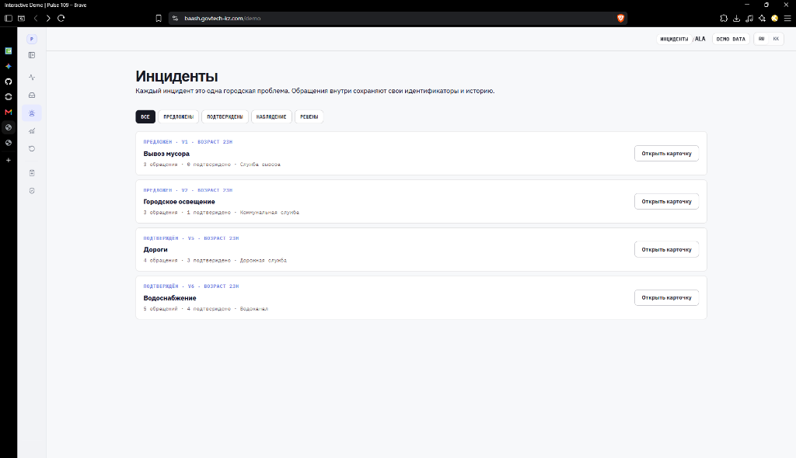
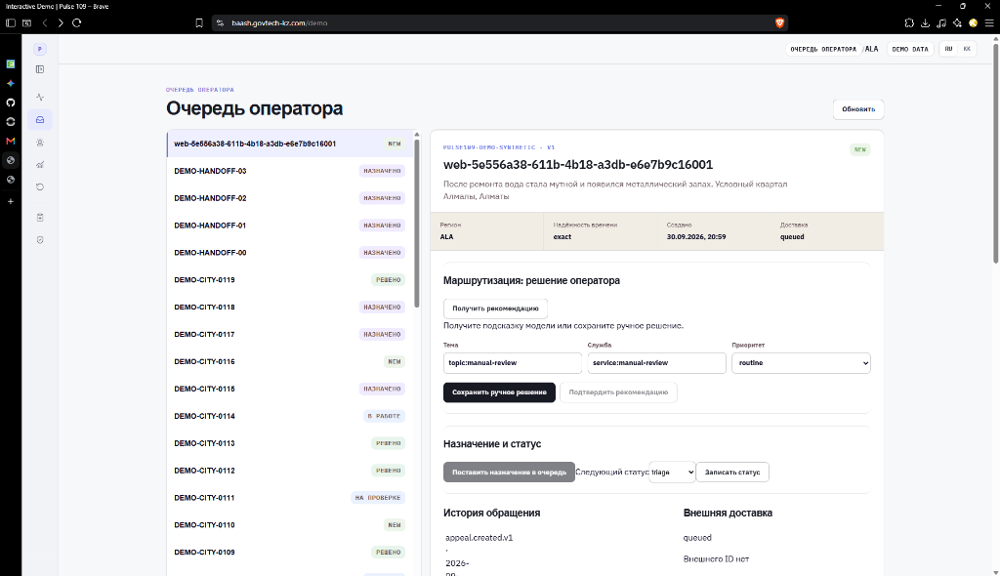
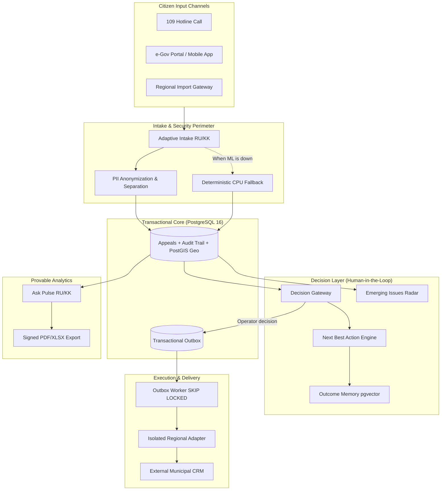
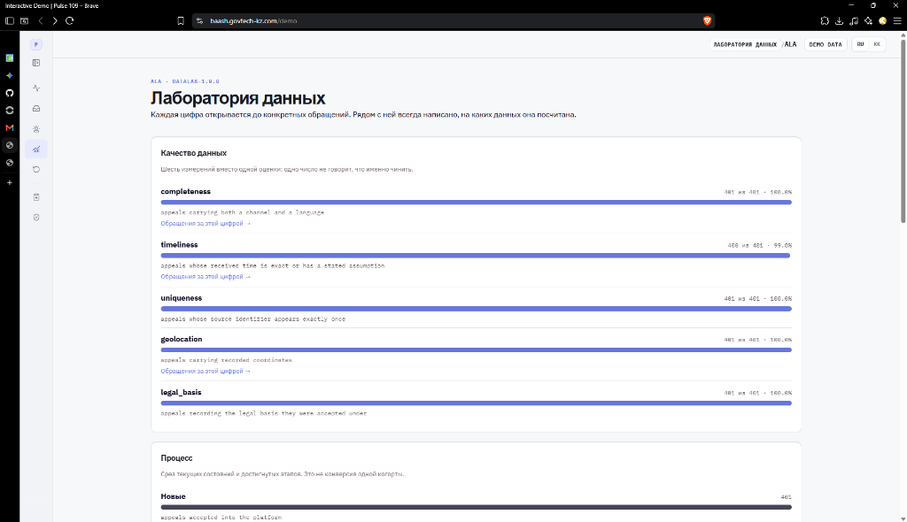
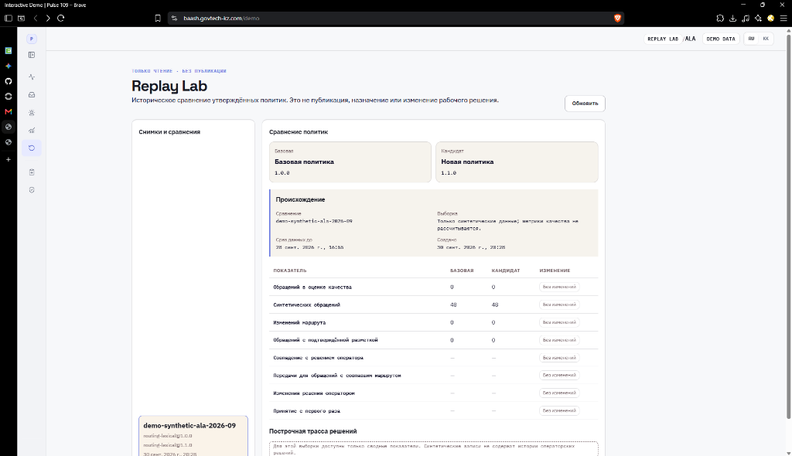

# Pulse 109

> Federated AI assistance layer for regional 109 municipal services: detecting hidden city emergencies, coordinating agencies, and delivering provable analytics without unconstrained AI risk.

[Русская версия](README.md) · [Live Hosted Demo](https://baash.govtech-kz.com/demo) · [Project Landing](https://baash.govtech-kz.com/) · [Golden Demo Script](docs/GOLDEN_DEMO.md) · [Operator Runbook](docs/DEMO_RUNBOOK.md) · [Architecture](docs/architecture/README.md) · [Feature Status](docs/FEATURE_STATUS.md)

The hosted link runs the `demo` profile with synthetic Almaty (ALA) records. It is not an internal municipal deployment and does not connect to a production CRM. Verified on 2026-09-30; see the [public deployment runbook](infra/runbooks/PUBLIC_DEPLOYMENT.md) for network details and constraints.


---

## Evaluation Rubric Matrix for Judges

| Evaluation Dimension                    | Existing 109 Challenge                                                                                                                | Pulse 109 Solution                                                                                                                                       | Where to Verify in Repository                                                                                                                    |
| :-------------------------------------- | :------------------------------------------------------------------------------------------------------------------------------------ | :------------------------------------------------------------------------------------------------------------------------------------------------------- | :----------------------------------------------------------------------------------------------------------------------------------------------- |
| **Civic Value & Impact**                | Citizen complaints are scattered across isolated agency silos. Systemic utility failures go unnoticed until full-scale outages occur. | **Emerging Issues Radar & War Room**: Automatic detection of infrastructure failures from weak, disparate signals before public escalation.              | [docs/features/EMERGING_ISSUES.md](docs/features/EMERGING_ISSUES.md)<br>[docs/features/INCIDENT_WAR_ROOM.md](docs/features/INCIDENT_WAR_ROOM.md) |
| **Innovation & AI Depth**               | Generic chat assistants hallucinate, while rigid keyword classifiers misroute calls with unusual phrasing.                            | **Spatio-semantic clustering (PostGIS + pgvector)**, historical Outcome Memory, and natural language analytics (Ask Pulse RU/KK).                        | [docs/features/ASK_PULSE.md](docs/features/ASK_PULSE.md)<br>[docs/features/OUTCOME_MEMORY.md](docs/features/OUTCOME_MEMORY.md)                   |
| **Enterprise Architecture**             | Fragile microservices, untracked mutations, and dropped messages when brokers fail under load.                                        | **Modular FastAPI core + PostgreSQL 16**, transactional outbox with `FOR UPDATE SKIP LOCKED`, idempotency keys, and contract-first adapters.             | [contracts/](contracts/)<br>[docs/architecture/README.md](docs/architecture/README.md)                                                           |
| **Trust, Safety & AI Governance**       | Unchecked automated decisions, leakage of personally identifiable information (PII), total system freeze if ML nodes crash.           | **"AI proposes — human confirms" guarantee**. Strict PII separation. Deterministic CPU lexical fallback: manual path is 100% operational without GPU/ML. | [docs/features/NEXT_BEST_ACTION.md](docs/features/NEXT_BEST_ACTION.md)<br>`pulse109.manual_path`                                                 |
| **Execution Quality & Reproducibility** | Mock pitch decks with no working backend behind them.                                                                                 | **Fully seeded 120-day historical world**, single-command verification script, 4 automated CI pipelines with database restore drills.                    | [docs/GOLDEN_DEMO.md](docs/GOLDEN_DEMO.md)<br>`scripts/demo_runtime.py`                                                                          |

---

## The GovTech Challenge: The "109 Classifier Trap"

When an underground water main ruptures or water quality degrades, citizens report the issue in completely different terms:

- _"Water is brown and smells metallic"_ $\to$ Routed to City Water Utility as a plumbing issue;
- _"Very low water pressure on the 5th floor"_ $\to$ Routed to Housing Maintenance (KSK) as building-internal maintenance;
- _"Child became sick after drinking tap water"_ $\to$ Routed to Sanitation & Health Inspection;
- _"Asphalt collapsed near the roadside hydrant"_ $\to$ Routed to Urban Mobility / Road Maintenance.

A standard CRM taxonomy splits this single municipal crisis across 4 separate municipal entities. **No single agency realizes a major contamination incident is underway.**

**How Pulse 109 Solves It:**

1. **Radar** monitors spatial clustering density (PostGIS), a 43-minute arrival window, and semantic proximity.
2. The platform flags an anomaly to the operator: _"6 incoming appeals within a 400-meter radius point to a shared water supply failure"_.
3. The operator creates a municipal **Incident** in the **Incident War Room** with one click, coordinating city responders hours before hundreds of secondary calls arrive.
4. Each citizen's appeal preserves its own tracking ID, statutory resolution deadline (SLA), and audit history.

---

## 3-Minute Golden Path for Judges

A deterministic walk-through script has been prepared for hackathon jury evaluation:

```
[Citizen Signal (RU/KK)]
       ↓
[Smart Intake: Category advice + duplicate discovery BEFORE submit]
       ↓
[Emerging Issues Radar: Spatio-temporal cluster on PostGIS]
       ↓
[Incident War Room: Unified incident command + Next Best Action with reason codes]
       ↓
[Transactional Outbox: Durable agency task dispatch via Worker]
       ↓
[Ask Pulse: Natural language question → Deterministic PostgreSQL calculation → Signed PDF/Excel]
```

### Demonstration Walkthrough:

1. **Submit Citizen Signal**:
   In the [presenter view](http://localhost:3000/demo?presenter=1) (or `Ctrl+Shift+D`), click "Fill example: water quality". Before submitting, the intake step flags similar active problems. Click "Submit appeal" manually.
2. **Detect Emergency in Radar**:
   Navigate to **Operations Center** $\to$ **Radar**. The 6 pre-existing reports merge with the new submission into a tight 7-signal cluster. Inspect the map, timeline, and correlation signals.
3. **Assemble War Room & Incident**:
   Click "Create incident". The consolidated War Room aggregates all 7 appeals, designates an owner, and presents **Next Best Action** recommendations backed by transparent reason codes.

   
   _Incident Registry: citizen reports across waste management, road repair, and water supply are grouped into singular city incidents while retaining individual tracking IDs and SLAs._

4. **Operator Decision & Outbox Delivery**:
   Open an appeal in the queue, request routing advice, and confirm the manual assignment. Observe resilient dispatch to the external service adapter via the transactional outbox worker.

   
   _Operator workspace: water quality appeal with AI recommendation. Consequential routing remains a human decision; task dispatch is guaranteed by the transactional outbox._

5. **Provable Municipal Analytics (Ask Pulse)**:
   In **Ask Pulse**, submit: _"Show appeals for the last 7 days in Almaty"_. Review the calculated chart, exact tally, provenance proof ("How calculated"), and download the signed PDF/Excel export. The language model never invents figures or generates arbitrary unvetted SQL — all aggregations run directly on PostgreSQL.

Full timing and presenter notes: [docs/GOLDEN_DEMO.md](docs/GOLDEN_DEMO.md).

---

## Architecture & Enterprise Reliability

Pulse 109 is built to deploy alongside existing Akimat municipal CRMs rather than forcing an expensive, risky replacement.



### Core Engineering Principles:

- **Non-Invasive Integration**: Sits beside regional CRMs, integrating via standardized adapters (Open311, Replay, and regional SDKs).
- **Zero Lost Tasks**: Transactional outbox with `FOR UPDATE SKIP LOCKED` guarantees reliable task delivery during network hiccups.
- **Fail-Safe Operation Without ML**: If GPU nodes or ML processes go down, intake, manual routing, status transitions, and audit trails remain 100% operational via CPU lexical fallbacks.
- **Privacy by Design**: Raw personal data (names, phone numbers, exact addresses) is strictly separated from feature vectors and never leaks into logs, metrics, or LLM prompts.

#### Data Quality Governance & Traceability (Data Lab)


_Data Lab: monitoring completeness, timeliness, uniqueness, and geolocation coverage with full drill-down to underlying appeals._

#### Safe Policy Modernization (Replay Lab)


_Replay Lab: side-by-side comparison of baseline (1.0.0) and candidate (1.1.0) policies on approved historical snapshots before deployment._

---

## Fast Verification for Reviewers

### Option 1: Instant Browser UI Inspection (No Docker, 30 seconds)

```bash
pnpm install
pnpm demo:mock
```

Open [http://localhost:3000/demo](http://localhost:3000/demo). The full operator console, incident screens, and radar run directly on in-memory mocks.

### Option 2: Full Production Stack on PostgreSQL (Complete Demo Profile)

Requires Docker Desktop, Python 3.10–3.13, and `uv`.

```powershell
# Windows
.\demo.ps1 prepare
```

```bash
# Linux / macOS
uv sync --all-groups --frozen
uv run python scripts/demo_runtime.py prepare
```

The script provisions the isolated `pulse109-demo` stack, runs Alembic migrations, seeds 120 days of synthetic history, simulates the live water cluster, and asserts readiness:

```text
PULSE 109 DEMO READY
```

Access the operator workspace at [http://localhost:3000/demo](http://localhost:3000/demo).

### Code Quality & Test Suite:

```bash
make lint typecheck test contract-test e2e
```

_Note:_ PostgreSQL integration tests require `PULSE109_TEST_DATABASE_URL` and run in isolated test databases; skipped tests do not count as passing.

---

## Honest Readiness Status: Real vs Synthetic vs External Blockers

We maintain strict technical integrity: external dependencies are never masked with fictional claims.

| Platform Component        | Implementation Status | What is Real Code                                                             | Demo Boundary                                                             |
| :------------------------ | :-------------------: | :---------------------------------------------------------------------------- | :------------------------------------------------------------------------ |
| **Business Logic & API**  |        ✅ 100%        | Modular FastAPI monolith, Pydantic contracts, transactional safety.           | Fully functional.                                                         |
| **Data Storage**          |        ✅ 100%        | PostgreSQL 16, PostGIS geospatial indexes, pgvector, forward migrations.      | Fully functional.                                                         |
| **Audit Trail & Outbox**  |        ✅ 100%        | Append-only operator audit log, lease-locked delivery queue.                  | Fully functional.                                                         |
| **Emerging Issues Radar** |        ✅ 100%        | PostGIS spatial-temporal cluster engine.                                      | Runs on synthetic Almaty coordinates.                                     |
| **Ask Pulse Analytics**   |        ✅ 100%        | RU/KK query translation, strict SQL execution on PostgreSQL, PDF/XLSX export. | Does not execute untrusted arbitrary LLM SQL.                             |
| **Machine Learning**      |      🟡 Partial       | Inference architecture, CPU lexical fallback, benchmarking harness.           | No production validation on raw citizen text (external blocker B02).      |
| **Regional Integration**  |      🟡 Partial       | Adapter SDK, queue worker, Open311-compatible schemas.                        | Uses deterministic replay adapter (no access to live Akimat CRM sandbox). |

### External Dependencies (Blockers B01–B10):

These items belong to municipal stakeholders and hackathon organizers:

- `B01` Official service catalog for all 20 regions of Kazakhstan.
- `B02` Raw pre-decision appeal text from historical archives.
- `B06` Official national taxonomy and formal service SLA terms.
- `B07` Production or sandbox credentials for regional 109 CRM APIs.
- `B08` Connection to state-approved identity providers (OIDC / IdP).
- `B10` Formal legal basis and retention policy for citizen PII.

Complete tracker: [DECISIONS_AND_BLOCKERS.md](DECISIONS_AND_BLOCKERS.md) and [docs/FEATURE_STATUS.md](docs/FEATURE_STATUS.md).

---

## Repository Map

```text
├── apps/web/             # Operator console, situational dashboard, and presenter view (Next.js)
├── services/
│   ├── core/             # Modular FastAPI core: appeals, incidents, radar, analytics
│   ├── worker/           # Transactional outbox worker for guaranteed external CRM delivery
│   └── inference/        # ML inference services and CPU fallback routing
├── adapters/             # Isolated municipal connectors (Open311, Replay, Adapter SDK)
├── contracts/            # Stable boundaries: OpenAPI specs, event catalogs, ADRs
├── analytics/            # Reproducible offline exploration on approved datasets
├── ml/                   # Candidate model evaluation harness and reproducible benchmarks
├── infra/compose/        # Docker Compose topologies for local and public deployment
├── scripts/              # Demo automation (demo_runtime.py), migrations, and verifications
└── docs/                 # Product, technical, and regulatory documentation
```

---

## Key Documentation for Judges

- 🎯 **[Golden Demo Script](docs/GOLDEN_DEMO.md)** — Step-by-step presentation script for project defense.
- 📋 **[Operator Runbook](docs/DEMO_RUNBOOK.md)** — Complete screen-by-screen walkthrough.
- 🏛️ **[Architecture Reference](docs/architecture/README.md)** — Database models, service boundaries, and state machines.
- 🔍 **[Feature Status Matrix](docs/FEATURE_STATUS.md)** — Detailed capability audit.
- ⚖️ **[External Blockers Tracker](DECISIONS_AND_BLOCKERS.md)** — Transparent account of integration dependencies.
- 📊 **[ML Research & Benchmarks](docs/ml/README.md)** — Multilingual routing evaluation on RU/KK datasets.
