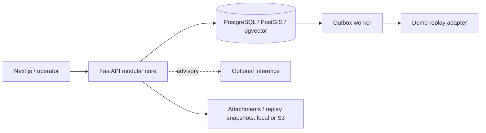

[Русский](README.md) | [English](README.en.md) | [Қазақша](README.kk.md)

# Pulse 109

An assistance layer for 109 services that connects appeals into city incidents, helps operators decide and provides verifiable analytics.

[Demo](https://baash.govtech-kz.com/demo) · [Landing](https://baash.govtech-kz.com/) · [Golden Demo](docs/GOLDEN_DEMO.md) · [Architecture](docs/architecture/README.md)

- **Team:** baash
- **Project:** Pulse 109
- **Track:** Gov cases
- **Case:** Case 2 — intelligent platform for citizen appeals to 109
- **Status:** public demonstration environment

### Public environment

**Landing:** https://baash.govtech-kz.com/ · **Demo:** https://baash.govtech-kz.com/demo

The organizer HTTPS proxy serves Next.js and the real FastAPI/PostgreSQL stack: migrations, audit, outbox, worker and analytics execute application code. Golden World contains synthetic ALA records; a replay adapter reproduces external delivery. PostgreSQL does not publish a host port. Availability checked on 1 October 2026: HTTP 200, API and database `ready`. This is a demo profile; operational details are in the [deployment runbook](infra/runbooks/PUBLIC_DEPLOYMENT.md).

### GovTech Camp submission description

**Title:** baash / Pulse 109

> Pulse 109 is an intelligent layer for 109 services that connects fragmented appeals into city incidents, helps operators make decisions and gives managers verifiable analytics.

The [Russian README](README.md) is canonical for submission.

## 1. The task

The case combines Smart Intake and routing, an Operator Assistant and a Situation Center: RU/KK, similar appeals, surge detection, demand forecasts and natural-language analytics. Operators must understand advice and confirm consequential actions.

Different reports about water, roads or lighting can describe one city problem. Separate queues obscure the connection. Pulse 109 surfaces the common signal while retaining independent handling of every appeal.

## 2. What we built

- **Smart Intake and operator queue:** adaptive questions, similar open issues, topic/service suggestions and human-confirmed routing.
- **Emerging Issues Radar:** groups by time, location and available taxonomy, with a map and human cluster review.
- **Incident War Room:** membership, history, ownership, evidence and confirmed merge/split decisions.
- **Next Best Action and Outcome Memory:** rule-based advice and comparable verified outcomes; the demo corpus is explicitly synthetic.
- **Operations Center and Data Lab:** workload, attention feed, data quality, handoffs and aggregate-to-appeal drill-down.
- **Ask Pulse:** RU/KK questions, PostgreSQL calculations, charts, provenance, drill-down, PDF/XLSX and baseline forecasts.
- **Platform and HTTPS demo:** PostgreSQL, audit, idempotency, outbox, worker, adapters and a manual path when ML fails.

**AI proposes — a human confirms.** An appeal is an individual citizen record with its own ID, history and state. An incident provides shared context for several appeals without erasing their identifiers or individual obligations.

## 3. Evolution during GovTech Camp

1. **Classification led to a data audit.** The initial direction was routing, operator assistance and a situation center. The audit found seven regions rather than twenty, no raw pre-decision citizen text and incompatible catalogs. The supplied data could not honestly prove the required RU/KK classifier.
2. **Exports became a verifiable foundation.** Canonical ingestion preserved provenance, time quality and quarantine. Separate routing/retrieval/forecast experiments exposed regional transfer limits and leakage from fields created after decisions. Their results remained research evidence.
3. **Individual tickets became a city situation.** Radar, Incident and War Room connect signals into a problem, while ownership, assignment and closure retain human confirmation. Outcome Memory, Replay Lab, Data Lab and Ask Pulse followed.
4. **APIs became a repeatable demonstration.** Product UI, MapLibre/OSM, a Golden World with 120 days of history, a public VPS and recording guidance made the flow inspectable. The final phase reconciles reliability and documentation with demonstrated limits.

Evidence: [Git chronology](docs/DEVELOPMENT_HISTORY.md), [Camp journal](docs/PROJECT_JOURNAL.md), [Decision Log](docs/DECISION_LOG.md).

## 4. Team work by week

Periods combine the journal and `main` history. Work before 12 September is journal-reported; the first retained Git commit is dated 12 September. Commit counts do not measure total effort.

| Period                         | Work                                                                                              | Main contributors                       | Result                                                            |
| ------------------------------ | ------------------------------------------------------------------------------------------------- | --------------------------------------- | ----------------------------------------------------------------- |
| Week 1, before 12 September    | Case analysis and source audit                                                                    | Team; individual breakdown not recorded | Documented data limits and initial direction                      |
| Week 2, 12–18 September        | Contracts, initial workflows, canonical ingest, routing/retrieval/forecast experiments            | Baktiyar, Arsen — Git                   | Executable foundation and research reports                        |
| Week 3, 19–25 September        | Research walkthrough, durable PostgreSQL, outbox, ownership, Decision Gateway, closure/replay     | Arsen, Baktiyar — Git                   | Manual workflow preserving decisions and delivery during failures |
| Week 4, 26 September–1 October | Incident/control plane, Radar, city demo, Ask Pulse, UI, storage, Golden Demo, VPS and final docs | Baktiyar, Arsen, Shyngyskhan — Git      | Public environment and inspectable demo route                     |

| Member                               | Main area                                  | Evidence                                                                                                                                                                |
| ------------------------------------ | ------------------------------------------ | ----------------------------------------------------------------------------------------------------------------------------------------------------------------------- |
| Januzak Aspandiyar (@aspaAI)         | Captain, architecture, defence             | Role reported in the original journal; individual weekly commits not verified in this history                                                                           |
| Arsen Baktygaliev (@Arseniiiii-ai)   | Data, ML research, city demo               | Git: ingest, baselines, retrieval/forecast, Radar/Operations, synthetic world, deployment overlays and CI/demo fixes                                                    |
| Baktiyar Ablaikhan (@sronters)       | Platform, governance, product UI           | Git: durable workflows, ownership/Decision Gateway, Incident/control plane, Ask Pulse, Golden Demo, maps and VPS deployment; 1 October recovery is operational evidence |
| Sagyt Shyngyskhan (@Shyngyskhan-333) | Replay/War Room/storage, UI, documentation | Git: `b3b4440`, `4559a7d`, `41b6a1f`, `e494390`                                                                                                                         |

Names follow the team journal. Git also uses `Arsen Baktygaliyev` and `Shyngyskhan`. The [journal](docs/PROJECT_JOURNAL.md) links contributions to commits.

## 5. What works now

✅ runtime; 🟡 partial / baseline / demo; 🔬 research; ⛔ external blocker. Full authority: [FEATURE_STATUS](docs/FEATURE_STATUS.md).

| Capability                                  | Current state                                                                                                    | Where to inspect                                                                                                               |
| ------------------------------------------- | ---------------------------------------------------------------------------------------------------------------- | ------------------------------------------------------------------------------------------------------------------------------ |
| Public landing and `/demo`                  | ✅ HTTPS, `demo` profile                                                                                         | [Landing](https://baash.govtech-kz.com/), [demo](https://baash.govtech-kz.com/demo)                                            |
| Smart Intake, queue, routing                | ✅ manual workflow; 🟡 lexical CPU advice                                                                        | Intake → queue → decision                                                                                                      |
| Radar, map, cluster → Incident              | ✅ geo/time/taxonomy, MapLibre/OSM with synthetic coordinates; 🟡 semantic signal unavailable                    | Operations → Radar → cluster; verify seed freshness before showing                                                             |
| War Room, Next Best Action, Outcome Memory  | ✅ APIs/UI; 🟡 rules and synthetic outcomes                                                                      | Incidents → War Room                                                                                                           |
| Ask Pulse RU/KK, charts, PDF/XLSX           | ✅ allowlisted questions and calculations with provenance                                                        | Operations → Ask Pulse                                                                                                         |
| 30/60/90-day forecasts                      | 🟡 seasonal-naive on 120 days of Golden World                                                                    | Ask Pulse → one/two/three-month question                                                                                       |
| Data Lab                                    | ✅ quality, handoffs, timings and drill-down                                                                     | Data Lab                                                                                                                       |
| Replay Lab                                  | 🟡 report list and aggregate policy comparison; per-case trace not recorded                                      | Replay Lab; synthetic cases excluded from quality scoring                                                                      |
| PostgreSQL, audit, outbox, worker, fallback | ✅ real processes; 🟡 synthetic external delivery                                                                | Timeline, health, [architecture](docs/architecture/README.md)                                                                  |
| CI on `e494390`                             | ✅ quality: 429 passed / 23 skipped without DB; integration: 23 passed twice; 🟡 overall CI fails security audit | [Run 36876998829](https://github.com/BAITC-Hacks/hack-803e2c8f-baash/actions/runs/36876998829), [details](docs/DEVELOPMENT.md) |

### Demo route

Four to five minutes: **new water appeal → operator decision → Radar → cluster → Incident War Room → Ask Pulse → source records / export**. Extra time: Outcome Memory, worker delivery, Data Lab or Replay Lab. Exact actions and water freshness checks are in [Golden Demo](docs/GOLDEN_DEMO.md). API counters change as reviewers act.


[Queue](docs/screenshots/operator-queue.png) · [Incidents](docs/screenshots/incidents-list.png) · [Data Lab](docs/screenshots/data-lab.png) · [Replay Lab](docs/screenshots/replay-lab.png). Captures illustrate the UI; inspect live state in `/demo`.

## Architecture



Regional CRMs use isolated adapters and stable [contracts](contracts/README.md). S3 is selected by configuration for attachments/replay; the public environment uses local volumes. Intake, manual routing, status and audit work without ML. See [architecture](docs/architecture/README.md) for trust and failure boundaries.

## Judge criteria

| Criterion         | Implemented response                                                | Evidence                                            |
| ----------------- | ------------------------------------------------------------------- | --------------------------------------------------- |
| Civic value       | Connect fragmented appeals and coordinate incidents                 | Radar, War Room, preserved appeal IDs               |
| Innovation and AI | Explainable advice and RU/KK analytics with explicit rules/fallback | Ask Pulse, Next Best Action, Outcome Memory         |
| Engineering       | Modular core, PostgreSQL, idempotency, transactional outbox         | Contracts, container-smoke and restore drill        |
| Trust and control | Human confirmation, regional access checks, manual ML fallback      | Decision Gateway, audit                             |
| Reproducibility   | Golden World, API walkthrough, public HTTPS environment             | Golden Demo, demo-profile-smoke, deployment runbook |

These are product evidence, not proof of the mandatory ML requirements: [competition audit](docs/review/COMPETITION_AUDIT_2026-09-29.md).

## Limits and research

- Historical exports cover **7 of 20 regions**; the public demo is synthetic **ALA**. The authoritative manifest and remaining sources are unavailable (`B01`).
- Demo background uses **5 topic families**; routing uses **4 synthetic topics**. Ten approved topics and a fine-tuned RU/KK runtime classifier are not proven (`B02/B06`).
- Fine-tuned embeddings are historical research on executor text and proxy labels. The corpus is withheld pending privacy review; the numbers do not prove citizen-text retrieval quality. Runtime uses a disclosed fallback.
- Golden World forecasts demonstrate baseline mechanics on fictional history, without a real demand accuracy claim.
- Regional CRM, production identity, legal basis and retention remain unresolved (`B07/B08/B10`). The scanner is a mock. Security CI found four advisories in `urllib3` and `PyJWT`: an open release gate.

[Status](docs/FEATURE_STATUS.md) · [Blockers](DECISIONS_AND_BLOCKERS.md) · [Acceptance Matrix](ACCEPTANCE_MATRIX.md) · [Documentation index](docs/README.md).

## Local startup and verification

Requires Docker with a Linux engine, Python 3.10–3.13, `uv` and Node.js/pnpm. From the root:

```sh
uv sync --all-groups --frozen
pnpm install --frozen-lockfile
uv run python scripts/demo_runtime.py prepare
```

`prepare` recreates only the local `pulse109-demo` project and seeds/verifies Golden World. Success: `PULSE 109 DEMO READY`. Open `http://localhost:3000/demo`. Windows: `.\demo.ps1 prepare`. The public VPS follows its separate [runbook](infra/runbooks/PUBLIC_DEPLOYMENT.md).

Development checks: `make lint typecheck test contract-test e2e build`. PostgreSQL integration requires `PULSE109_TEST_DATABASE_URL` and the [isolated runner](docs/DEVELOPMENT.md); skipped is not passed. This documentation pass did not rerun the backend suite.
