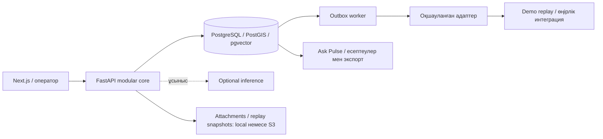

[Русский](README.md) · [English](README.en.md) · [Қазақша](README.kk.md)

# Pulse 109

> Жеке өтініштерден — қалалық мәселенің тұтас көрінісіне.

109 қызметтеріне арналған зияткерлік қабат: өтініштерді қалалық оқиғаларға байланыстырады, операторға шешім қабылдауға көмектеседі және басшыға тексеруге болатын талдау ұсынады.

[Демоны ашу](https://baash.govtech-kz.com/demo) · [Басты бет](https://baash.govtech-kz.com/) · [Golden Demo](docs/demo/GOLDEN_DEMO.kk.md) · [Архитектура](docs/architecture/README.kk.md)


**Команда:** baash · **Жоба:** Pulse 109 · **Бағыт:** Gov cases · **Кейс:** Case 2 — азаматтардың 109 қызметіне жолдаған өтініштерімен жұмыс істейтін зияткерлік платформа. Тапсыруға арналған негізгі нұсқа — [орыс тіліндегі README](README.md).

### Жалпыға қолжетімді стенд

**[Басты бет](https://baash.govtech-kz.com/)** пен **[интерактивті демо](https://baash.govtech-kz.com/demo)** ұйымдастырушылардың HTTPS proxy қызметі арқылы бір Next.js қолданбасында жұмыс істейді. Негізінде — FastAPI, PostgreSQL, миграциялар, аудит, outbox және worker. Golden World — синтетикалық ALA қалалық әлемі; сыртқы жеткізуді replay adapter жаңғыртады. PostgreSQL стек ішінде қолжетімді. Параметрлер мен тексерулер [deployment runbook](infra/runbooks/PUBLIC_DEPLOYMENT.kk.md) құжатында.

## Міндет

109 кейсі **Smart Intake пен бағыттауды**, **оператор көмекшісін** және **ахуалдық орталықты** біріктіреді: RU/KK тілдерінде жұмыс, ұқсас өтініштер, күрт өсуді анықтау, жүктемені болжау және деректерге табиғи тілде сұрақ қою.

Су, жол немесе жарық туралы әртүрлі хабарламалар бір қалалық мәселені сипаттауы мүмкін. Бөлек кезектер олардың байланысын жасырады. Pulse 109 ортақ белгіні көрсетіп, қызметтердің жұмысын үйлестіруге көмектеседі және әр өтініштің жеке өңделуін сақтайды.

## Не жасадық

- **Smart Intake және оператор кезегі:** бейімделетін сұрақтар, ұқсас ашық мәселелерді іздеу, тақырып пен қызмет ұсынысы және бағытты адамның растауы.
- **Emerging Issues Radar:** орын, уақыт және тақырып бойынша хабарламаларды топтау, MapLibre/OSM картасы және кластерді оператордың қарауы.
- **Incident War Room:** мәселенің ортақ жұмыс кеңістігі — құрам, тарих, жауапты тарап, дәлелдер және расталатын merge/split.
- **Next Best Action және Outcome Memory:** себеп кодтары бар ұсыныстар мен салыстырылатын расталған нәтижелер.
- **Operations Center және Data Lab:** жүктеме, назар қажет ететін жағдайлар, дерек сапасы, қайта бағыттау және көрсеткіштен бастапқы өтініштерге өту.
- **Ask Pulse:** RU/KK сұрақтары, PostgreSQL есептеулері, графиктер, деректердің шығу тегі, drill-down, PDF/XLSX және болжам.
- **Сенімді платформа:** сақталатын шешімдер, аудит, идемпотенттілік, outbox, worker және адаптерлер; ML істемегенде қолмен өңдеу жолы жұмыс істейді.

**ЖИ ұсынады — адам растайды.** Әр өтініштің өз ID нөмірі, тарихы және жеке міндеттемелері сақталады. Оқиға қызметтерді үйлестіру үшін бірнеше өтінішке ортақ контекст береді.

## GovTech Camp барысында шешім қалай дамыды

1. **Бастапқы деректерді тексердік.** Жіктеу, бағыттау және оператор көмекшісінен бастадық. Берілген жеті өңірлік экспорттың аудиті анықтамалықтардың әртүрлі екенін және шешімге дейінгі бастапқы мәтіннің жоқтығын көрсетті. Келесі қадам — ортақ деректер қабаты және ML үміткерлерін бөлек бағалау болды.
2. **Тексерілетін негіз құрдық.** Канондық ingest деректердің шығу тегін, уақыт сапасын және карантинді сақтайды. Routing/retrieval/forecast тәжірибелері өңірлік айырмашылықтарды ескеруге және оператор шешімінен кейін пайда болатын өрістерді қолданбауға көмектесті.
3. **Назарды қалалық жағдайға кеңейттік.** Жеке өтініштерді Radar, Incident және War Room байланыстырды. Жауапкершілік, адам растауы және тапсырманы беру бақылауы мәселені анықтаудан орындауға дейінгі жолды біріктірді; Outcome Memory, Replay Lab және Data Lab кері байланыс қосты.
4. **Өнімді зерттеуге қолайлы еттік.** Ask Pulse, жаңа интерфейс, карта, 120 күндік Golden World және жалпыға қолжетімді VPS API-ді тұтас демо сценарийіне айналдырды. Соңғы кезең — тұрақтандыру, тексеру және қорғауға дайындық.

Шешімдер мен коммиттер: [даму тарихы](docs/development/DEVELOPMENT_HISTORY.kk.md) · [Camp журналы](docs/submission/PROJECT_JOURNAL.kk.md) · [Decision Log](docs/governance/DECISION_LOG.kk.md).

## Команда және апталар бойынша жұмыс

| Кезең                       | Жұмыс                                                                           | Негізгі қатысушылар          | Нәтиже                                                           |
| --------------------------- | ------------------------------------------------------------------------------- | ---------------------------- | ---------------------------------------------------------------- |
| 1-апта, 12 қыркүйекке дейін | Кейсті талдау, дереккөздер аудиті және бағытты таңдау                           | Команда                      | Деректер көрінісі мен шешім жоспары                              |
| 2-апта, 12–18 қыркүйек      | Контракттар, алғашқы workflow, канондық ingest, routing/retrieval/forecast      | Baktiyar, Arsen              | Орындалатын негіз және зерттеу есептері                          |
| 3-апта, 19–25 қыркүйек      | Тұтас сценарий, PostgreSQL, outbox, ownership, Decision Gateway, closure/replay | Arsen, Baktiyar              | Ақау кезінде шешім мен жеткізу күйін сақтайтын қолмен өңдеу жолы |
| 4-апта, 26 қыркүйек–1 қазан | Incident, Radar, Ask Pulse, UI, storage, Golden Demo, VPS және құжаттар         | Baktiyar, Arsen, Shyngyskhan | Қолжетімді стенд және көрсетілім бағыты                          |

| Қатысушы                                 | Негізгі үлес                                                                                                                          |
| ---------------------------------------- | ------------------------------------------------------------------------------------------------------------------------------------- |
| **Januzak Aspandiyar (@aspaAI)**         | Капитан, архитектура және қорғау — командалық журнал бойынша                                                                          |
| **Arsen Baktygaliev (@Arseniiiii-ai)**   | Өңірлік деректер, routing/retrieval/forecast зерттеулері, Radar/Operations, қалалық әлем, deployment overlays және CI/demo түзетулері |
| **Baktiyar Ablaikhan (@sronters)**       | Durable workflows, governance, ownership/Decision Gateway, Incident, Ask Pulse, UI/UX, Golden Demo, карталар және VPS deployment      |
| **Sagyt Shyngyskhan (@Shyngyskhan-333)** | Replay/War Room/storage, Hex UI және жюриге арналған қорытынды құжаттар                                                               |

Кезеңдер мен рөлдер командалық журнал және жоба тарихы бойынша берілген; үлес пен дереккөздердің толық сипаттамасы [PROJECT_JOURNAL](docs/submission/PROJECT_JOURNAL.kk.md) құжатында.

## Қазір не жұмыс істейді

| Мүмкіндік                  | Қазіргі жұмыс                                                             | Қайдан тексеруге болады                                                                |
| -------------------------- | ------------------------------------------------------------------------- | -------------------------------------------------------------------------------------- |
| Жалпыға қолжетімді сайт    | Басты бет және интерактивті HTTPS демо                                    | [Басты бет](https://baash.govtech-kz.com/) → [демо](https://baash.govtech-kz.com/demo) |
| Smart Intake және бағыттау | Қабылдау, ұқсас мәселелер, ұсыныс және қолмен шешім                       | Қабылдау → кезек → шешім                                                               |
| Radar және карта           | Тақырыпты ескеретін кеңістіктік-уақыттық топтар; кластер → Incident       | Operations → Radar → кластер                                                           |
| War Room                   | Тарих, құрам, ownership, Next Best Action және Outcome Memory             | Оқиғалар → War Room                                                                 |
| Ask Pulse                  | RU/KK сұрақтары, есептеулер, графиктер, бастапқы жазбалар, PDF/XLSX       | Operations → Ask Pulse                                                                 |
| 30/60/90 күндік болжам     | 120 күндік тарихқа негізделген ашық seasonal-naive baseline               | Ask Pulse → 1/2/3 айға болжам                                                          |
| Data Lab және Replay Lab   | Сапа мен drill-down; сақталған есептер және саясаттарды жиынтық салыстыру | Data Lab / Replay Lab                                                                  |
| Платформа                  | PostgreSQL, аудит, outbox, worker, адаптерлер және қолмен өңдеу           | Timeline, health, [архитектура](docs/architecture/README.kk.md)                           |

Мүмкіндіктердің толық матрицасы — [FEATURE_STATUS](docs/submission/FEATURE_STATUS.kk.md); тексерулердің қазіргі нәтижелері — [DEVELOPMENT](docs/development/DEVELOPMENT.kk.md).

## Неліктен Pulse 109: «жіктеуіш тұзағы»

Бір сумен жабдықтау мәселесі әртүрлі сөздермен сипатталуы мүмкін:

- _«Су лайланып, тоттың иісі шығады»_;
- _«Бесінші қабатта су қысымы төмен»_;
- _«Үй жанындағы жөндеуден кейін су тоқтады»_;
- _«Су бағанының жанындағы асфальт қазылған»_.

Жіктеу хабарламаларды бағыттауға көмектеседі, бірақ әртүрлі тақырыптар мен кезектер олардың байланысын жасыруы мүмкін. **Әр өтінішті дұрыс бағыттау қалалық жағдайдың ортақ көрінісін көруге әлі жеткіліксіз.**

Pulse 109 келесі деңгейді қосады: **Radar** орын, уақыт пен тақырыпты салыстырады → оператор кластерді картадан қарайды → **Incident War Room** ашады → қызметтердің әрекеттерін үйлестіреді. Хабарламалар арасындағы байланыс адам тексеретін болжам болып қалады; әр өтініштің тарихы сақталады.

### Жюриге арналған өнім дәлелдері

| Өлшем                | Pulse 109 жауабы                                        | Қайдан көрінеді                                 |
| -------------------- | ------------------------------------------------------- | ----------------------------------------------- |
| Мемлекеттік құндылық | Мәселенің ортақ көрінісі және қызметтерді үйлестіру     | Radar, War Room, өтініштердің жеке ID нөмірлері |
| Инновация және ЖИ    | Түсіндірілетін ұсыныстар мен RU/KK талдауы              | Ask Pulse, Next Best Action, Outcome Memory     |
| Инженерлік негіз     | Модульдік core, PostgreSQL, идемпотенттілік және outbox | Контракттар, container-smoke, restore drill     |
| Сенім және бақылау   | Адам растауы және ML жоқта қолмен өңдеу                 | Decision Gateway, аудит, fallback               |
| Қайталанушылық       | Golden World, API walkthrough және ашық HTTPS           | Golden Demo, CI, deployment runbook             |

## Golden Demo: 4–5 минуттағы бір бағыт

```text
Азамат хабарламасы RU/KK
        ↓
Smart Intake: сұрақтар + ұқсас ашық мәселелер
        ↓
Radar: картадағы хабарламалар тобы
        ↓
Incident War Room: ортақ контекст + Next Best Action
        ↓
Оператор әрекеті → outbox → worker → adapter
        ↓
Ask Pulse: сұрақ → есептеу → бастапқы жазбалар → PDF/XLSX
```

1. **Су сапасы туралы хабарлау:** жүргізуші көмекшісіндегі мысалды толтыру, ұқсас мәселелерді көрсету және өтінішті қолмен жіберу.
2. **Radar ашу:** scan іске қосып, дайындалған су кластерінің картасы мен хабарламаларын қарау.
3. **Incident құру:** War Room ішінен тарихты, үйлестірушіні, Outcome Memory және Next Best Action көрсету.
4. **Әрекетті растау:** кезектегі өтінішті тағайындау және outbox/worker арқылы сақталатын жеткізуді көрсету.
5. **Ask Pulse сұрағы:** «Алматыдағы соңғы 7 күннің өтініштерін көрсет» → сан, график, есептеу түсіндірмесі, бастапқы жазбалар және экспорт.

[Толық сценарий](docs/demo/GOLDEN_DEMO.kk.md) · [Жүргізуші нұсқаулығы](docs/demo/DEMO_RUNBOOK.kk.md) · [Демоны жазу](docs/demo/DEMO_RECORDING_SCRIPT.kk.md). Көрсетілім алдында runbook бойынша Golden World уақыт терезесін өзекті етіп дайындаңыз.

[Оператор кезегі](docs/screenshots/operator-queue.png) · [Оқиғалар тізілімі](docs/screenshots/incidents-list.png) · [Data Lab](docs/screenshots/data-lab.png) · [Replay Lab](docs/screenshots/replay-lab.png).

## Архитектура және сенімділік



- **Қолданыстағы процестерге қосылады:** өңірлік жүйелер адаптерлер мен тұрақты [контракттар](contracts/README.kk.md) арқылы қосылады.
- **Шешімдер мен тапсырмаларды сақтайды:** transactional outbox, `FOR UPDATE SKIP LOCKED`, қайталап жіберу және идемпотентті командалар.
- **ML болмаса да жұмыс істейді:** inference істемесе, қабылдау, қолмен бағыттау, күйлер және аудит жалғасады.
- **Тексерілетін сандар береді:** Ask Pulse рұқсат етілген талдау сұраныстарын, ядро есептеулерін және бастапқы жазбаларға сілтемелерді қолданады.

Толық сызбалар мен қолжетімділік шекаралары — [архитектурада](docs/architecture/README.kk.md).

## Тексеру және іске қосу

Толық жергілікті жүйе үшін Docker Linux engine, Python 3.10–3.13, `uv` және Node.js/pnpm қажет:

```sh
uv sync --all-groups --frozen
pnpm install --frozen-lockfile
uv run python scripts/demo_runtime.py prepare
```

`prepare` тек жергілікті `pulse109-demo` жобасын қайта құрып, миграцияларды орындайды, Golden World деректерін толтырады және тексереді. Сәтті аяқталу белгісі: `PULSE 109 DEMO READY`. [http://localhost:3000/demo](http://localhost:3000/demo) ашыңыз. Windows: `.\demo.ps1 prepare`. Жалпыға қолжетімді VPS үшін бөлек [runbook](infra/runbooks/PUBLIC_DEPLOYMENT.kk.md) қолданылады.

```sh
make lint typecheck test contract-test e2e build
```

PostgreSQL integration `PULSE109_TEST_DATABASE_URL` арқылы [оқшауланған runner](docs/development/DEVELOPMENT.kk.md) ішінде орындалады. Қазіргі CI нәтижелері [тексеру құжатында](docs/development/DEVELOPMENT.kk.md) және [GitHub Actions](https://github.com/BAITC-Hacks/hack-803e2c8f-baash/actions) бетінде берілген.

**GovTech Camp формасына — baash / Pulse 109:**

> Pulse 109 — бөлек өтініштерді қалалық оқиғаларға байланыстыратын, операторға шешім қабылдауға көмектесетін және басшыға тексеруге болатын талдау беретін 109 қызметтеріне арналған зияткерлік қабат.

## Қазіргі стендтің шекаралары

| Сала                    | Қазіргі жүйе және пилоттың келесі кезеңі                                                                                                                                                                                                                                                                                                                    |
| ----------------------- | ----------------------------------------------------------------------------------------------------------------------------------------------------------------------------------------------------------------------------------------------------------------------------------------------------------------------------------------------------------- |
| Деректер мен интеграция | Демо синтетикалық ALA Golden World және replay adapter қолданады. Канондық қабат берілген жеті өңірлік экспорт негізінде құрылған; қалған өңірлер мен нақты CRM деректер/API берілгеннен кейін адаптерлер арқылы қосылады.                                                                                                                                  |
| Модельдер мен болжам    | Runtime детерминирленген lexical fallback және seasonal-naive болжам қолданады. Fine-tuned үміткерлер рұқсат етілген шешімге дейінгі корпус пен таксономия алынғанша бөлек зерттеу бағытында қалады. Демо каталогында төрт routing тақырыбы мен бес фондық топ бар; 10 тақырыпты, 20 өңірді және нақты өтініштердегі модель сапасын бағалау — келесі кезең. |
| Replay және пайдалану   | Replay Lab саясаттарды есеп деңгейінде салыстырады; жеке шешімдердің трассасы әзірге жазылмайды. S3 конфигурация арқылы қосылады, VPS жергілікті томдарды қолданады. Production identity, құқықтық негіз, сақтау мерзімі және жұмыс scanner-і пилот үшін келісуді қажет етеді; қазіргі scanner — mock.                                                      |

[Қазіргі күй](docs/submission/FEATURE_STATUS.kk.md) · [Зерттеулер мен кейс талаптары](docs/review/COMPETITION_AUDIT_2026-09-29.kk.md) · [Сыртқы тәуелділіктер](docs/governance/DECISIONS_AND_BLOCKERS.kk.md) · [Құжаттар индексі](docs/README.kk.md).
