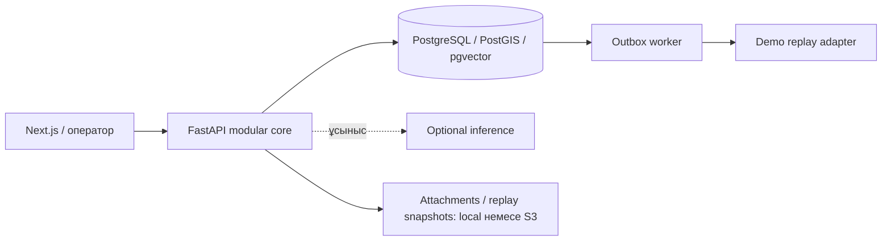

[Русский](README.md) | [English](README.en.md) | [Қазақша](README.kk.md)

# Pulse 109

109 қызметтеріне арналған зияткерлік қабат: өтініштерді қалалық инциденттерге байланыстырады, операторға шешім қабылдауға көмектеседі және тексеруге болатын талдау ұсынады.

[Демо](https://baash.govtech-kz.com/demo) · [Басты бет](https://baash.govtech-kz.com/) · [Golden Demo](docs/GOLDEN_DEMO.md) · [Архитектура](docs/architecture/README.md)

- **Команда:** baash
- **Жоба:** Pulse 109
- **Бағыт:** Gov cases
- **Кейс:** Case 2 — азаматтардың 109 қызметіне жолдаған өтініштерімен жұмыс істейтін зияткерлік платформа
- **Күйі:** жалпыға қолжетімді демонстрациялық стенд

### Қолжетімді стенд

**Басты бет:** https://baash.govtech-kz.com/ · **Демо:** https://baash.govtech-kz.com/demo

Ұйымдастырушылардың HTTPS proxy қызметі Next.js пен FastAPI/PostgreSQL жүйесіне бағыттайды. Миграциялар, аудит, outbox, worker және талдау нақты қолданба кодымен орындалады. Golden World ішіндегі ALA жазбалары синтетикалық; сыртқы жеткізуді replay adapter жаңғыртады. PostgreSQL порты хостта жарияланбайды. 2026 жылғы 1 қазандағы тексеру: HTTP 200, API мен дерекқор — `ready`. Пайдалану тәртібі [runbook](infra/runbooks/PUBLIC_DEPLOYMENT.md) құжатында.

### GovTech Camp формасына арналған сипаттама

**Жоба атауы:** baash / Pulse 109

> Pulse 109 — бөлек өтініштерді қалалық инциденттерге байланыстыратын, операторға шешім қабылдауға көмектесетін және басшыға тексеруге болатын талдау беретін 109 қызметтеріне арналған зияткерлік қабат.

Тапсыруға арналған негізгі нұсқа — [орыс тіліндегі README](README.md).

## 1. Міндет

Кейс Smart Intake пен бағыттауды, оператор көмекшісін және ахуалдық орталықты қамтиды: RU/KK, ұқсас өтініштерді іздеу, күрт өсуді анықтау, жүктемені болжау және деректерге табиғи тілде сұрақ қою. Маңызды әрекеттерді оператор түсініп, растауы керек.

Су, жол немесе жарық туралы әртүрлі хабарламалар бір қалалық мәселені сипаттауы мүмкін. Бөлек кезектер олардың байланысын жасырады. Pulse 109 ортақ белгіні көрсетіп, әр өтініштің жеке өңделуін сақтайды.

## 2. Не жасадық

- **Smart Intake және оператор кезегі:** бейімделетін сұрақтар, ұқсас ашық мәселелер, тақырып пен қызмет ұсынысы, бағытты адамның растауы.
- **Emerging Issues Radar:** уақыт, координаттар және қолжетімді тақырып бойынша топтау; карта мен кластерді адамның қарауы.
- **Incident War Room:** инцидент құрамы, тарихы, жауапты тарап, дәлелдер және расталатын merge/split әрекеттері.
- **Next Best Action және Outcome Memory:** ережелерге негізделген ұсыныстар мен салыстырылатын расталған нәтижелер; демо корпусы синтетикалық деп белгіленген.
- **Operations Center және Data Lab:** жүктеме, назар қажет ететін жағдайлар, дерек сапасы, қайта бағыттау және көрсеткіштен бастапқы өтініштерге өту.
- **Ask Pulse:** RU/KK сұрақтары, PostgreSQL есептеулері, графиктер, деректердің шығу тегі, drill-down, PDF/XLSX және базалық болжам.
- **Платформа және HTTPS демо:** PostgreSQL, аудит, идемпотенттілік, outbox, worker, адаптерлер және ML істемеген кезде қолмен өңдеу жолы.

**ЖИ ұсынады — адам растайды.** Өтініштің өз ID нөмірі, тарихы және күйі бар. Инцидент бірнеше өтінішке ортақ жұмыс контекстін береді; олардың нөмірлері мен жеке міндеттемелері сақталады.

## 3. GovTech Camp барысында шешім қалай өзгерді

1. **Жіктеуден деректер аудитіне.** Бастапқы бағыт — бағыттау, оператор көмекшісі және ахуалдық орталық. Аудит 20 өңірдің орнына 7 өңірді, азаматтың шешімге дейінгі бастапқы мәтінінің жоқтығын және анықтамалықтардың үйлеспейтінін көрсетті. Сондықтан берілген деректер қажетті RU/KK жіктеуішін дәлелдеуге жеткіліксіз болды.
2. **Экспорттардан тексерілетін негізге.** Канондық қабат деректердің шығу тегін, уақыт сапасын және карантинді сақтады. Routing/retrieval/forecast тәжірибелері өңірлер арасында тасымалдау шектеулерін және шешімнен кейін пайда болған өрістерден ақпараттың ағып кету қаупін көрсетті. Бұл нәтижелер зерттеу деңгейінде қалды.
3. **Жеке өтініштен қалалық жағдайға.** Radar, Incident және War Room хабарламаларды ортақ мәселеге байланыстырады. Жауапкершілік, тағайындау және жабу адамның растауын қажет етеді. Кейін Outcome Memory, Replay Lab, Data Lab және Ask Pulse қосылды.
4. **API-ден қайталанатын көрсетілімге.** Өнім интерфейсі, MapLibre/OSM картасы, 120 күндік Golden World, жалпыға қолжетімді VPS және бейне жазу тәртібі жасалды. Соңғы кезең — сенімділікті тексеру және құжаттарды нақты шектеулермен сәйкестендіру.

Дәлелдер: [Git тарихы](docs/DEVELOPMENT_HISTORY.md), [Camp журналы](docs/PROJECT_JOURNAL.md), [Decision Log](docs/DECISION_LOG.md).

## 4. Команданың апталар бойынша жұмысы

Кезеңдер журнал мен `main` тарихынан жинақталған. 12 қыркүйекке дейінгі жұмыс журналда сипатталған; алғашқы сақталған Git коммиті 12 қыркүйекке тиесілі. Коммит саны адамның барлық еңбегін өлшемейді.

| Кезең                       | Жұмыс                                                                                            | Негізгі қатысушылар                       | Нәтиже                                                           |
| --------------------------- | ------------------------------------------------------------------------------------------------ | ----------------------------------------- | ---------------------------------------------------------------- |
| 1-апта, 12 қыркүйекке дейін | Кейсті талдау, дереккөздер аудиті                                                                | Команда; жеке үлестер журналда бөлінбеген | Құжатталған шектеулер мен бастапқы бағыт                         |
| 2-апта, 12–18 қыркүйек      | Контракттар, алғашқы workflow, ingest және ML тәжірибелері                                       | Baktiyar, Arsen — Git                     | Орындалатын негіз және зерттеу есептері                          |
| 3-апта, 19–25 қыркүйек      | Зерттеу сценарийі, PostgreSQL, outbox, ownership, Decision Gateway, closure/replay               | Arsen, Baktiyar — Git                     | Ақау кезінде шешім мен жеткізу күйін сақтайтын қолмен өңдеу жолы |
| 4-апта, 26 қыркүйек–1 қазан | Incident/control plane, Radar, демо қала, Ask Pulse, UI, storage, Golden Demo, VPS және құжаттар | Baktiyar, Arsen, Shyngyskhan — Git        | Қолжетімді стенд және тексерілетін көрсетілім                    |

| Қатысушы                             | Негізгі үлес және дәлел                                                                                                                                                                |
| ------------------------------------ | -------------------------------------------------------------------------------------------------------------------------------------------------------------------------------------- |
| Januzak Aspandiyar (@aspaAI)         | Капитан, архитектура, қорғау — бастапқы журналда көрсетілген рөл. Жеке апталық коммиттері осы тарихта расталмаған                                                                      |
| Arsen Baktygaliev (@Arseniiiii-ai)   | Деректер, routing/retrieval/forecast, Radar/Operations, synthetic world, deployment overlays, CI/demo түзетулері — Git                                                                 |
| Baktiyar Ablaikhan (@sronters)       | Durable workflows, ownership/Decision Gateway, Incident/control plane, Ask Pulse, UI, Golden Demo, карталар және VPS deployment — Git; 1 қазандағы қалпына келтіру — пайдалану жазбасы |
| Sagyt Shyngyskhan (@Shyngyskhan-333) | Replay/War Room/storage, Hex UI, жюриге арналған құжаттар — `b3b4440`, `4559a7d`, `41b6a1f`, `e494390`                                                                                 |

Аттар команданың журналынан алынған. Git ішінде `Arsen Baktygaliyev` және `Shyngyskhan` атаулары да бар.

## 5. Қазір не жұмыс істейді

✅ — runtime; 🟡 — ішінара / baseline / demo; 🔬 — зерттеу; ⛔ — сыртқы кедергі. Толық күй [FEATURE_STATUS](docs/FEATURE_STATUS.md) құжатында.

| Мүмкіндік                                   | Қазіргі күй                                                                                                       | Қайдан тексеруге болады                                                                                                       |
| ------------------------------------------- | ----------------------------------------------------------------------------------------------------------------- | ----------------------------------------------------------------------------------------------------------------------------- |
| Басты бет және `/demo`                      | ✅ HTTPS, `demo` профилі                                                                                          | [Басты бет](https://baash.govtech-kz.com/), [демо](https://baash.govtech-kz.com/demo)                                         |
| Smart Intake, кезек, бағыттау               | ✅ қолмен өңдеу; 🟡 lexical CPU ұсынысы                                                                           | Қабылдау → кезек → шешім                                                                                                      |
| Radar, карта, кластер → Incident            | ✅ уақыт/география/тақырып, синтетикалық координаттары бар MapLibre/OSM; 🟡 семантикалық белгі қолжетімсіз        | Operations → Radar; seed уақытының өзектілігін тексеру керек                                                                  |
| War Room, Next Best Action, Outcome Memory  | ✅ API/UI; 🟡 ережелер және синтетикалық нәтижелер                                                                | Инциденттер → War Room                                                                                                        |
| Ask Pulse RU/KK, графиктер, PDF/XLSX        | ✅ рұқсат етілген сұрақтар мен шығу тегі көрсетілген есептеу                                                      | Operations → Ask Pulse                                                                                                        |
| 30/60/90 күндік болжам                      | 🟡 Golden World тарихына арналған seasonal-naive                                                                  | 1/2/3 айға болжам сұрағы                                                                                                      |
| Data Lab                                    | ✅ сапа, қайта бағыттау, timings, drill-down                                                                      | Data Lab                                                                                                                      |
| Replay Lab                                  | 🟡 есептер мен саясаттардың жиынтық салыстыруы; жеке шешімдердің трассасы жазылмаған                              | Replay Lab; синтетикалық жазбалар сапа бағасынан шығарылады                                                                   |
| PostgreSQL, аудит, outbox, worker, fallback | ✅ нақты процестер; 🟡 синтетикалық сыртқы жеткізу                                                                | Timeline және health                                                                                                          |
| `e494390` коммитінің CI тексеруі            | ✅ quality: 429 passed / 23 skipped; integration: 23 passed екі рет; 🟡 security audit салдарынан жалпы CI сәтсіз | [36876998829](https://github.com/BAITC-Hacks/hack-803e2c8f-baash/actions/runs/36876998829), [түсіндірме](docs/DEVELOPMENT.md) |

4–5 минуттық көрсетілім: **су туралы жаңа өтініш → оператор шешімі → Radar → кластер → Incident War Room → Ask Pulse → бастапқы жазбалар / экспорт**. Нақты қадамдар мен деректердің өзектілігі [Golden Demo](docs/GOLDEN_DEMO.md) құжатында. Экран сандары API-ден келеді және әрекеттерден кейін өзгереді.


## Архитектура мен бағалау дәлелдері



Өңірлік CRM бөлек адаптерлер және тұрақты [контракттар](contracts/README.md) арқылы қосылады. S3 attachments/replay үшін конфигурация арқылы таңдалады; жалпыға қолжетімді стенд local volumes қолданады. Қабылдау, қолмен бағыттау, күйлер және аудит ML болмаса да жұмыс істейді.

Жюриге арналған дәлелдер: Radar/War Room — ортақ мәселені көру; Ask Pulse — тексерілетін талдау; PostgreSQL/outbox — шешімдерді сақтау; адам растауы — бақылау; Golden Demo және HTTPS — қайталанатын көрсетілім. Бұлар міндетті ML талаптарының орындалуын алмастырмайды: [сәйкестік аудиті](docs/review/COMPETITION_AUDIT_2026-09-29.md).

## Шектеулер

- Тарихи экспорттар **20 өңірдің 7-еуін** қамтиды. Жария демо — синтетикалық **ALA**; бұл Алматының нақты статистикасы емес (`B01`).
- Демо фонында **5 тақырып тобы**, routing-каталогта **4 синтетикалық тақырып** бар. Кемінде 10 бекітілген тақырып және runtime ішіндегі fine-tuned RU/KK жіктеуіш дәлелденбеген (`B02/B06`).
- Fine-tuned embeddings — орындаушылардың мәтіндері мен proxy белгілеріне негізделген тарихи зерттеу. Корпус privacy review аяқталғанша жабық. Бұл нәтижелер азамат мәтіндері бойынша іздеу сапасын дәлелдемейді; runtime анық көрсетілген fallback қолданады.
- Болжам ойдан құрастырылған тарихтағы baseline жұмысын көрсетеді. Нақты жүктемеге қатысты тексерілген дәлдік мәлімделмейді.
- Өңірлік CRM, production identity, құқықтық негіз және retention келісілмеген (`B07/B08/B10`). Scanner — mock. Security CI `urllib3` және `PyJWT` пакеттерінде төрт advisory анықтады; бұл release gate ашық қалды.

## Жергілікті іске қосу және тексеру

Docker Linux engine, Python 3.10–3.13, `uv` және Node.js/pnpm қажет:

```sh
uv sync --all-groups --frozen
pnpm install --frozen-lockfile
uv run python scripts/demo_runtime.py prepare
```

`prepare` тек жергілікті `pulse109-demo` жобасын қайта құрып, Golden World деректерін толтырады және тексереді. Сәтті аяқталу белгісі: `PULSE 109 DEMO READY`. Мекенжай: `http://localhost:3000/demo`. Windows: `.\demo.ps1 prepare`. Жалпыға қолжетімді VPS үшін бөлек [runbook](infra/runbooks/PUBLIC_DEPLOYMENT.md) қолданылады.

Даму тексерулері: `make lint typecheck test contract-test e2e build`. PostgreSQL integration үшін `PULSE109_TEST_DATABASE_URL` және [оқшауланған runner](docs/DEVELOPMENT.md) қажет; skipped — passed деген сөз емес. Бұл құжаттық тексеруде backend suite қайта іске қосылған жоқ.

[Қазіргі күй](docs/FEATURE_STATUS.md) · [Сыртқы кедергілер](DECISIONS_AND_BLOCKERS.md) · [Acceptance Matrix](ACCEPTANCE_MATRIX.md) · [Құжаттар индексі](docs/README.md).
