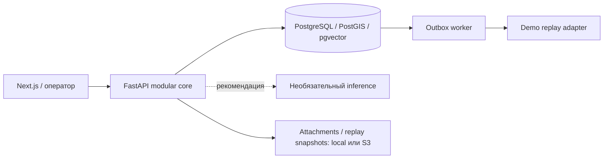

[Русский](README.md) | [English](README.en.md) | [Қазақша](README.kk.md)

# Pulse 109

Интеллектуальный слой для служб 109: связывает обращения в городские инциденты, помогает оператору и даёт проверяемую аналитику.

[Демо](https://baash.govtech-kz.com/demo) · [Лендинг](https://baash.govtech-kz.com/) · [Golden Demo](docs/GOLDEN_DEMO.md) · [Архитектура](docs/architecture/README.md)

- **Команда:** baash
- **Проект:** Pulse 109
- **Трек:** Gov cases
- **Кейс:** Case 2 — интеллектуальная платформа работы с обращениями граждан 109
- **Статус:** публичный демонстрационный стенд

### Публичный стенд

**Лендинг:** https://baash.govtech-kz.com/ · **Демо:** https://baash.govtech-kz.com/demo

Организаторский HTTPS proxy ведёт на Next.js и реальный стек FastAPI/PostgreSQL: миграции, аудит, outbox, worker и аналитика исполняются кодом продукта. Golden World содержит синтетические записи ALA; внешнюю доставку воспроизводит replay adapter. PostgreSQL не публикует порт на хосте. Проверка доступности 1 октября 2026 года: HTTP 200, API `ready`, база `ready`. Это демонстрационный профиль; эксплуатационные параметры — в [runbook](infra/runbooks/PUBLIC_DEPLOYMENT.md).

### Описание для формы GovTech Camp

**Название:** baash / Pulse 109

> Pulse 109 — интеллектуальный слой для служб 109, который связывает разрозненные обращения в городские инциденты, помогает оператору принять решение и даёт руководителю проверяемую аналитику.

## 1. Задача

Кейс объединяет Smart Intake и маршрутизацию, помощника оператора и ситуационный центр: RU/KK, поиск похожих обращений, обнаружение всплесков, прогноз нагрузки и вопросы к данным обычным языком. Оператор должен понимать подсказку и подтверждать значимые действия.

Разные сообщения о воде, дороге или освещении могут описывать одну городскую проблему. Раздельные очереди скрывают эту связь. Pulse 109 помогает увидеть общий сигнал, сохраняя самостоятельную обработку каждого обращения.

## 2. Что мы сделали

- **Smart Intake и очередь оператора:** адаптивные вопросы, похожие открытые проблемы, рекомендация темы/службы и ручное подтверждение маршрута.
- **Emerging Issues Radar:** группы сообщений по времени, координатам и доступной теме; карта и проверка кластера человеком.
- **Incident War Room:** состав инцидента, история, владение, доказательства и подтверждаемые merge/split.
- **Next Best Action и Outcome Memory:** рекомендации правил и сопоставимые подтверждённые исходы; демонстрационный корпус явно синтетический.
- **Operations Center и Data Lab:** текущая нагрузка, лента внимания, качество данных, передачи и переход от показателя к обращениям.
- **Ask Pulse:** RU/KK вопросы, расчёт чисел в PostgreSQL, графики, происхождение, drill-down, PDF/XLSX и базовый прогноз.
- **Платформа и HTTPS-демо:** PostgreSQL, аудит, идемпотентность, outbox, worker, адаптеры и ручной путь при отказе ML.

**ИИ предлагает — человек подтверждает.** Обращение — отдельная запись гражданина со своим ID, историей и состоянием. Инцидент — общий контекст нескольких обращений; связывание не стирает их идентификаторы и индивидуальные обязательства.

## 3. Как решение менялось за GovTech Camp

1. **От классификации к проверке данных.** Исходное направление — маршрутизация, помощник и ситуационный центр. Аудит выявил 7 регионов вместо 20, отсутствие сырого дооператорского текста и несовместимые справочники. Поэтому нельзя было честно обучить и подтвердить требуемый RU/KK классификатор на выданных данных.
2. **От экспортов к проверяемой основе.** Канонический слой сохранил происхождение, качество времени и карантин. Отдельные routing/retrieval/forecast эксперименты показали ограничения переноса между регионами и риск утечки из полей, созданных после решения. Их результаты остались исследовательскими.
3. **От одного тикета к городской ситуации.** Добавили Radar, модель Incident и War Room: сообщения связываются в проблему, а владение, назначения и закрытие проходят человеческое подтверждение. Затем появились Outcome Memory, Replay Lab, Data Lab и Ask Pulse.
4. **От API к воспроизводимому показу.** Обновили продуктовый интерфейс, добавили MapLibre/OSM, Golden World со 120 днями истории, публичный VPS и маршрут записи демо. Финальный этап — проверка надёжности и согласование документации с фактическими ограничениями.

Коммиты и причины решений: [история разработки](docs/DEVELOPMENT_HISTORY.md), [журнал Camp](docs/PROJECT_JOURNAL.md), [Decision Log](docs/DECISION_LOG.md).

## 4. Работа команды по неделям

Периоды сведены из журнала и истории `main`. Работа до 12 сентября описана в журнале; первый сохранённый Git-коммит датирован 12 сентября. Число коммитов не измеряет общий вклад участника.

| Период                          | Что делали                                                                                                    | Основные участники                                   | Результат                                                                 |
| ------------------------------- | ------------------------------------------------------------------------------------------------------------- | ---------------------------------------------------- | ------------------------------------------------------------------------- |
| Неделя 1, до 12 сентября        | Разбор кейса и аудит источников                                                                               | Команда; персональная разбивка в журнале не записана | Ограничения данных и исходное направление; документально описанная работа |
| Неделя 2, 12–18 сентября        | Контракты, первые workflow, канонический ingest, routing/retrieval/forecast эксперименты                      | Baktiyar, Arsen — Git                                | Исполняемая основа и исследовательские отчёты                             |
| Неделя 3, 19–25 сентября        | Сквозной исследовательский сценарий, durable PostgreSQL, outbox, ownership, Decision Gateway, closure/replay  | Arsen, Baktiyar — Git                                | Ручной путь, сохраняющий решения и доставку при отказах                   |
| Неделя 4, 26 сентября–1 октября | Incident/control plane, Radar, городское demo, Ask Pulse, UI, storage, Golden Demo, VPS и финальные документы | Baktiyar, Arsen, Shyngyskhan — Git                   | Публичный стенд и проверяемый маршрут показа                              |

| Участник                             | Основная зона                                | Подтверждённый вклад                                                                                                                                                                |
| ------------------------------------ | -------------------------------------------- | ----------------------------------------------------------------------------------------------------------------------------------------------------------------------------------- |
| Januzak Aspandiyar (@aspaAI)         | Капитан, архитектура, защита                 | Роль зафиксирована в исходном PROJECT_JOURNAL; персональные недельные коммиты в этой истории не подтверждены                                                                        |
| Arsen Baktygaliev (@Arseniiiii-ai)   | Данные, ML-исследования, городской demo      | Ingest, baselines, retrieval/forecast, Radar/Operations, синтетический мир, deployment overlays и CI/demo fixes — Git                                                               |
| Baktiyar Ablaikhan (@sronters)       | Платформа, governance, продуктовый интерфейс | Durable workflows, ownership/Decision Gateway, Incident/control plane, Ask Pulse, Golden Demo, карты и VPS deployment — Git; восстановление VPS 1 октября — эксплуатационная запись |
| Sagyt Shyngyskhan (@Shyngyskhan-333) | Replay/War Room/storage, UI и документация   | `b3b4440`, `4559a7d`, `41b6a1f`, `e494390` — Git                                                                                                                                    |

Имена сохранены по командному журналу; Git использует также alias `Arsen Baktygaliyev` и `Shyngyskhan`. Подробная привязка к коммитам — в [журнале](docs/PROJECT_JOURNAL.md).

## 5. Что работает сейчас

✅ — работает в исполняемом контуре; 🟡 — частично / базовый алгоритм / демо; 🔬 — исследовательский результат; ⛔ — внешний блокер. Полная матрица: [FEATURE_STATUS](docs/FEATURE_STATUS.md).

| Возможность                                  | Сейчас                                                                                                              | Где проверить                                                                                                                         |
| -------------------------------------------- | ------------------------------------------------------------------------------------------------------------------- | ------------------------------------------------------------------------------------------------------------------------------------- |
| Публичные landing и `/demo`                  | ✅ HTTPS, профиль `demo`                                                                                            | [Лендинг](https://baash.govtech-kz.com/), [демо](https://baash.govtech-kz.com/demo)                                                   |
| Smart Intake, очередь и маршрутизация        | ✅ ручной workflow; 🟡 лексическая CPU рекомендация                                                                 | Приём → очередь → решение                                                                                                             |
| Radar, карта, кластер → Incident             | ✅ география/время/тема, MapLibre/OSM на синтетических координатах; 🟡 семантический сигнал недоступен              | Operations → Radar → кластер; свежесть seed проверить перед показом                                                                   |
| War Room, Next Best Action, Outcome Memory   | ✅ рабочие API/UI; 🟡 правила и synthetic outcomes                                                                  | Инциденты → War Room                                                                                                                  |
| Ask Pulse RU/KK, графики, PDF/XLSX           | ✅ разрешённые вопросы и расчёты с происхождением                                                                   | Operations → Ask Pulse                                                                                                                |
| Прогноз на 30/60/90 дней                     | 🟡 seasonal-naive на 120 днях Golden World                                                                          | Ask Pulse → вопрос о 1/2/3 месяцах                                                                                                    |
| Data Lab                                     | ✅ качество, передачи, timings и drill-down                                                                         | Лаборатория данных                                                                                                                    |
| Replay Lab                                   | 🟡 список и сводное сравнение политик; трасса отдельных решений не записана                                         | Replay Lab; synthetic исключены из оценки качества                                                                                    |
| PostgreSQL, audit, outbox, worker и fallback | ✅ настоящие процессы; 🟡 синтетическая внешняя доставка                                                            | Timeline, health, [архитектура](docs/architecture/README.md)                                                                          |
| Проверки CI на `e494390`                     | ✅ quality: 429 passed / 23 skipped без БД; integration: 23 passed дважды; 🟡 общий CI красный из-за security audit | [Прогон 36876998829](https://github.com/BAITC-Hacks/hack-803e2c8f-baash/actions/runs/36876998829), [подробности](docs/DEVELOPMENT.md) |

### Маршрут показа

За 4–5 минут: **новое обращение о воде → решение оператора → Radar → кластер → Incident War Room → Ask Pulse → исходные записи / экспорт**. При дополнительном времени — Outcome Memory, доставка через worker, Data Lab или Replay Lab. Точные действия и требования к свежести водного сценария — в [Golden Demo](docs/GOLDEN_DEMO.md). Счётчики читаются из API и меняются после действий.


[Очередь](docs/screenshots/operator-queue.png) · [Инциденты](docs/screenshots/incidents-list.png) · [Data Lab](docs/screenshots/data-lab.png) · [Replay Lab](docs/screenshots/replay-lab.png). Снимки иллюстрируют интерфейс; состояние стенда проверяется в `/demo`.

## Архитектура



Региональные CRM подключаются через отдельные адаптеры и стабильные [контракты](contracts/README.md). S3 подключён конфигурацией к attachments/replay; публичный стенд использует локальные тома. Ручной приём, маршрутизация, статусы и аудит работают без ML. Подробные границы и режимы отказа — в [архитектуре](docs/architecture/README.md).

## Соответствие критериям жюри

| Критерий                 | Реализованный ответ                                                           | Доказательство                                      |
| ------------------------ | ----------------------------------------------------------------------------- | --------------------------------------------------- |
| Государственная ценность | Связь разрозненных обращений и координация инцидента                          | Radar, War Room, сохранённые ID обращений           |
| Инновационность и ИИ     | Объяснимые рекомендации и аналитика RU/KK; правила и fallback явно обозначены | Ask Pulse, Next Best Action, Outcome Memory         |
| Инженерная зрелость      | Модульный core, PostgreSQL, идемпотентность и transactional outbox            | Контракты, CI container-smoke и restore drill       |
| Доверие и контроль       | Человеческое подтверждение, региональные проверки доступа, ручной путь без ML | Decision Gateway, audit, fallback                   |
| Воспроизводимость        | Golden World, API walkthrough и публичный HTTPS-стенд                         | Golden Demo, demo-profile-smoke, deployment runbook |

Это продуктовые доказательства, а не замена обязательным ML-требованиям кейса: [аудит соответствия](docs/review/COMPETITION_AUDIT_2026-09-29.md).

## Границы и исследовательские результаты

- Исторические экспорты покрывают **7 из 20 регионов**; публичное демо — синтетический **ALA**. Полный манифест и остальные источники отсутствуют (`B01`).
- Демо содержит **5 семейств тем**, каталог маршрутизации — **4 синтетические темы**. Минимум 10 утверждённых тем и дообученный RU/KK классификатор в исполняемом контуре не подтверждены (`B02/B06`).
- Дообученные embeddings остаются историческим экспериментом на текстах исполнителей и proxy-разметке. Корпус скрыт до проверки приватности; числа не доказывают качество поиска по текстам граждан. Рабочий контур использует явно обозначенный резервный алгоритм.
- Прогноз в Golden World показывает работу базового алгоритма на вымышленной истории. Проверенная точность на реальной нагрузке не заявляется.
- Региональная CRM, рабочая идентификация, правовые основания и сроки хранения не согласованы (`B07/B08/B10`). Сканер — mock. Security CI выявил четыре предупреждения об уязвимостях в `urllib3` и `PyJWT`; это открытый release gate, а не закрытый пункт.

[Текущий статус](docs/FEATURE_STATUS.md) · [Внешние блокеры](DECISIONS_AND_BLOCKERS.md) · [Acceptance Matrix](ACCEPTANCE_MATRIX.md) · [Индекс документации](docs/README.md).

## Локальный запуск и проверка

Нужны Docker с Linux engine, Python 3.10–3.13, `uv`, Node.js/pnpm. Из корня:

```sh
uv sync --all-groups --frozen
pnpm install --frozen-lockfile
uv run python scripts/demo_runtime.py prepare
```

`prepare` пересоздаёт только локальный проект `pulse109-demo`, наполняет и проверяет Golden World; успех — `PULSE 109 DEMO READY`. Откройте `http://localhost:3000/demo`. На Windows: `.\demo.ps1 prepare`. Это локальные адреса; публичный VPS обслуживается по отдельному [runbook](infra/runbooks/PUBLIC_DEPLOYMENT.md).

Проверки разработки: `make lint typecheck test contract-test e2e build`. PostgreSQL integration требует `PULSE109_TEST_DATABASE_URL` и [изолированного runner](docs/DEVELOPMENT.md); skipped не означает passed. Этот документационный проход не запускал набор тестов backend повторно.
