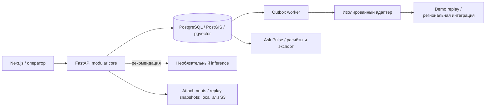

[Русский](README.md) · [English](README.en.md) · [Қазақша](README.kk.md)

# Pulse 109

> От отдельных обращений — к целостной картине городской проблемы.

Интеллектуальный слой для служб 109: связывает обращения в городские инциденты, помогает оператору принять решение и даёт руководителю проверяемую аналитику.

[Открыть демо](https://baash.govtech-kz.com/demo) · [Лендинг](https://baash.govtech-kz.com/) · [Golden Demo](docs/GOLDEN_DEMO.md) · [Архитектура](docs/architecture/README.md)


**Команда:** baash · **Проект:** Pulse 109 · **Трек:** Gov cases · **Кейс:** Case 2 — интеллектуальная платформа работы с обращениями граждан 109.

### Публичный стенд

**[Лендинг](https://baash.govtech-kz.com/)** и **[интерактивное демо](https://baash.govtech-kz.com/demo)** работают одним Next.js-приложением за HTTPS proxy организаторов. В основе — FastAPI, PostgreSQL, миграции, аудит, outbox и worker. Golden World — синтетический городской мир ALA; внешнюю доставку воспроизводит replay adapter. PostgreSQL доступен внутри стека. Параметры и проверки стенда — в [deployment runbook](infra/runbooks/PUBLIC_DEPLOYMENT.md).

## Задача

Кейс 109 объединяет **Smart Intake и маршрутизацию**, **помощника оператора** и **ситуационный центр**: работа на RU/KK, похожие обращения, обнаружение всплесков, прогноз нагрузки и вопросы к данным обычным языком.

Разные сообщения о воде, дороге или освещении могут описывать одну городскую проблему. Раздельные очереди скрывают связь между ними. Pulse 109 помогает увидеть общий сигнал и организовать работу служб, сохраняя самостоятельную обработку каждого обращения.

## Что мы построили

- **Smart Intake и очередь оператора:** адаптивные вопросы, поиск похожих открытых проблем, подсказка темы/службы и подтверждение маршрута человеком.
- **Emerging Issues Radar:** группы сообщений по месту, времени и теме, карта MapLibre/OSM и проверка кластера оператором.
- **Incident War Room:** общий штаб проблемы — состав, история, владение, доказательства и подтверждаемые merge/split.
- **Next Best Action и Outcome Memory:** рекомендации с кодами причин и сопоставимые подтверждённые исходы.
- **Operations Center и Data Lab:** нагрузка, лента внимания, качество данных, передачи и переход от показателя к исходным обращениям.
- **Ask Pulse:** RU/KK вопросы, расчёты в PostgreSQL, графики, происхождение данных, drill-down, PDF/XLSX и прогноз.
- **Надёжная платформа:** сохраняемые решения, аудит, идемпотентность, outbox, worker и адаптеры; ручной путь работает при отказе ML.

**ИИ предлагает — человек подтверждает.** Обращение сохраняет собственный ID, историю и индивидуальные обязательства. Инцидент связывает несколько обращений в общий контекст для координации служб.

## Как решение эволюционировало за GovTech Camp

1. **Проверили исходные данные.** Начали с классификации, маршрутизации и помощника оператора. Аудит семи предоставленных региональных выгрузок показал разные справочники и отсутствие исходного дооператорского текста. Это определило следующий шаг: единый слой данных и отдельная оценка ML-кандидатов.
2. **Построили проверяемую основу.** Канонический ingest сохраняет происхождение, качество времени и карантин. Routing/retrieval/forecast эксперименты помогли учесть различия регионов и исключить использование полей, появляющихся после решения оператора.
3. **Расширили фокус до городской ситуации.** Вместо изолированной обработки тикетов появились Radar, Incident и War Room. Ownership, подтверждение решений и контроль передачи связали обнаружение проблемы с её исполнением; Outcome Memory, Replay Lab и Data Lab добавили обратную связь.
4. **Сделали продукт исследуемым.** Ask Pulse, новый интерфейс, карта, Golden World со 120 днями истории и публичный VPS превратили API в сквозной демонстрационный сценарий. Финальный этап — стабилизация, проверка и подготовка защиты.

Причины решений и коммиты: [история разработки](docs/DEVELOPMENT_HISTORY.md) · [журнал Camp](docs/PROJECT_JOURNAL.md) · [Decision Log](docs/DECISION_LOG.md).

## Команда и работа по неделям

| Период                          | Что делали                                                                         | Основные участники           | Результат                                               |
| ------------------------------- | ---------------------------------------------------------------------------------- | ---------------------------- | ------------------------------------------------------- |
| Неделя 1, до 12 сентября        | Разбор кейса, аудит источников и выбор направления                                 | Команда                      | Картина данных и план решения                           |
| Неделя 2, 12–18 сентября        | Контракты, первые workflow, канонический ingest, routing/retrieval/forecast        | Baktiyar, Arsen              | Исполняемая основа и исследовательские отчёты           |
| Неделя 3, 19–25 сентября        | Сквозной сценарий, PostgreSQL, outbox, ownership, Decision Gateway, closure/replay | Arsen, Baktiyar              | Ручной путь, сохраняющий решения и доставку при отказах |
| Неделя 4, 26 сентября–1 октября | Incident, Radar, Ask Pulse, UI, storage, Golden Demo, VPS и документация           | Baktiyar, Arsen, Shyngyskhan | Публичный стенд и маршрут показа                        |

| Участник                                 | Основной вклад                                                                                                                     |
| ---------------------------------------- | ---------------------------------------------------------------------------------------------------------------------------------- |
| **Januzak Aspandiyar (@aspaAI)**         | Капитан, архитектура и защита — по командному журналу                                                                              |
| **Arsen Baktygaliev (@Arseniiiii-ai)**   | Региональные данные, routing/retrieval/forecast исследования, Radar/Operations, городской мир, deployment overlays и CI/demo fixes |
| **Baktiyar Ablaikhan (@sronters)**       | Durable workflows, governance, ownership/Decision Gateway, Incident, Ask Pulse, UI/UX, Golden Demo, карты и VPS deployment         |
| **Sagyt Shyngyskhan (@Shyngyskhan-333)** | Replay/War Room/storage, Hex UI и итоговые документы для жюри                                                                      |

Периоды и роли сведены по командному журналу и истории проекта; подробный вклад и источники — в [PROJECT_JOURNAL](docs/PROJECT_JOURNAL.md).

## Что работает сейчас

| Возможность                  | Сейчас                                                                | Где проверить                                                                        |
| ---------------------------- | --------------------------------------------------------------------- | ------------------------------------------------------------------------------------ |
| Публичный сайт               | Лендинг и интерактивное HTTPS-демо                                    | [Лендинг](https://baash.govtech-kz.com/) → [демо](https://baash.govtech-kz.com/demo) |
| Smart Intake и маршрутизация | Приём, похожие проблемы, рекомендация и ручное решение                | Приём → очередь → решение                                                            |
| Radar и карта                | Пространственно-временные группы с учётом темы; кластер → Incident    | Operations → Radar → кластер                                                         |
| War Room                     | История, состав, ownership, Next Best Action и Outcome Memory         | Инциденты → War Room                                                                 |
| Ask Pulse                    | RU/KK вопросы, расчёты, графики, исходные записи, PDF/XLSX            | Operations → Ask Pulse                                                               |
| Прогноз 30/60/90 дней        | Прозрачный seasonal-naive baseline на 120 днях истории                | Ask Pulse → прогноз на 1/2/3 месяца                                                  |
| Data Lab и Replay Lab        | Качество и drill-down; сохранённые отчёты и сводное сравнение политик | Data Lab / Replay Lab                                                                |
| Платформа                    | PostgreSQL, audit, outbox, worker, адаптеры и ручной fallback         | Timeline, health, [архитектура](docs/architecture/README.md)                         |

Полная матрица возможностей — [FEATURE_STATUS](docs/FEATURE_STATUS.md); текущие результаты проверок — [DEVELOPMENT](docs/DEVELOPMENT.md).

## Почему Pulse 109: «ловушка классификатора»

Одна проблема водоснабжения может проявляться разными словами:

- _«Вода мутная и пахнет ржавчиной»_;
- _«Слабый напор на пятом этаже»_;
- _«После ремонта возле дома пропала вода»_;
- _«Разрыли асфальт рядом с колонкой»_.

Классификация помогает распределить сообщения, но разные темы и очереди могут скрыть их связь. **Правильно направить каждый тикет ещё недостаточно, чтобы увидеть общую городскую ситуацию.**

Pulse 109 добавляет следующий уровень: **Radar** сопоставляет место, время и тему → оператор проверяет кластер на карте → создаёт **Incident War Room** → координирует действия служб. Связь сообщений остаётся гипотезой для проверки человеком; история каждого обращения сохраняется.

### Продуктовые доказательства для жюри

| Критерий                 | Ответ Pulse 109                                      | Где видно                                   |
| ------------------------ | ---------------------------------------------------- | ------------------------------------------- |
| Государственная ценность | Общая картина проблемы и координация служб           | Radar, War Room, отдельные ID обращений     |
| Инновационность и ИИ     | Объяснимые подсказки и аналитика RU/KK               | Ask Pulse, Next Best Action, Outcome Memory |
| Инженерная зрелость      | Модульный core, PostgreSQL, идемпотентность и outbox | Контракты, container-smoke, restore drill   |
| Доверие и контроль       | Человеческое подтверждение и ручной путь без ML      | Decision Gateway, audit, fallback           |
| Воспроизводимость        | Golden World, API walkthrough и публичный HTTPS      | Golden Demo, CI, deployment runbook         |

## Golden Demo: один путь за 4–5 минут

```text
Сигнал гражданина RU/KK
        ↓
Smart Intake: вопросы + похожие открытые проблемы
        ↓
Radar: группа сообщений на карте
        ↓
Incident War Room: общий контекст + Next Best Action
        ↓
Действие оператора → outbox → worker → adapter
        ↓
Ask Pulse: вопрос → расчёт → исходные записи → PDF/XLSX
```

1. **Подать сигнал о качестве воды:** заполнить пример в помощнике ведущего, показать похожие проблемы, отправить обращение вручную.
2. **Открыть Radar:** запустить scan, изучить карту и сообщения подготовленного водного кластера.
3. **Создать Incident:** перейти в War Room, показать историю, координатора, Outcome Memory и Next Best Action.
4. **Подтвердить действие:** назначить обращение в очереди и показать сохраняемую доставку через outbox/worker.
5. **Спросить Ask Pulse:** «Покажи обращения за последние 7 дней в Алматы» → число, график, «Как рассчитано», исходные записи и экспорт.

[Полный сценарий](docs/GOLDEN_DEMO.md) · [Инструкция ведущего](docs/DEMO_RUNBOOK.md) · [Запись демо](docs/DEMO_RECORDING_SCRIPT.md). Перед показом подготовьте актуальное временное окно Golden World по runbook.

[Очередь оператора](docs/screenshots/operator-queue.png) · [Реестр инцидентов](docs/screenshots/incidents-list.png) · [Data Lab](docs/screenshots/data-lab.png) · [Replay Lab](docs/screenshots/replay-lab.png).

## Архитектура и надёжность



- **Встраивается в существующие процессы:** региональные системы подключаются через адаптеры и стабильные [контракты](contracts/README.md).
- **Сохраняет решения и поручения:** transactional outbox, `FOR UPDATE SKIP LOCKED`, повторные попытки и идемпотентные команды.
- **Работает без ML:** приём, ручная маршрутизация, статусы и аудит продолжают выполняться при отказе inference.
- **Даёт проверяемые числа:** Ask Pulse использует разрешённые аналитические запросы, расчёты ядра и ссылки на исходные записи.

Подробные схемы и границы доступа — в [архитектуре](docs/architecture/README.md).

## Проверка и запуск

Для полного локального контура нужны Docker с Linux engine, Python 3.10–3.13, `uv` и Node.js/pnpm:

```sh
uv sync --all-groups --frozen
pnpm install --frozen-lockfile
uv run python scripts/demo_runtime.py prepare
```

`prepare` пересоздаёт только локальный проект `pulse109-demo`, применяет миграции, наполняет и проверяет Golden World. Успех — `PULSE 109 DEMO READY`. Откройте [http://localhost:3000/demo](http://localhost:3000/demo). На Windows: `.\demo.ps1 prepare`. Публичный VPS обслуживается по отдельному [runbook](infra/runbooks/PUBLIC_DEPLOYMENT.md).

```sh
make lint typecheck test contract-test e2e build
```

PostgreSQL integration запускается через [изолированный runner](docs/DEVELOPMENT.md) с `PULSE109_TEST_DATABASE_URL`. Текущие CI-прогоны и результаты собраны в [разделе проверки](docs/DEVELOPMENT.md) и [GitHub Actions](https://github.com/BAITC-Hacks/hack-803e2c8f-baash/actions).

**Для формы GovTech Camp — baash / Pulse 109:**

> Pulse 109 — интеллектуальный слой для служб 109, который связывает разрозненные обращения в городские инциденты, помогает оператору принять решение и даёт руководителю проверяемую аналитику.

## Границы текущего стенда

| Область               | Текущий контур и следующий этап пилота                                                                                                                                                                                                                                                                                                               |
| --------------------- | ---------------------------------------------------------------------------------------------------------------------------------------------------------------------------------------------------------------------------------------------------------------------------------------------------------------------------------------------------- |
| Данные и интеграция   | Демо использует синтетический Golden World ALA и replay adapter. Канонический слой построен на семи предоставленных региональных выгрузках; остальные регионы и конкретная CRM подключаются через адаптеры после предоставления данных/API.                                                                                                          |
| Модели и прогноз      | Runtime использует детерминированный lexical fallback и seasonal-naive прогноз. Fine-tuned кандидаты — отдельный research track до появления разрешённого дооператорского корпуса и таксономии. Каталог демо: четыре routing-темы и пять фоновых семейств; валидация 10 тем, 20 регионов и качества моделей на реальных обращениях — следующий этап. |
| Replay и эксплуатация | Replay Lab сравнивает политики на уровне отчёта; трасса отдельных решений пока не записывается. S3 подключён конфигурацией, VPS использует локальные тома. Production identity, правовые основания, retention и рабочий scanner требуют согласования для пилота; текущий scanner — mock.                                                             |

[Текущий статус](docs/FEATURE_STATUS.md) · [Исследования и соответствие кейсу](docs/review/COMPETITION_AUDIT_2026-09-29.md) · [Внешние зависимости](DECISIONS_AND_BLOCKERS.md) · [Индекс документации](docs/README.md).
