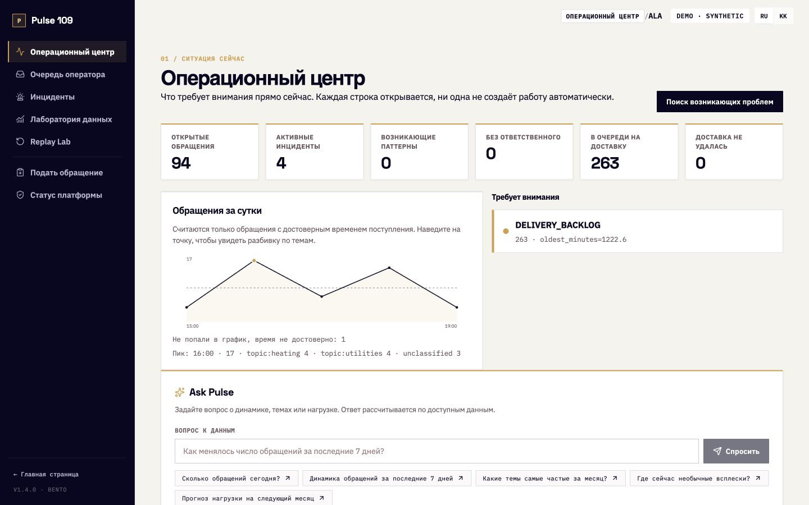
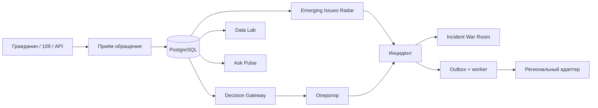

# Pulse 109

> Платформа для работы с обращениями граждан: от отдельного сигнала до выявления городской проблемы, координации служб и проверяемой аналитики.

[English version](README.en.md) · [Открыть локальное демо](http://localhost:3000/demo) · [Golden Demo](docs/GOLDEN_DEMO.md) · [Архитектура](docs/architecture/README.md)



Pulse 109 работает рядом с действующими региональными системами 109. Каждое обращение сохраняет собственный идентификатор, историю и срок исполнения, даже если оператор связывает его с инцидентом. Маршрутизация и обработка обращения продолжают работать при недоступности ML.

## Что решает продукт

Несколько граждан могут сообщать об одной городской проблеме разными словами и через разные каналы. При обработке каждого обращения по отдельности общий паттерн легко упустить. Pulse 109 связывает три задачи целевого кейса:

| Модуль                 | Помощь оператору и руководителю                                                                                                       |
| ---------------------- | ------------------------------------------------------------------------------------------------------------------------------------- |
| **Smart Intake**       | Принимает обращение, подсказывает тему, службу и приоритет. Рекомендация остаётся советом; решение сохраняет оператор.                |
| **Operator Assistant** | Показывает кандидатов на похожие обращения, возможные дубликаты, историю подтверждённых исходов и следующий шаг с обоснованием.       |
| **Situation Center**   | Показывает операционную картину, обнаруживает группы близких обращений и даёт проверяемые ответы на вопросы к данным через Ask Pulse. |

## Golden Demo: одна история от обращения до решения

1. Выполните `prepare`, откройте [демо](http://localhost:3000/demo) и покажите заполненный поток обращений. В [помощнике ведущего](http://localhost:3000/demo?presenter=1) есть пресет «качество воды»: он заполняет вымышленное обращение, а отправку оставляет человеку. До отправки видны кандидаты на похожие проблемы; автоматического объединения нет.
2. В **Операционном центре** запустите Radar. Шесть близких сообщений о воде уже составляют свежий кластер; после отправки пресета их станет семь. Откройте карту, временную динамику и признаки связи.
3. Создайте инцидент из кластера. В **Incident War Room** покажите участников, ответственность и **Next Best Action** с кодами причин. Человек подтверждает связь и дальнейшие действия.
4. В очереди откройте обращение, запросите рекомендацию по маршруту и сохраните ручное решение. Покажите его идентификатор, историю и доставку назначения через worker.
5. В **Ask Pulse** спросите о динамике обращений за семь дней в Алматы. Покажите число, график, покрытие источников и «Как рассчитано», затем откройте обращения за цифрой и скачайте PDF или Excel. Прогноз на 1–3 месяца доступен в подготовленном мире на синтетической истории.

Для короткого показа начните с уже заполненного мира и шагов 2, 3 и 5. Подробный маршрут, действия ведущего и границы демонстрации — в [Golden Demo](docs/GOLDEN_DEMO.md). Числа зависят от состояния базы; статистика реальных регионов не подразумевается.

## Соответствие целевому кейсу

| Задача                           | Что доступно сейчас                                                                                                                                                                                      |
| -------------------------------- | -------------------------------------------------------------------------------------------------------------------------------------------------------------------------------------------------------- |
| Приём и классификация            | Адаптивный приём и рекомендация по теме/службе; работающий CPU lexical fallback. Финальная модель на тексте граждан не валидирована.                                                                     |
| Русский и казахский              | Интерфейс приёма и вопросы Ask Pulse на RU/KK.                                                                                                                                                           |
| Ответственная служба и приоритет | Подсказка, Decision Gateway и ручное подтверждение; утверждённые справочник и SLA ожидаются.                                                                                                             |
| Похожие обращения и дубликаты    | Кандидаты до подачи обращения и управление участниками инцидента с подтверждением человека.                                                                                                              |
| Предыдущие решения               | Outcome Memory по проверенным исходам; в демо этот корпус синтетический.                                                                                                                                 |
| Операционная картина и всплески  | Operations Center и Emerging Issues Radar по географии, времени и таксономии. Семантический сигнал ждёт исходный текст обращений.                                                                        |
| Прогноз на 1–3 месяца            | Сезонный базовый прогноз в Ask Pulse при достаточной непрерывной истории; `prepare` создаёт 120 синтетических дней для показа горизонтов 30/60/90 дней. Это не валидированный прогноз реальной нагрузки. |
| Вопросы к данным                 | Ask Pulse: управляемые запросы, числа, графики, происхождение расчёта и переход к исходным обращениям.                                                                                                   |
| PDF и Excel                      | Экспорт подписанного среза показанного результата при разрешённой цели экспорта.                                                                                                                         |
| Тематическое покрытие            | В текущем демо пять семейств тем для городского фона и четыре синтетические темы маршрутизации. Порог ТЗ «не менее десяти» ещё не подтверждён.                                                           |

Актуальный статус каждой возможности и внешние зависимости — в [матрице функций](docs/FEATURE_STATUS.md).

## Ключевые возможности

- **[Operations Center](docs/features/OPERATIONS_CENTER.md)** — обращения, инциденты и сигналы, которые требуют внимания сейчас.
- **[Emerging Issues Radar](docs/features/EMERGING_ISSUES.md)** — группы обращений, близких по месту, времени и теме. Radar показывает паттерн, а не устанавливает причину.
- **[Incident War Room](docs/features/INCIDENT_WAR_ROOM.md)** — единое рабочее место по городской проблеме с обращениями, историей, ответственностью и следующими действиями.
- **[Next Best Action](docs/features/NEXT_BEST_ACTION.md)** — предложения с причинами и проверяемыми основаниями.
- **[Outcome Memory](docs/features/OUTCOME_MEMORY.md)** — поиск подтверждённых похожих исходов.
- **[Ask Pulse](docs/features/ASK_PULSE.md)** — вопросы на русском и казахском, вычисленные PostgreSQL ответы, графики, покрытие, переход к записям и экспорт. Языковой компонент не пишет SQL и не рассчитывает итоговые числа.
- **[Data Lab](docs/features/DATA_LAB.md)** — качество данных и операционная аналитика с переходом от показателя к обращениям.
- **[Replay Lab](docs/features/REPLAY_LAB.md)** — проверка изменений политики на одобренной истории до применения; в демо синтетические записи исключены из оценки качества модели.

Каждая алгоритмическая возможность сообщает состояние `available`, `abstained` или `unavailable` с причиной. Оператор видит разницу между «ничего не найдено» и «расчёт не выполнялся».

## AI предлагает. Человек подтверждает.

Система может предложить тему, службу, приоритет, похожее обращение, участника инцидента и следующий шаг. Маршрутизацию, изменение приоритета, связывание обращений и операционные действия подтверждает человек. При недоступности ML сохраняются приём обращения, ручной маршрут, смена статуса и аудит.

## Как устроена платформа



Ядро — модульное FastAPI-приложение. Веб, API, worker, inference и адаптеры запускаются отдельно; PostgreSQL остаётся источником истины. Подробные схемы — в [архитектуре](docs/architecture/README.md), стабильные границы — в [контрактах](contracts/).

## Демо-режим

Для записи демо можно выбрать автономную симуляцию без Docker или профиль на PostgreSQL. В обоих случаях обращения, личности и внешние ответы синтетические; демо не подтверждает качество моделей на реальных данных.

## Быстрый запуск без Docker

Из корня репозитория выполните:

```bash
pnpm install
pnpm demo:mock
```

Откройте [локальное демо](http://localhost:3000/demo). Этот маршрут запускает только веб-приложение: API-ответы, обращения, аналитика и действия оператора работают на локальных моках в памяти процесса. Внешняя доставка не выполняется. Закройте процесс через `Ctrl+C`; подробности — в [инструкции автономного демо](docs/MOCK_DEMO.md).

## Демо на PostgreSQL

В этом профиле используются реальные FastAPI, PostgreSQL, миграции, транзакции, аудит, incident workflow, transactional outbox, worker и аналитика. Внешнюю муниципальную CRM заменяет детерминированный replay adapter.

## Запуск PostgreSQL-профиля

Нужны Docker с работающим Linux engine, Python 3.10–3.13, `uv` и свободные порты 3000, 5432, 8080–8084. Выполняйте из корня репозитория:

```bash
uv sync --all-groups --frozen
uv run python scripts/demo_runtime.py prepare
```

Команда поднимет отдельный demo-проект, пройдёт полный API-сценарий, создаст чистый мир и проверит Radar, Ask Pulse, прогнозы и экспорт. Готовность подтверждает строка `PULSE 109 DEMO READY`. Откройте [главную страницу](http://localhost:3000) или [рабочее демо](http://localhost:3000/demo). В Windows доступна команда `.\demo.ps1 prepare` из PowerShell.

```bash
uv run python scripts/demo_runtime.py verify  # базовая проверка пути через API
uv run python scripts/demo_runtime.py reset   # удаляет только тома проекта pulse109-demo
```

После `reset` снова выполните `prepare`. Подробности и путь по интерфейсу — в [runbook](docs/DEMO_RUNBOOK.md).

## Технологии и проверка

Next.js · React · TypeScript · FastAPI · Python · PostgreSQL · PostGIS · pgvector · Docker Compose · transactional outbox · audit trail · CPU fallback.

```bash
make lint typecheck test contract-test e2e
uv run python scripts/demo_runtime.py prepare
```

Для PostgreSQL integration tests нужен `PULSE109_TEST_DATABASE_URL`; пропуск этих тестов не равен успешному прохождению. Команды, изолированный test runner и сведения о CI — в [инструкции для разработчиков](docs/DEVELOPMENT.md).

## Структура репозитория

| Путь                                    | Назначение                                            |
| --------------------------------------- | ----------------------------------------------------- |
| `apps/web`                              | Интерфейс оператора и приём обращения                 |
| `services/core`                         | FastAPI, бизнес-модули, репозитории и миграции        |
| `services/worker`, `services/inference` | Доставка из outbox и необязательный inference-процесс |
| `adapters`                              | Изолированные региональные адаптеры и SDK             |
| `analytics`, `ml`                       | Исследование данных и протокол сравнения моделей      |
| `contracts`                             | OpenAPI, схемы, события и архитектурные решения       |
| `infra/compose`, `scripts`, `tests`     | Запуск, проверка и тесты                              |
| `docs`                                  | Продуктовая и техническая документация                |

## Текущие границы

Демо не является внедрением в акимате. Для производственной интеграции нужны региональный API и доступы, провайдер идентификации, утверждённые таксономия и SLA, правовые основания и сроки хранения, одобренные данные и валидация моделей. Эти решения остаются за заказчиком и организаторами; список — в [DECISIONS_AND_BLOCKERS.md](DECISIONS_AND_BLOCKERS.md). Точный статус функций, включая частично готовые, — в [docs/FEATURE_STATUS.md](docs/FEATURE_STATUS.md).

## Документация

[Индекс](docs/README.md) · [Golden Demo](docs/GOLDEN_DEMO.md) · [Runbook](docs/DEMO_RUNBOOK.md) · [Архитектура](docs/architecture/README.md) · [Контракты](contracts/) · [ML research](docs/ml/README.md)
