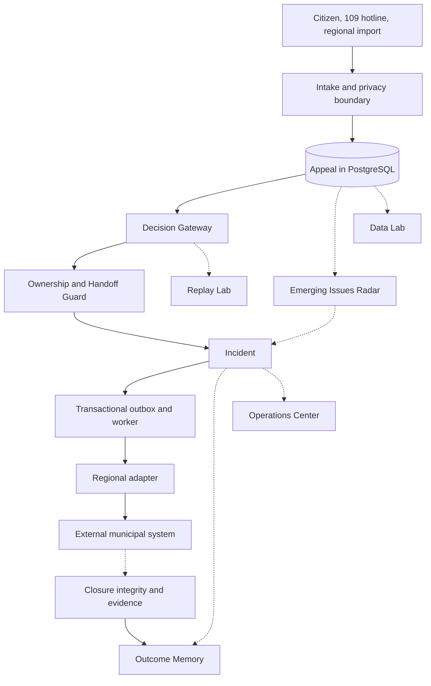

# Pulse 109

Pulse 109 turns scattered citizen appeals into detected city problems,
coordinates who resolves them, verifies the result and learns from confirmed
outcomes.

## Why it exists

A 109 hotline routes against a taxonomy that already exists. A city problem can
appear before a category for it does. Six people report that the water smells
odd, tastes metallic and looks cloudy after repairs, a classifier scatters them
across four categories, and nobody sees that they are one thing.

Pulse 109 sits beside the existing regional systems rather than replacing them.
An accepted appeal keeps its own identifier, timeline and version even when it
joins an incident. Routing, priority, incident membership and closure stay human
decisions.

## The product flow

```
Citizen signals
      ↓
DETECT      Emerging Issues Radar, Data Lab anomalies
      ↓
UNDERSTAND  Incident War Room, Data Lab
      ↓
DECIDE      Ownership, Next Best Action, human confirmation
      ↓
ACT         Transactional outbox, worker, regional adapter
      ↓
VERIFY      Closure integrity, evidence, recurrence
      ↓
LEARN       Outcome Memory, Replay Lab
```

## Architecture



Detailed diagrams live in the [architecture notes](docs/architecture/README.md).

## Flagship capabilities

| Capability                                                | What it does                                                                      |
| --------------------------------------------------------- | --------------------------------------------------------------------------------- |
| [Emerging Issues Radar](docs/features/EMERGING_ISSUES.md) | Groups reports that arrive close in space and time and fit the taxonomy poorly    |
| [Incident War Room](docs/features/INCIDENT_WAR_ROOM.md)   | One incident as one city problem, assembled in a single read                      |
| [Next Best Action](docs/features/NEXT_BEST_ACTION.md)     | Evidence-backed suggestions with the reason codes that produced them              |
| [Outcome Memory](docs/features/OUTCOME_MEMORY.md)         | What was actually done about comparable problems, human-confirmed closures only   |
| [Operations Center](docs/features/OPERATIONS_CENTER.md)   | Where the city needs attention now, every row opening the thing it describes      |
| [Replay Lab](docs/features/REPLAY_LAB.md)                 | Test a routing change against approved history before it ships                    |
| [Data Lab](docs/features/DATA_LAB.md)                     | Reproducible exploration and live analytics that drill down to individual appeals |

Each capability reports one of three states: `available`, `abstained` or
`unavailable`, with a controlled reason code. An operator can always tell
"nothing found" from "nothing ran".

## What is real and what is synthetic

| Real                                         | Synthetic in the demo                   |
| -------------------------------------------- | --------------------------------------- |
| FastAPI business logic and validation        | The municipal records themselves        |
| PostgreSQL schema, migrations, transactions  | Coordinates placed on the map           |
| Transactional outbox, worker leases, retries | The external system that receives them  |
| Audit trail, provenance, idempotency         | The service catalog and intake policies |
| Incident merge, split, membership decisions  | Historical outcomes                     |
| Closure integrity and evidence checks        |                                         |

The malware scanner is a mock and must never be described as production
antivirus. No model quality number in this repository is validated.

## Quick start

Requires Docker with a working Linux engine, Python 3.10 to 3.13, `uv`, and free
ports 3000, 5432 and 8080 to 8084.

```bash
uv sync --all-groups --frozen
uv run python scripts/demo_runtime.py up
```

Open **http://localhost:3000**. The command applies migrations, loads the
synthetic catalog and builds a deterministic city of roughly 130 appeals through
the same endpoints an operator uses. On Windows use `.\demo.ps1 up`.

```bash
uv run python scripts/demo_runtime.py verify   # checks, end-to-end flow, then reseeds
uv run python scripts/demo_runtime.py reset    # removes only the demo volumes
```

### The 60 second walkthrough

1. **Operations center** opens first. Press **Run scan**.
2. An emerging pattern appears. Open it: the reports on a map, how the arrivals
   built up, the signals that linked them.
3. **Create an incident** from the cluster. The war room opens.
4. Read one suggestion with its reason codes, then confirm the assignment.
5. Watch the outbox deliver, attach evidence, close with verification.
6. **Data lab**: press any figure to reach the appeals behind it.

The full path is in the [demo runbook](docs/DEMO_RUNBOOK.md).

## Repository map

| Path                                    | Responsibility                                                        |
| --------------------------------------- | --------------------------------------------------------------------- |
| `apps/web`                              | Next.js operator workspace and citizen intake                         |
| `services/core`                         | FastAPI business modules, PostgreSQL repositories, Alembic migrations |
| `services/worker`, `services/inference` | Outbox delivery and the optional inference process                    |
| `adapters`                              | Replay and Open311 implementations, and the adapter SDK               |
| `analytics`                             | Reproducible offline exploration of approved canonical datasets       |
| `ml`                                    | Candidate evaluation harness and offline comparison protocol          |
| `contracts`                             | OpenAPI, canonical schemas, event catalog, ADRs                       |
| `data`                                  | Schemas, manifests and synthetic fixtures. Never real records         |
| `infra/compose`, `scripts`              | Runtime topology, demo commands, verification and release tooling     |
| `docs`                                  | Product, capability, architecture and status documentation            |
| `tests`                                 | Contract, integration and end-to-end suites                           |

## Engineering

FastAPI · Next.js · PostgreSQL with PostGIS and pgvector · Alembic forward-only
migrations · Docker Compose · transactional outbox with `FOR UPDATE SKIP LOCKED`
· idempotency keys · append-only audit and provenance · human-in-the-loop
decision model · Ed25519 signed configuration bundles.

## Verification

```bash
make lint typecheck test contract-test e2e
make eda                                       # reproducible exploration report
uv run python scripts/demo_runtime.py verify   # the demo, end to end
```

PostgreSQL integration tests need `PULSE109_TEST_DATABASE_URL`. Without it
pytest reports them as skipped, which is not the same as passing. Run them with
the isolated runner; it creates, migrates and removes a UUID-named database for
each pass, without modifying the configured base or demo database:

```bash
PULSE109_TEST_DATABASE_URL=postgresql://<role>:<password>@<host>:5432/<any-existing-db> \
  uv run python scripts/run_integration_tests.py --runs 2
```

The database role must be allowed to create and drop the runner's own isolated
databases. CI runs two passes as a second-run regression check. CI runs four
jobs: quality, a containerised smoke with a restore drill, a demo profile smoke
and a supply chain audit.

**CI status note.** If you are reading this on the BAITC-Hacks mirror, its
Actions checks show red. The jobs never start there: GitHub reports
`The job was not started because your account is locked due to a billing issue`,
which is an organization billing lock, not a failure of this code. The same four
jobs pass on the development repository, for example
[this run](https://github.com/Arseniiiii-ai/baash-109-pulse/actions/runs/36299408363).

## Current state and limitations

The [feature matrix](docs/FEATURE_STATUS.md) is the authority on what is
implemented, what is partial and what is blocked. In short:

- No live regional integration. Delivery goes to a deterministic replay adapter.
- No production identity provider. The demo actor is labelled as development.
- No approved taxonomy or SLA, so intake policies in the demo are synthetic.
- No object storage integration. Attachments live in a local volume.
- Not deployed. Local Docker Compose only.
- Replay Lab has an inspection-only report list and policy-level metric diff.
  It has no per-case decision trace because the persisted report does not retain
  per-case outputs, confidence, reason codes, status or action.

The ten external blockers are recorded in
[DECISIONS_AND_BLOCKERS.md](DECISIONS_AND_BLOCKERS.md). They belong to the
customer and the organizers. Writing a plausible value for any of them would
turn an honest gap into a false claim.

## Documentation

[Index](docs/README.md) · [Capabilities](docs/features/README.md) ·
[Demo runbook](docs/DEMO_RUNBOOK.md) · [Feature status](docs/FEATURE_STATUS.md) ·
[Architecture](docs/architecture/README.md) ·
[Decision log](docs/DECISION_LOG.md) ·
[Development history](docs/DEVELOPMENT_HISTORY.md) ·
[ML research](docs/ml/README.md) ·
[Questions for organizers](docs/GOVTECH_BUSINESS_QUESTIONS.md)
