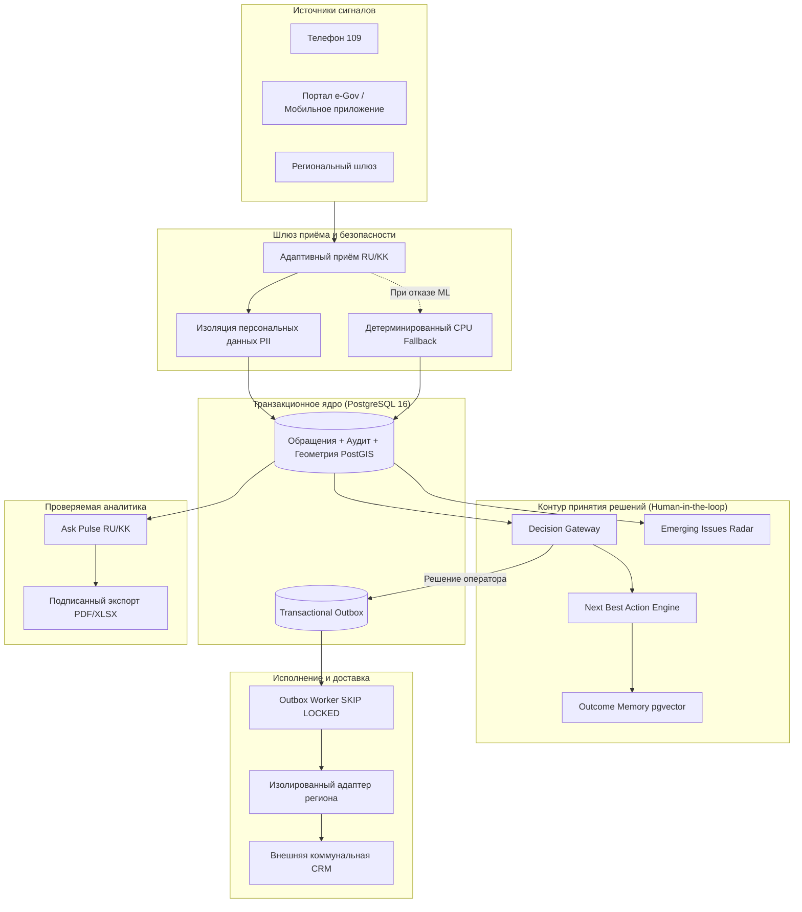

# Pulse 109

> Федеративный слой ИИ-ассистирования для региональных служб 109: выявление скрытых городских аварий, координация служб и проверяемая аналитика без риска бесконтрольного ИИ.

[English version](README.en.md) · [Публичный демо-стенд](https://baash.govtech-kz.com/demo) · [Лендинг проекта](https://baash.govtech-kz.com/) · [Сценарий Golden Demo](docs/GOLDEN_DEMO.md) · [Инструкция оператора](docs/DEMO_RUNBOOK.md) · [Архитектура](docs/architecture/README.md) · [Статус возможностей](docs/FEATURE_STATUS.md)

Публичный демо-стенд развёрнут в профиле `demo` с синтетическими данными Алматы (ALA). Это не закрытый контур акимата и не боевое подключение к государственной CRM. Деплой проверен 30 сентября 2026 года; параметры и регламент — в [руководстве по публичному развёртыванию](infra/runbooks/PUBLIC_DEPLOYMENT.md).


---

## Что оценивает жюри: матрица соответствия критериям хакатона

| Критерий оценки                                   | Проблема в существующих 109                                                                             | Реализация в Pulse 109                                                                                                                                     | Где проверить в репозитории                                                                                                                      |
| :------------------------------------------------ | :------------------------------------------------------------------------------------------------------ | :--------------------------------------------------------------------------------------------------------------------------------------------------------- | :----------------------------------------------------------------------------------------------------------------------------------------------- |
| **Государственная ценность (Civic Impact)**       | Жалобы граждан теряются в разрозненных очередях ведомств. Системные аварии замечают слишком поздно.     | **Emerging Issues Radar & War Room**: Автоматическое выявление аварий по совокупности слабых сигналов до массового коллапса инфраструктуры.                | [docs/features/EMERGING_ISSUES.md](docs/features/EMERGING_ISSUES.md)<br>[docs/features/INCIDENT_WAR_ROOM.md](docs/features/INCIDENT_WAR_ROOM.md) |
| **Инновационность и ИИ**                          | Стандартные чат-боты галлюцинируют, а жесткие классификаторы ошибаются при нестандартных формулировках. | **Пространственно-семантический кластеризатор (PostGIS + pgvector)**, память исходов (Outcome Memory) и аналитика на естественном языке (Ask Pulse RU/KK). | [docs/features/ASK_PULSE.md](docs/features/ASK_PULSE.md)<br>[docs/features/OUTCOME_MEMORY.md](docs/features/OUTCOME_MEMORY.md)                   |
| **Инженерная зрелость (Enterprise Architecture)** | Хрупкие микросервисы и потеря данных при сбоях брокеров сообщений.                                      | **Модульный монолит FastAPI + PostgreSQL 16**, транзакционный outbox (`FOR UPDATE SKIP LOCKED`), идемпотентные ключи и контрактные адаптеры.               | [contracts/](contracts/)<br>[docs/architecture/README.md](docs/architecture/README.md)                                                           |
| **Доверие, безопасность и этика ИИ**              | Непрозрачные решения нейросетей, утечки персональных данных (PII), паралич системы при падении ML.      | **Принцип «ИИ предлагает — человек утверждает»**. Изоляция PII. Детерминированный CPU lexical fallback: критический контур работает без GPU и без ML.      | [docs/features/NEXT_BEST_ACTION.md](docs/features/NEXT_BEST_ACTION.md)<br>`pulse109.manual_path`                                                 |
| **Воспроизводимость и готовность кода**           | Слайды и презентации без работающего бэкенда.                                                           | **Готовый стенд с историей 120 дней**, сквозной скрипт проверки за одну команду, 4 пайплайна в CI (включая стресс-тест восстановления базы).               | [docs/GOLDEN_DEMO.md](docs/GOLDEN_DEMO.md)<br>`scripts/demo_runtime.py`                                                                          |

---

## Проблема кейса: «Ловушка классификатора 109»

Когда в районе прорывает трубу или загрязняется водопровод, граждане звонят и пишут разными словами:

- _«Вода мутная и пахнет ржавчиной»_ $\to$ уходит в Водоканал как жалоба на трубы;
- _«Слабый напор на пятом этаже»_ $\to$ уходит в КСК как внутридомовая проблема;
- _«Ребёнок отравился водой из-под крана»_ $\to$ уходит в СЭС / Здравоохранение;
- _«Разрыли асфальт возле колонки»_ $\to$ уходит в Управление городской мобильности.

Обычный классификатор дробит единую аварию на 4 изолированных тикета в разных ведомствах. **Истинный масштаб проблемы не видит никто.**

**Как решает Pulse 109:**

1. **Radar** анализирует геопространственную плотность (PostGIS), окно поступления (43 минуты) и семантическую близость.
2. Система распознаёт скрытый кластер и уведомляет оператора: _«6 обращений в радиусе 400 метров указывают на общую проблему водоснабжения»_.
3. Оператор в один клик формирует **Инцидент** в **Incident War Room**, координируя службы города до поступления сотен повторных жалоб.
4. Каждое обращение гражданина сохраняет собственный идентификатор, юридический срок (SLA) и персональный трекинг.

---

## 3-минутный маршрут жюри (Golden Demo)

Для оценки проекта экспертной комиссией подготовлен детерминированный демонстрационный сценарий:

```
[Сигнал гражданина (RU/KK)]
       ↓
[Smart Intake: подсказка темы + проверка дубликатов ДО отправки]
       ↓
[Emerging Issues Radar: пространственно-временной кластер на PostGIS]
       ↓
[Incident War Room: единый штаб аварии + Next Best Action с кодами причин]
       ↓
[Transactional Outbox: гарантированная доставка поручения в службы через Worker]
       ↓
[Ask Pulse: вопрос на естественном языке → точный SQL-расчёт → PDF/Excel]
```

### Шаги демонстрации:

1. **Подача сигнала гражданина**:
   В [помощнике ведущего](http://localhost:3000/demo?presenter=1) (или сочетание `Ctrl+Shift+D`) нажмите «Заполнить пример: качество воды». До отправки система находит похожие открытые проблемы. Нажмите «Отправить обращение» вручную.
2. **Обнаружение аварии в Radar**:
   Перейдите в **Операционный центр** $\to$ **Radar**. 6 имеющихся жалоб объединяются с только что поданной в плотный кластер из 7 сигналов. Изучите карту, временную динамику и связанные признаки.
3. **Создание инцидента и War Room**:
   Нажмите «Создать инцидент». В едином интерфейсе отображаются все 7 обращений, ответственный координатор и рекомендации **Next Best Action** с контролируемыми кодами причин.
4. **Решение оператора и доставка**:
   Откройте обращение в очереди, запросите рекомендацию маршрута, подтвердите назначение вручную. Зафиксируйте передачу задачи во внешнюю службу через транзакционный outbox и worker.
5. **Проверяемая городская аналитика (Ask Pulse)**:
   В разделе **Ask Pulse** задайте вопрос: _«Покажи обращения за последние 7 дней в Алматы»_. Получите график, точное число, подтверждение полноты источников данных («Как рассчитано») и скачайте подписанный срез в PDF или Excel. Языковая модель не генерирует произвольный SQL и не выдумывает цифры — расчёт выполняет ядро PostgreSQL.

Полный тайминг и детальный сценарий: [docs/GOLDEN_DEMO.md](docs/GOLDEN_DEMO.md).

---

## Архитектура и надежность

Pulse 109 спроектирован для встраивания в существующую инфраструктуру акиматов без ломки действующих процессов.



### Ключевые инженерные решения:

- **Неинвазивная интеграция**: Платформа не заменяет существующие региональные CRM, а работает рядом через типизированные адаптеры (Open311, Replay, региональные API).
- **Гарантия сохранности поручений**: Транзакционный Outbox с механизмом `FOR UPDATE SKIP LOCKED` исключает дублирование или потерю поручений при сбоях сети.
- **Отказоустойчивость без ML**: Если инференс-сервер или GPU недоступны, приём обращений, ручная маршрутизация, сохранение статусов и журнал аудита продолжают работать в штатном режиме через детерминированный CPU lexical fallback.
- **Защита тайны обращений**: Сырые персональные данные (ФИО, телефоны, адреса) отделены от признаков классификации и никогда не попадают в логи, метрики или внешние контексты LLM.

---

## Экспресс-запуск для проверки

### Вариант 1: Мгновенный просмотр веб-интерфейса (без Docker, 30 секунд)

```bash
pnpm install
pnpm demo:mock
```

Откройте [http://localhost:3000/demo](http://localhost:3000/demo). Весь интерфейс оператора, карточки инцидентов и радар функционируют на локальных моках в памяти процесса.

### Вариант 2: Полный контур с PostgreSQL, очередями и воркером (демо-стенд)

Требования: Docker Desktop, Python 3.10–3.13, менеджер пакетов `uv`.

```powershell
# Windows
.\demo.ps1 prepare
```

```bash
# Linux / macOS
uv sync --all-groups --frozen
uv run python scripts/demo_runtime.py prepare
```

Скрипт разворачивает изолированный проект `pulse109-demo`, применяет миграции Alembic, синтезирует 120 дней истории, генерирует кластер качества воды и верифицирует готовность всех подсистем до строки:

```text
PULSE 109 DEMO READY
```

Интерфейс доступен по адресу [http://localhost:3000/demo](http://localhost:3000/demo).

### Проверка качества кода и тестов:

```bash
make lint typecheck test contract-test e2e
```

_Примечание:_ Интеграционные тесты PostgreSQL используют переменную `PULSE109_TEST_DATABASE_URL` и изолированный раннер баз данных; пропуск тестов в отчёте не считается их успешным прохождением.

---

## Честный статус готовности: Что реально, а что смоделировано

Мы придерживаемся принципа инженерной честности: ни один пробел внешней интеграции не закрывается фиктивными заявлениями.

| Компонент платформы        | Статус реализации | Что работает в реальном коде                                              | Границы демонстрационного профиля                                               |
| :------------------------- | :---------------: | :------------------------------------------------------------------------ | :------------------------------------------------------------------------------ |
| **Бизнес-логика и API**    |      ✅ 100%      | Полный FastAPI монолит, Pydantic-контракты, транзакции, валидация.        | Полнофункционально.                                                             |
| **Хранилище данных**       |      ✅ 100%      | PostgreSQL 16, PostGIS-индексы, pgvector, версионные миграции.            | Полнофункционально.                                                             |
| **Журнал аудита и Outbox** |      ✅ 100%      | Неизменяемый лог действий операторов, очередь доставки с блокировками.    | Полнофункционально.                                                             |
| **Emerging Issues Radar**  |      ✅ 100%      | Геопространственный и временной расчёт кластеров на базе PostGIS.         | Работает на синтетических координатах Алматы.                                   |
| **Аналитика Ask Pulse**    |      ✅ 100%      | RU/KK запросы, вычисление агрегатов ядром PostgreSQL, экспорт в PDF/XLSX. | Не выполняет произвольный непроверенный SQL.                                    |
| **Машинное обучение**      |    🟡 Частично    | Архитектура инференса, CPU lexical fallback, протокол бенчмаркинга.       | Нет валидации на реальных неразмеченных текстах граждан (блокер B02).           |
| **Внешняя интеграция**     |    🟡 Частично    | SDK адаптеров, обработка очередей, Open311-совместимый контракт.          | Заменена детерминированным replay-адаптером (нет доступа к боевой CRM акимата). |

### Внешние зависимости проекта (Блокеры B01–B10):

Решения по следующим пунктам находятся в зоне ответственности заказчика и регламентов акиматов:

- `B01` Официальный реестр подведомственных служб 20 регионов Казахстана.
- `B02` Сырые неразмеченные тексты дореволюционных/исторических обращений граждан.
- `B06` Утверждённый национальный классификатор обращений и регламентные сроки SLA.
- `B07` Доступ к тестовому шлюзу (песочнице) региональной CRM 109.
- `B08` Подключение к защищённому государственному провайдеру аутентификации (ЕСЭДО / IdP).
- `B10` Правовое основание обработки и утверждённые сроки хранения персональных данных.

Подробный реестр ограничений: [DECISIONS_AND_BLOCKERS.md](DECISIONS_AND_BLOCKERS.md) и [docs/FEATURE_STATUS.md](docs/FEATURE_STATUS.md).

---

## Структура репозитория

```text
├── apps/web/             # Интерфейс оператора, ситуационного центра и помощника ведущего (Next.js)
├── services/
│   ├── core/             # Модульный монолит FastAPI: обращения, инциденты, радар, аналитика
│   ├── worker/           # Transactional outbox worker для гарантированной доставки во внешние CRM
│   └── inference/        # Контур вспомогательного ИИ и CPU-fallback классификации
├── adapters/             # Изолированные адаптеры к муниципальным системам (Open311, Replay, SDK)
├── contracts/            # Стабильные контракты: OpenAPI схемы, события, архитектурные решения (ADR)
├── analytics/            # Воспроизводимый исследовательский анализ утверждённых датасетов
├── ml/                   # Протокол сравнения моделей-кандидатов и воспроизводимые бенчмарки
├── infra/compose/        # Топология Docker Compose для локального и публичного развёртывания
├── scripts/              # Автоматизация демо-мира (demo_runtime.py), миграций и верификации
└── docs/                 # Продуктовая, техническая и регламентная документация
```

---

## Навигация по документации для жюри

- 🎯 **[Сценарий показа (Golden Demo)](docs/GOLDEN_DEMO.md)** — пошаговый маршрут защиты проекта.
- 📋 **[Руководство оператора стенда (Runbook)](docs/DEMO_RUNBOOK.md)** — полное описание каждого экрана и клик-маршрута.
- 🏛️ **[Архитектурная документация](docs/architecture/README.md)** — схемы базы данных, модулей и жизненного цикла инцидентов.
- 🔍 **[Матрица статуса функционала](docs/FEATURE_STATUS.md)** — детальный аудит готовности каждого компонента.
- ⚖️ **[Реестр внешних блокеров](DECISIONS_AND_BLOCKERS.md)** — открытый список внешних интеграционных зависимостей.
- 📊 **[Исследование ML-моделей](docs/ml/README.md)** — методология оценки мультиязычных моделей классификации (RU/KK).
