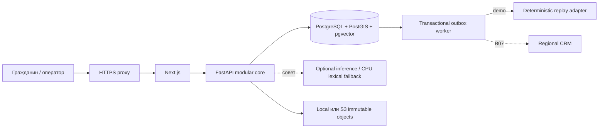
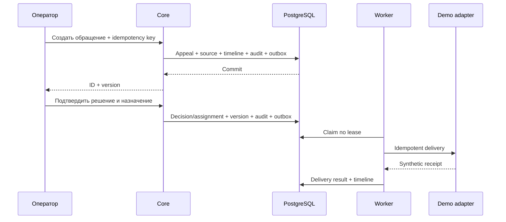
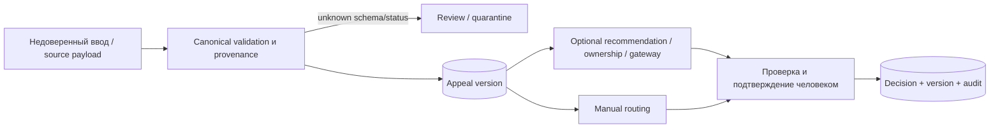
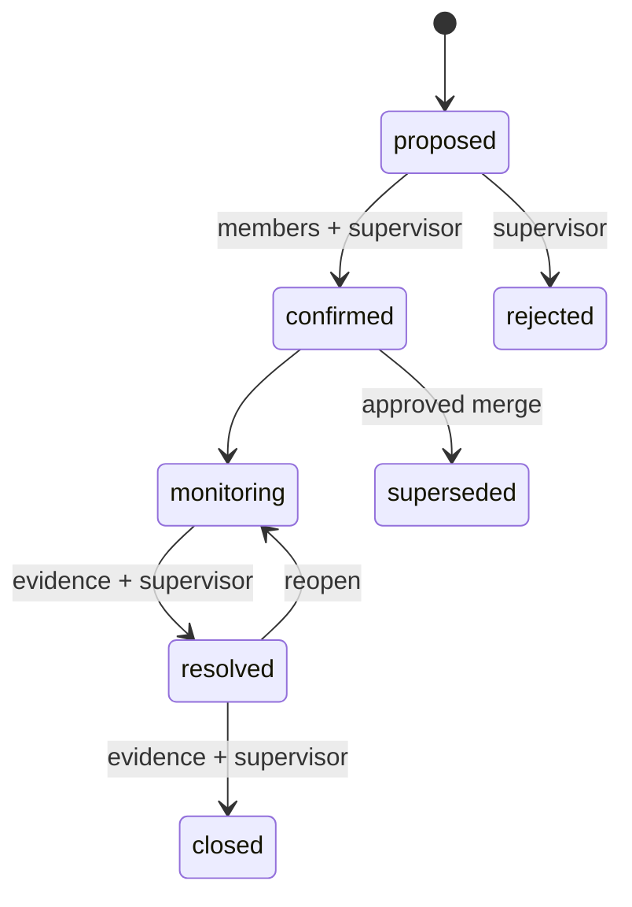
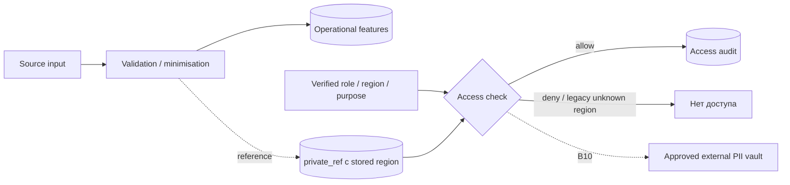

[Русский](README.md) · [English](README.en.md) · [Қазақша](README.kk.md)

# Pulse 109 Architecture

The current executable topology and trust boundaries. [FEATURE_STATUS](../FEATURE_STATUS.en.md) defines capability readiness; [contracts](../../contracts/README.en.md) define stable API, schema and event boundaries. This description does not certify production readiness.

## Processes and sources of truth

Next.js serves the landing page and workspace, proxying versioned APIs to the modular FastAPI core. PostgreSQL is the source of truth for appeals, decisions, incident membership, audit and outbox; PostGIS/pgvector/FTS share that database boundary. Web, core, worker, inference and adapters run as separate processes. Inference is optional for the manual path.

The public instance uses the organizer HTTPS proxy already occupying 80/443. Next.js and API are host-accessible only through loopback; PostgreSQL publishes no port. Local object storage is selected. S3 is wired into attachments and replay snapshots in code, but a private bucket has not been verified on this instance. [Deployment record](../../infra/runbooks/PUBLIC_DEPLOYMENT.en.md).

## Transaction and delivery

Appeal creation and decisions atomically persist the record projection, immutable source reference, history, audit, idempotency result and outbox. A successful response means a committed transaction. Assignments begin as `queued`; `delivered` follows a recorded adapter attempt. The worker uses PostgreSQL leases and `FOR UPDATE SKIP LOCKED`.

Demo replay is prohibited in `pilot/production`. Real delivery requires an approved regional adapter under B07; if it fails, accepted decisions remain saved for retries.

## Data and human decisions

Unknown or ambiguous event time is never inferred from row order or import time. Post-decision fields are excluded from intake-model training. AI cannot route, change priority, add duplicate membership or send a generated response without human confirmation. Next Best Action offers rules; Outcome Memory searches verified outcomes under access control.

Ask Pulse accepts an allowlisted structured query, calculates numbers in the core and returns a chart with provenance. The model does not generate SQL. Signed actor- and region-bound context pins the calculation for drill-down and PDF/XLSX; the audit does not retain question text.

## Appeal and incident

An incident links at least two existing appeals. Each membership is confirmed separately; a supervisor confirms the incident once required members are present. Merge/split validate versions and preserve appeal identifiers and history. PostgreSQL validates references to allowed member attachments; official evidence-admission rules require external approval.

War Room reads the assembled workspace; changes use domain-service APIs with version, evidence and idempotency checks. MapLibre/OSM shows synthetic report geography, not a proven impact area. Coordinates are sparse in real sources; missing geography is explicit. Real data with an external tile provider requires privacy and network review.

## Failures

| Failure | Behavior |
| --- | --- |
| PostgreSQL / audit store | Readiness fails; intake never reports false success |
| Inference / GPU | Manual intake, routing, statuses and audit remain available; failure is explicit |
| Regional adapter | Decision remains saved; `queued/retry/failed` delivery states retain history |
| Unknown schema/status/time | Review, quarantine or unknown value; no silent coercion |
| Object storage / evidence | Errors are never replaced with approved evidence or fabricated bytes |

Persistent containers on the current VPS use `unless-stopped`; the rootless Docker user service is enabled and uses linger. This restores processes, not a guarantee of external HTTPS availability or sufficient quota.

## Privacy and identity

The demo identity is explicitly labelled. A real identity provider, PII vault, lawful bases and retention remain B08/B10. Raw PII never enters logs, metric labels or traces. Attachments undergo checks and quarantine; the demo mock scanner does not certify antivirus protection.

## Where to verify

[OpenAPI](../../contracts/openapi.yaml) · [canonical schema](../../contracts/canonical_request.schema.json) · [event catalog](../../contracts/event_catalog.en.md) · [ADR](../../contracts/adr/) · [CI and commands](../DEVELOPMENT.en.md) · [Golden Demo](../GOLDEN_DEMO.en.md). Specifications and internal technical notes are indexed in [docs/README](../README.en.md); the product overview is [README](../../README.en.md).
