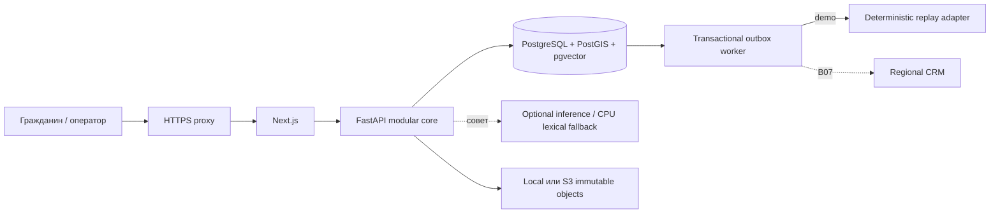
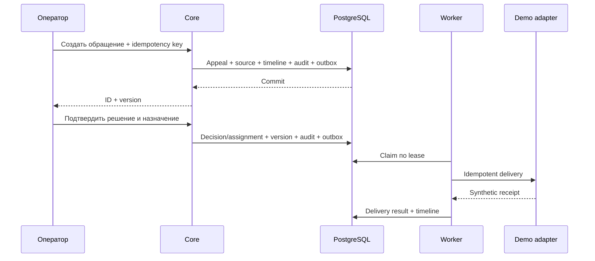
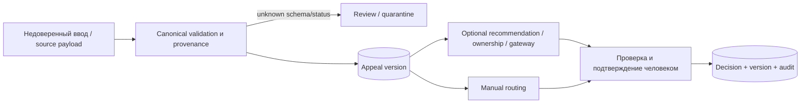
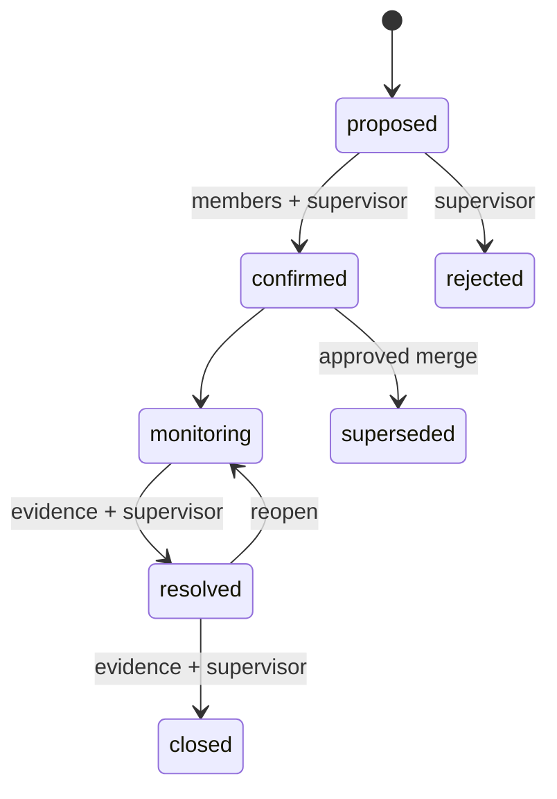
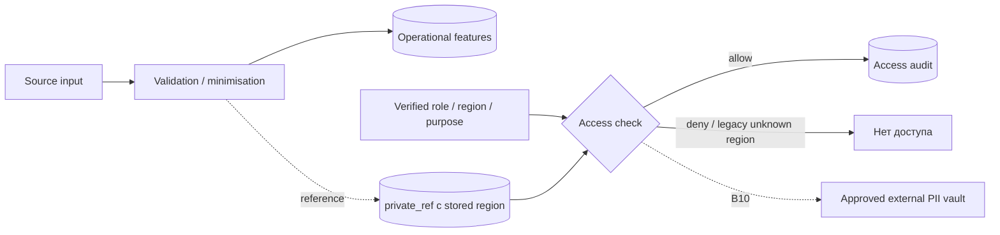

[Русский](README.md) · [English](README.en.md) · [Қазақша](README.kk.md)

# Pulse 109 архитектурасы

Қазіргі орындалу ортасы мен сенім шекараларының сипаттамасы. [FEATURE_STATUS](../submission/FEATURE_STATUS.kk.md) мүмкіндіктердің дайындығын анықтайды; [контрактілер](../../contracts/README.kk.md) API, схема және оқиғалардың тұрақты шекараларын береді. Сипаттама өндірістік пайдалануға дайындықты куәландырмайды.

## Процестер және негізгі дереккөздер

Next.js лендинг пен жұмыс кеңістігін көрсетіп, нұсқаланған API-ды FastAPI модульдік ядросына прокси арқылы жібереді. PostgreSQL — өтініштер, шешімдер, оқиға құрамы, аудит және outbox үшін негізгі дереккөз; PostGIS/pgvector/FTS сол дерекқор ортасында. Web, core, worker, inference және адаптерлер бөлек процестерде іске қосылады. Қолмен орындалатын жолға inference міндетті емес.

Қоғамдық стендте ұйымдастырушылардың HTTPS proxy-і 80/443 порттарын пайдаланады. Next.js пен API хостта тек loopback арқылы қолжетімді; PostgreSQL порты жарияланбайды. Жергілікті нысандық қойма таңдалған. S3 кодта тіркемелер мен replay снимоктарына қосылған, бірақ осы стендте жеке bucket тексерілмеген. [Орналастыру жазбасы](../../infra/runbooks/PUBLIC_DEPLOYMENT.kk.md).

## Транзакция және жеткізу

Өтініш жасау мен шешім жазба көрінісін, өзгермейтін бастапқы сілтемені, тарихты, аудитті, идемпотенттік тексеру нәтижесін және outbox-ті атомдық сақтайды. Сәтті жауап сақталған транзакцияны білдіреді. Тағайындау алдымен `queued` күйінде; `delivered` адаптердің тіркелген әрекетінен кейін пайда болады. Worker PostgreSQL leases және `FOR UPDATE SKIP LOCKED` қолданады.

`pilot/production` ішінде демо replay тыйым салынған. Нақты жеткізу үшін келісілген B07 өңірлік адаптері қажет; ол істен шықса, қабылданған шешімдер қайта әрекет үшін сақталады.

## Деректер және адамның шешімдері

Белгісіз не екіұшты оқиға уақыты жол реті немесе импорт уақытынан толықтырылмайды. Шешімнен кейін жасалған өрістер қабылдау модельдерін оқытуға қолданылмайды. ИИ адамның растауынсыз бағыттау, басымдық өзгерту, дубльге қосу немесе генерацияланған жауап жіберу әрекетін орындамайды. Next Best Action ережелік ұсыныс береді; Outcome Memory қолжетімділік бақылауымен расталған нәтижелерді іздейді.

Ask Pulse рұқсат етілген құрылымдық сұрауды қабылдап, ядро ішінде сандарды есептейді және деректер шығу тегі бар график қайтарады. Модель SQL жасамайды. Субъект пен өңірге байланған қолтаңбалы контекст бастапқы жазбаларды қарау мен PDF/XLSX үшін есепті бекітеді; аудит сұрақ мәтінін сақтамайды.

## Өтініш және оқиға

Оқиға кемінде екі бар өтінішті байланыстырады. Әр өтініштің қатысуы бөлек расталады; қажетті қатысушылар жиналғаннан кейін басшы оқиғаны растайды. Merge/split нұсқаны тексеріп, өтініш идентификаторлары мен тарихын сақтайды. PostgreSQL қатысушылардың рұқсат етілген тіркемелеріне сілтемелерді тексереді; дәлелдерді қабылдаудың ресми ережелері сыртқы келісуді талап етеді.

War Room біріктірілген жұмыс кеңістігін оқиды; өзгерістер домендік қызмет API-лары арқылы нұсқа, дәлел және идемпотенттік тексерулерімен орындалады. MapLibre/OSM дәлелденген әсер аймағын емес, синтетикалық хабарламалар географиясын көрсетеді. Нақты көздерде координаттар сирек; жоқ география ашық белгіленеді. Нақты деректерді сыртқы тайл жеткізушісімен қолданар алдында құпиялық пен желіні тексеру қажет.

## Ақаулар

| Ақау | Мінез-құлық |
| --- | --- |
| PostgreSQL / audit store | Дайындық тексеруі өтпейді, қабылдау жалған сәттілік көрсетпейді |
| Inference / GPU | Қолмен қабылдау, бағыттау, күйлер және аудит қолжетімді; ақау көрінеді |
| Regional adapter | Шешім сақталған; `queued/retry/failed` жеткізу күйлерінің тарихы бар |
| Белгісіз схема/күй/уақыт | Тексеру, карантин немесе белгісіз мән; жасырын түрлендірусіз |
| Нысандық қойма / evidence | Қате рұқсат етілген дәлелмен немесе жалған байттармен алмастырылмайды |

Қазіргі VPS тұрақты контейнерлерінде `unless-stopped` бар, rootless Docker пайдаланушы қызметі қосылған және linger қолданады. Бұл процестерді қалпына келтіру, сыртқы HTTPS қолжетімділігі не жеткілікті квота кепілі емес.

## Құпиялық және сәйкестендіру

Демонстрациялық тіркелгі анық белгіленген. Нақты тұлға провайдері, PII қоймасы, құқықтық негіздер және сақтау мерзімдері B08/B10 болып қалады. Бастапқы PII журналдарға, метрика белгілеріне және трассаларға түспейді. Тіркемелер тексеру мен карантиннен өтеді; демо mock сканері антивирустық қорғанысты куәландырмайды.

## Қайда тексеруге болады

[OpenAPI](../../contracts/openapi.yaml) · [canonical schema](../../contracts/canonical_request.schema.json) · [event catalog](../../contracts/event_catalog.kk.md) · [ADR](../../contracts/adr) · [CI және командалар](../development/DEVELOPMENT.kk.md) · [Golden Demo](../demo/GOLDEN_DEMO.kk.md). Спецификациялар мен ішкі техникалық жазбалар [docs/README](../README.kk.md) ішінде; өнім шолуы — [README](../../README.kk.md).
