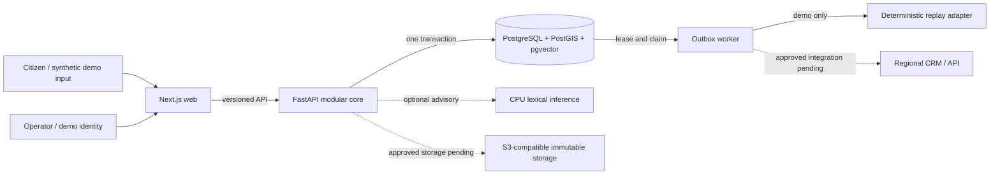
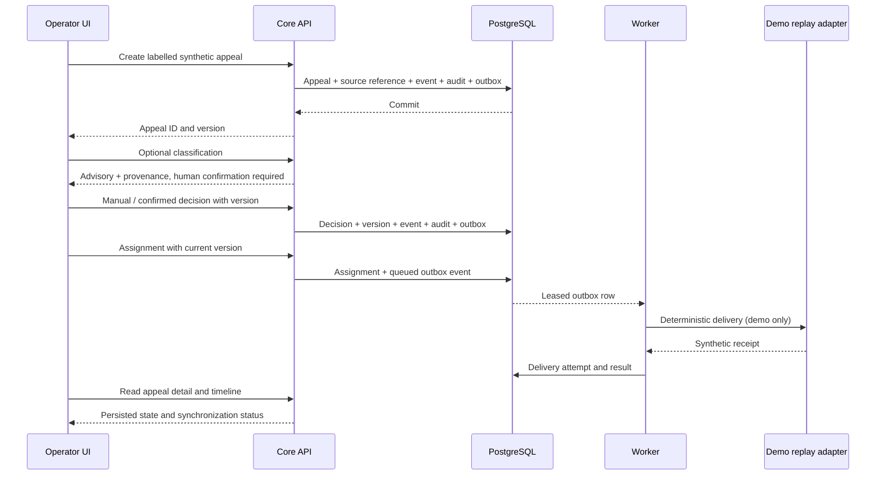
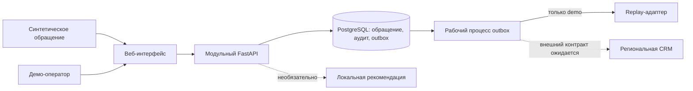

# Pulse 109 architecture / Архитектура Pulse 109

## EN - runtime and trust boundaries

Pulse 109 is a federated assistance layer. PostgreSQL is the authoritative store for appeals, decisions, incident membership, audit and outbox. The browser uses the Next.js web proxy; the FastAPI core owns business commands. A worker claims eligible outbox rows under PostgreSQL leases. In `demo`, it delivers to the deterministic replay adapter. In `pilot` and `production`, replay delivery is rejected at startup and delivery remains unavailable until a regional adapter is approved. Optional inference can fail without blocking manual handling.

The core transaction writes the appeal projection, immutable timeline, audit event, idempotency receipt and outbox message together. The acceptance response does not depend on inference or a regional system. An assignment receipt means **queued** until a delivery attempt confirms it. A replay adapter result is labelled synthetic and cannot be used in an operational profile.

## RU - процессы и границы доверия

Pulse 109 дополняет региональные системы, но не заменяет их. PostgreSQL хранит обращения, решения оператора, состав инцидентов, аудит и очередь исходящих событий. Веб-интерфейс обращается к действующему FastAPI через прокси Next.js. Рабочий процесс забирает события из PostgreSQL с ограниченной по времени блокировкой. Только в профиле `demo` он использует детерминированный replay-адаптер. В `pilot` и `production` запуск replay-доставки запрещён; реальная доставка ждёт согласованного регионального API. Классификация может быть недоступна без остановки ручного маршрута.

Создание обращения и решение человека фиксируются транзакционно. Каждое обращение сохраняет свой ID, версию и историю при связи с инцидентом. Неизвестные региональные статусы и правила не заменяются вымышленными значениями. Временные метки с неизвестным бизнес-временем остаются неизвестными. Синтетическая демонстрация не служит оценкой качества модели на реальных данных.

The design rationale and module boundaries are in [`contracts/adr/`](../../contracts/adr/); current limitations are in [`docs/FEATURE_STATUS.md`](../FEATURE_STATUS.md).
