# Pulse 109 architecture / Архитектура Pulse 109

## EN - runtime and trust boundaries

Pulse 109 is a federated assistance layer. PostgreSQL is the authoritative store for appeals, decisions, incident membership, audit and outbox. The browser uses the Next.js web proxy; the FastAPI core owns business commands. A worker claims eligible outbox rows under PostgreSQL leases. In `demo`, it delivers to the deterministic replay adapter. In `pilot` and `production`, replay delivery is rejected at startup and delivery remains unavailable until a regional adapter is approved. Optional inference can fail without blocking manual handling.

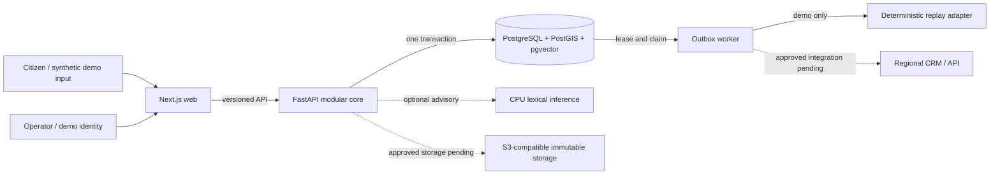

The core transaction writes the appeal projection, immutable timeline, audit event, idempotency receipt and outbox message together. The acceptance response does not depend on inference or a regional system. An assignment receipt means **queued** until a delivery attempt confirms it. A replay adapter result is labelled synthetic and cannot be used in an operational profile.

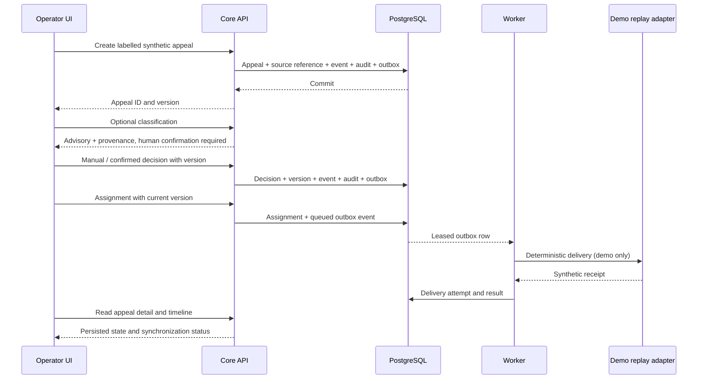

## RU - процессы и границы доверия

Pulse 109 дополняет региональные системы, но не заменяет их. PostgreSQL хранит обращения, решения оператора, состав инцидентов, аудит и очередь исходящих событий. Веб-интерфейс обращается к действующему FastAPI через прокси Next.js. Рабочий процесс забирает события из PostgreSQL с ограниченной по времени блокировкой. Только в профиле `demo` он использует детерминированный replay-адаптер. В `pilot` и `production` запуск replay-доставки запрещён; реальная доставка ждёт согласованного регионального API. Классификация может быть недоступна без остановки ручного маршрута.

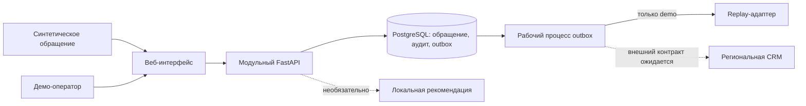

Создание обращения и решение человека фиксируются транзакционно. Каждое обращение сохраняет свой ID, версию и историю при связи с инцидентом. Неизвестные региональные статусы и правила не заменяются вымышленными значениями. Временные метки с неизвестным бизнес-временем остаются неизвестными. Синтетическая демонстрация не служит оценкой качества модели на реальных данных.

The design rationale and module boundaries are in [`contracts/adr/`](../../contracts/adr/); current limitations are in [`docs/FEATURE_STATUS.md`](../FEATURE_STATUS.md).

## Data flow / Поток данных

EN: A source reference and business-time quality arrive with the appeal. The core stores the appeal, timeline, audit and outbox in PostgreSQL before acknowledging it. The worker later records delivery attempts. An attachment has a separate validated blob and database reference in demo; operational upload is unavailable until approved storage and scanning exist.

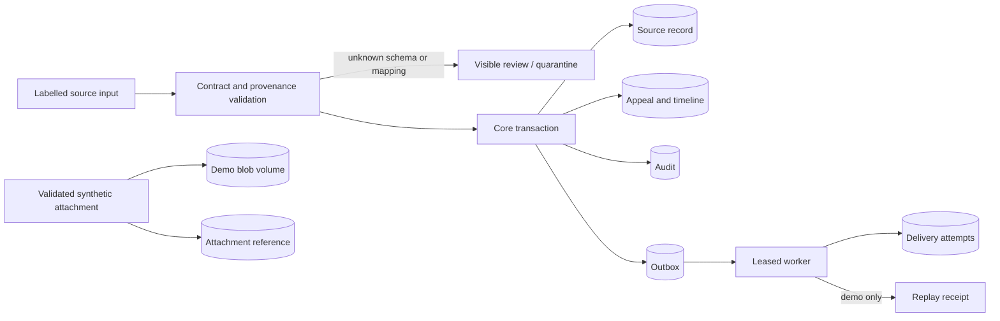

RU: Исходная ссылка и качество бизнес-времени поступают вместе с обращением. Ядро фиксирует обращение, историю, аудит и outbox в PostgreSQL до ответа о приёме. Рабочий процесс позже записывает попытки доставки. В демо байты вложения и ссылка хранятся отдельно; для рабочего режима загрузка ждёт утверждённого хранилища и сканирования.

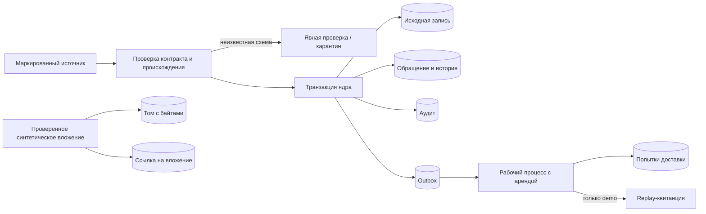

## AI and human decisions / ИИ и решения человека

EN: Classification is optional advice. The operator may use it, correct it or use the manual path. Ownership assessment and Decision Gateway remain advisory; an approved policy is needed before consequential automation. The recorded decision is version-bound and audited.

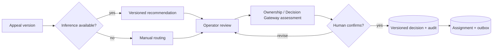

RU: Классификация необязательна и носит рекомендательный характер. Оператор может принять, исправить или полностью обойти рекомендацию. Оценка принадлежности и Decision Gateway не исполняют последствия без решения человека или утверждённой политики. Решение привязано к версии обращения и аудируется.

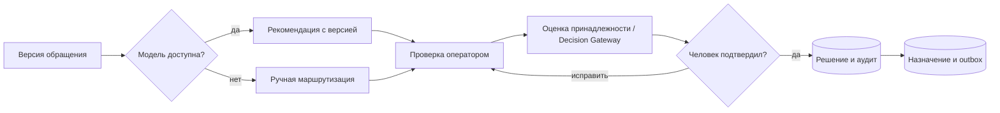

## Incident lifecycle / Жизненный цикл инцидента

EN: A proposal names at least two existing appeals. Each membership is confirmed separately. A supervisor confirms the incident only after two confirmed members. Merge and split are separate versioned topology decisions; they never erase appeal identities. PostgreSQL topology decisions and resolution verify that evidence references identify clean attachments of current members. Approved evidence policy remains external.

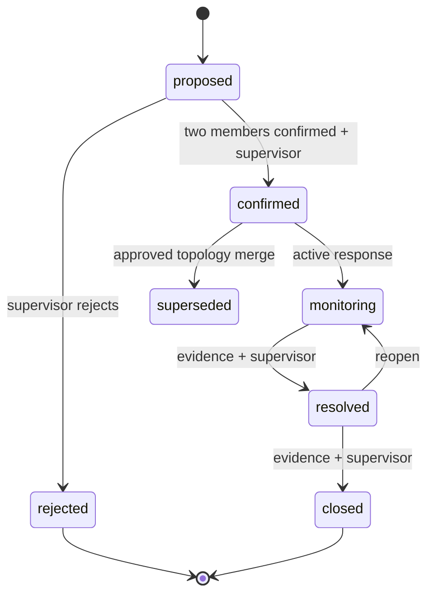

RU: Предложение содержит минимум два существующих обращения. Участие каждого подтверждается отдельно; руководитель подтверждает инцидент после двух подтверждённых участников. Объединение и разделение — отдельные версионированные решения, не стирающие ID обращений. Для завершения требуются ссылки на доказательства; проверка принадлежности доказательств инциденту ещё требует усиления.

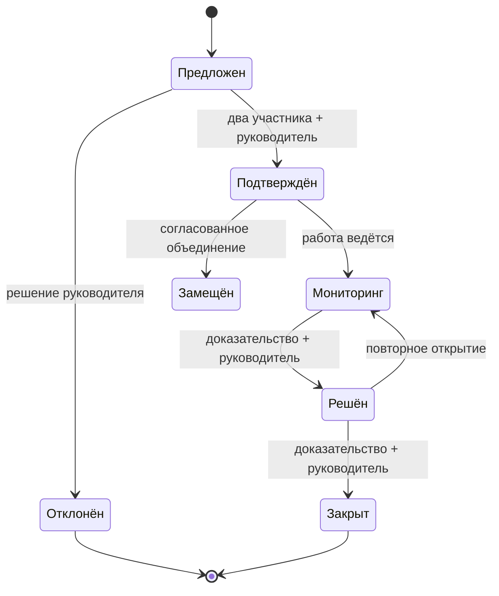

## Failure modes / Режимы отказа

EN: PostgreSQL outage fails readiness and stops acceptance. An inference outage leaves the manual path available. An adapter outage leaves accepted appeals and queued messages durable for retry. Unknown source schemas/statuses enter review instead of being coerced. Pilot/production attachment upload and replay delivery fail closed until approved integrations exist.

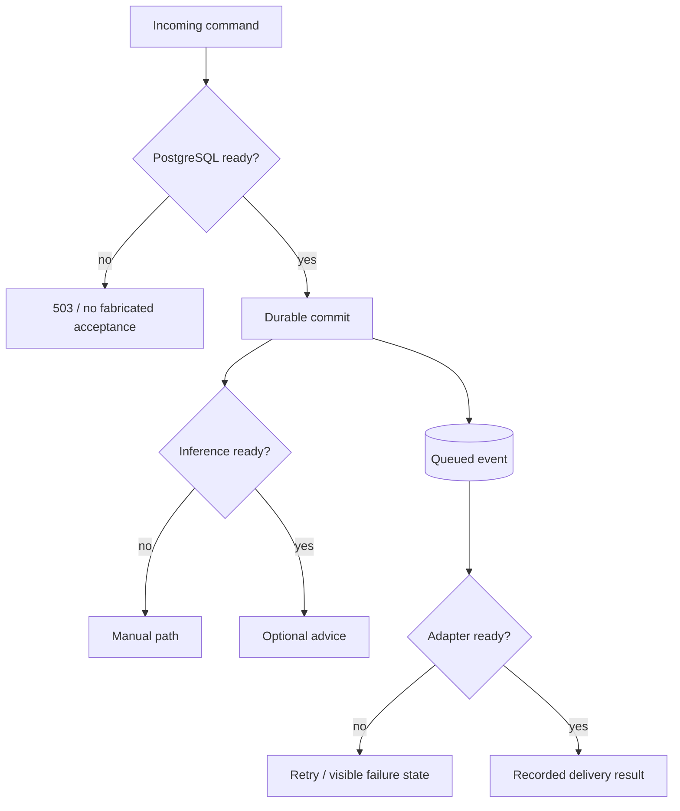

RU: При отказе PostgreSQL readiness не проходит, приём не изображает успех. При отказе модели ручной путь остаётся доступным. При отказе адаптера принятые обращения и события сохраняются для повторной попытки. Неизвестные схемы и статусы уходят на проверку. В pilot/production загрузка вложений и replay-доставка закрыты до появления утверждённых интеграций.

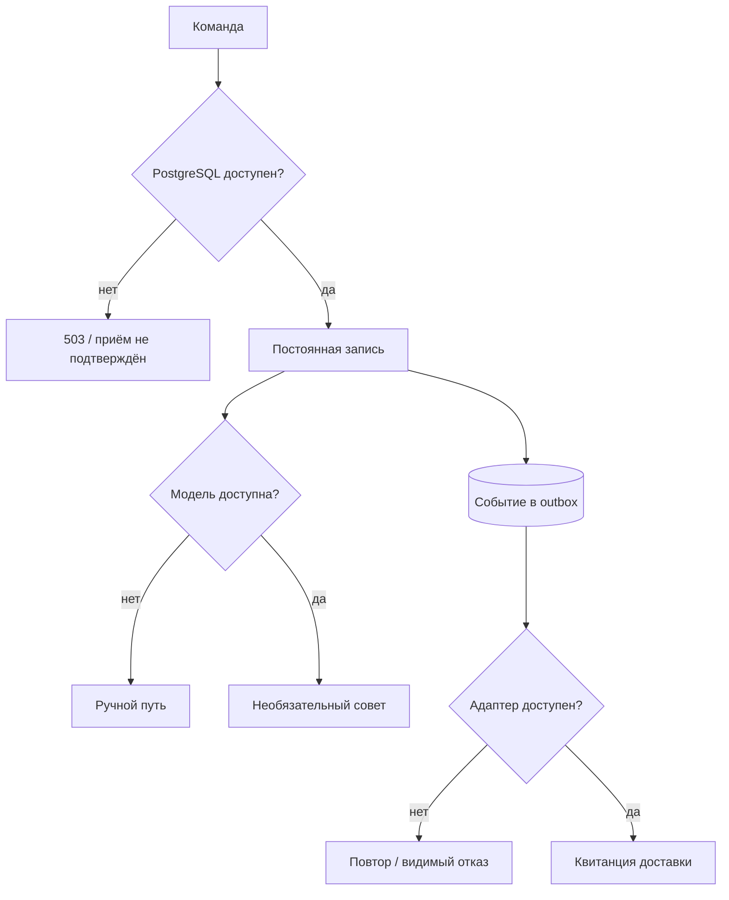

## Privacy boundary / Граница персональных данных

EN: Operational features use tokens and references, not raw citizen identifiers. A private reference has a stored region; the actor's verified region and role must match before resolution or audit-list access. Legacy references without a proven region remain inaccessible. The actual vault, approved retention and operational identity are external dependencies, so this diagram is a boundary contract rather than a claim that a production vault is deployed.

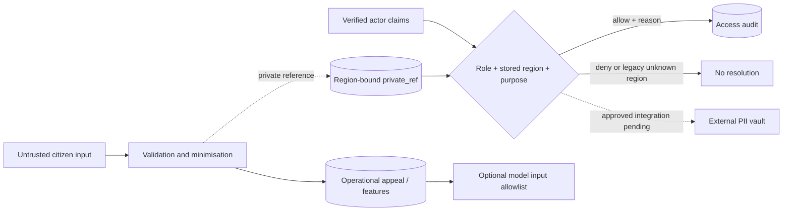

RU: В операционных признаках используются токены и ссылки, а не исходные идентификаторы граждан. Для доступа к приватной ссылке проверяются сохранённый регион, роль и подтверждённые claims субъекта; доступ аудируется. Старые ссылки без доказанного региона недоступны. Хранилище PII, сроки хранения и рабочая идентификация ещё требуют внешнего утверждения.

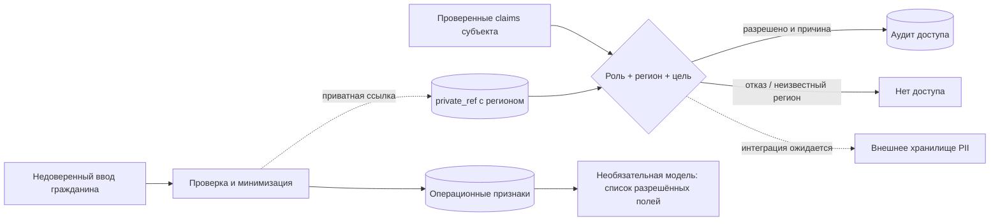
