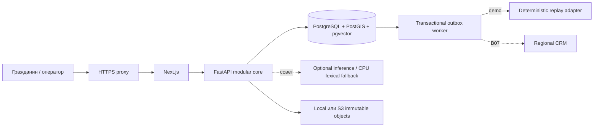
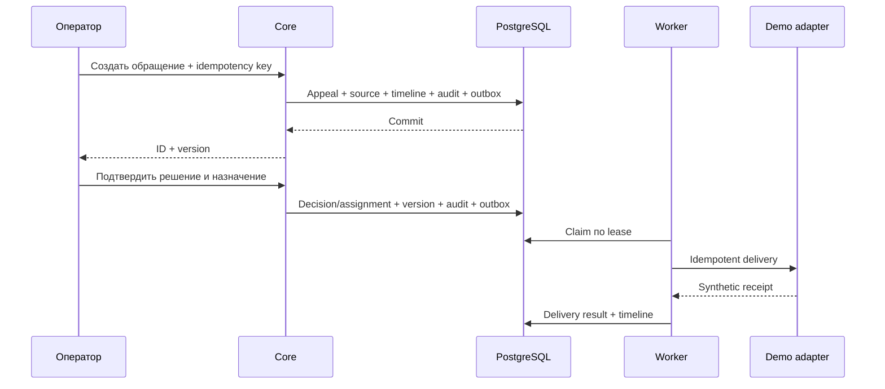
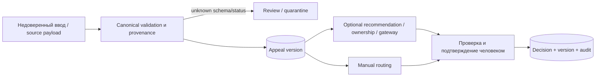
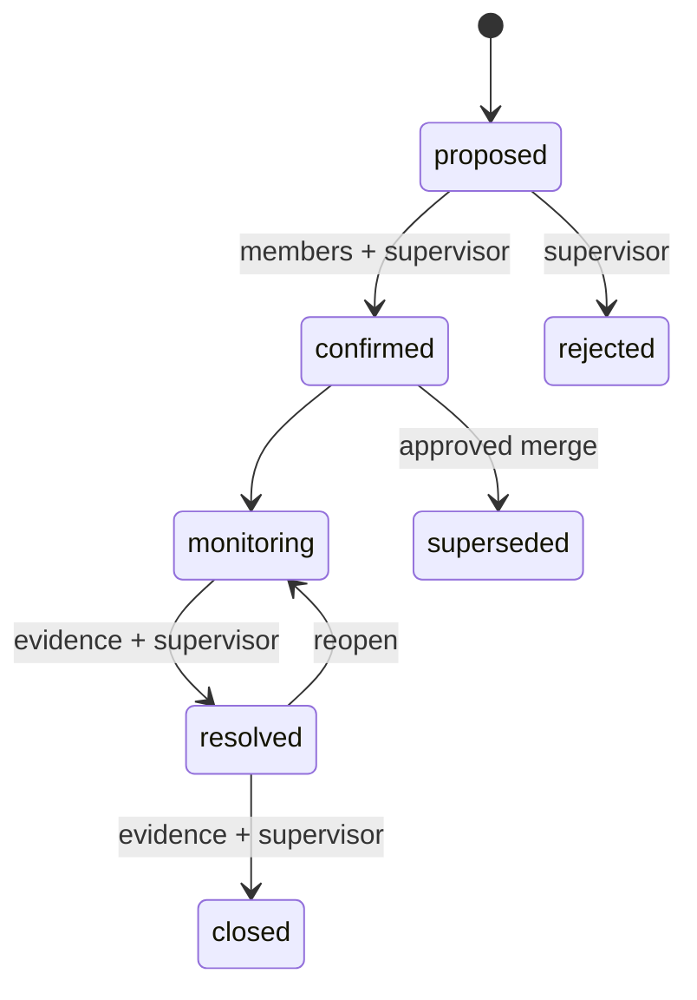
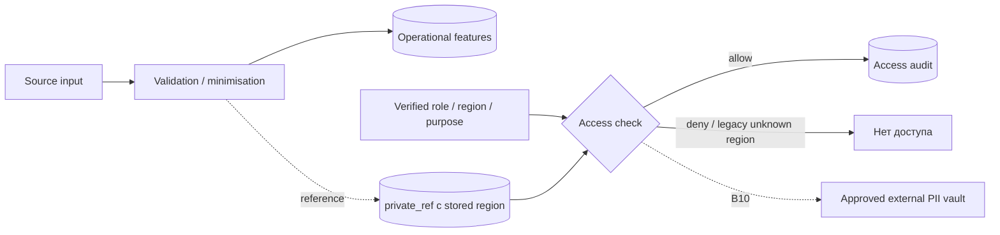

[Русский](README.md) · [English](README.en.md) · [Қазақша](README.kk.md)

# Архитектура Pulse 109

Описание текущего исполняемого контура и границ доверия. [FEATURE_STATUS](../submission/FEATURE_STATUS.md) определяет готовность возможностей; [контракты](../../contracts/README.md) задают стабильные границы API, схем и событий. Описание не удостоверяет готовность к промышленной эксплуатации.

## Процессы и источники истины

Next.js обслуживает лендинг и рабочее пространство, проксируя API с версионированием к модульному ядру FastAPI. PostgreSQL — источник истины для обращений, решений, состава инцидентов, аудита и outbox; PostGIS/pgvector/FTS находятся в том же контуре БД. Web, core, worker, inference и адаптеры запускаются отдельными процессами. Inference необязателен для ручного пути.

На публичном стенде HTTPS proxy организаторов уже занимает 80/443. Next.js и API доступны на хосте только через loopback; PostgreSQL не публикует порт. Выбрано локальное объектное хранилище. S3 подключён в коде к вложениям и replay-снимкам, но частный bucket на этом стенде не проверен. [Запись о развёртывании](../../infra/runbooks/PUBLIC_DEPLOYMENT.md).

## Транзакция и доставка

Создание обращения и решение атомарно сохраняют представление записи, неизменяемую ссылку на источник, историю, аудит, результат проверки идемпотентности и outbox. Успешный ответ означает сохранённую транзакцию. Назначение сначала находится в состоянии `queued`; `delivered` появляется после зарегистрированной попытки адаптера. Worker использует PostgreSQL leases и `FOR UPDATE SKIP LOCKED`.

В `pilot/production` демонстрационный replay запрещён. Для настоящей доставки нужен согласованный региональный адаптер B07; при его отказе принятые решения сохраняются для повторных попыток.

## Данные и решения человека

Неизвестное или неоднозначное время события не достраивается из порядка строк или времени импорта. Поля, созданные после решения, не используются для обучения моделей приёма. ИИ не выполняет маршрутизацию, изменение приоритета, включение в дубли или отправку сгенерированного ответа без подтверждения человека. Next Best Action предлагает правила; Outcome Memory ищет подтверждённые исходы с контролем доступа.

Ask Pulse принимает разрешённый структурированный запрос, рассчитывает числа в ядре и возвращает график с происхождением данных. Модель не генерирует SQL. Подписанный контекст с привязкой к субъекту и региону фиксирует расчёт для просмотра исходных записей и PDF/XLSX; аудит не сохраняет текст вопроса.

## Обращение и инцидент

Инцидент связывает минимум два существующих обращения. Участие каждого обращения подтверждается отдельно; руководитель подтверждает инцидент после набора необходимых участников. Merge/split проверяют версию и сохраняют идентификаторы и историю обращений. PostgreSQL проверяет ссылки на допущенные вложения участников; официальные правила допуска доказательств требуют внешнего согласования.

War Room читает объединённое рабочее пространство; изменения выполняются через API доменных сервисов с проверками версии, доказательств и идемпотентности. MapLibre/OSM показывает географию синтетических сообщений, а не доказанную зону воздействия. В реальных источниках координаты редки; отсутствующая география явно отмечается. Перед использованием реальных данных с внешним поставщиком тайлов требуется проверка приватности и сети.

## Отказы

| Отказ                          | Поведение                                                                 |
| ------------------------------ | ------------------------------------------------------------------------- |
| PostgreSQL / audit store       | Проверка готовности не проходит, приём не сообщает ложный успех           |
| Inference / GPU                | Ручной приём, маршрутизация, статусы и аудит доступны; отказ явно виден   |
| Regional adapter               | Решение сохранено; состояния доставки `queued/retry/failed` имеют историю |
| Неизвестная схема/статус/время | Проверка, карантин или неизвестное значение; без скрытого приведения      |
| Объектное хранилище / evidence | Ошибка не подменяется допущенным доказательством или фиктивными байтами   |

На текущем VPS постоянные контейнеры имеют `unless-stopped`, пользовательская служба rootless Docker включена и использует linger. Это восстановление процессов, а не гарантия доступности внешнего HTTPS или достаточной квоты.

## Приватность и идентификация

Демонстрационная учётная запись явно обозначена. Реальный провайдер идентификации, хранилище PII, правовые основания и сроки хранения остаются B08/B10. Исходные PII не попадают в журналы, метки метрик или трассы. Вложения проходят проверку и карантин; демонстрационный mock-сканер не удостоверяет антивирусную защиту.

## Где проверять

[OpenAPI](../../contracts/openapi.yaml) · [canonical schema](../../contracts/canonical_request.schema.json) · [event catalog](../../contracts/event_catalog.md) · [ADR](../../contracts/adr) · [CI и команды](../development/DEVELOPMENT.md) · [Golden Demo](../demo/GOLDEN_DEMO.md). Спецификации и внутренние технические записки индексированы в [docs/README](../README.md); обзор продукта — [README](../../README.md).
