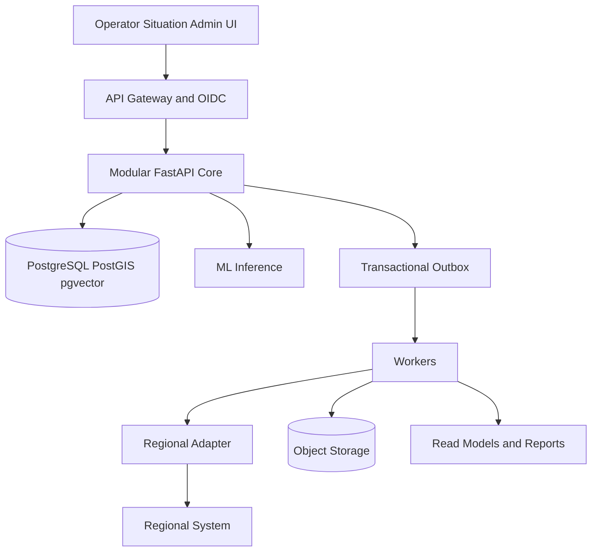

[Русский](CODEX_IMPLEMENTATION_HANDOFF.md) · [English](CODEX_IMPLEMENTATION_HANDOFF.en.md) · [Қазақша](CODEX_IMPLEMENTATION_HANDOFF.kk.md)

> Тарихи құжат. Жобаның қазіргі күйі үшін негізгі дереккөз емес.

# Pulse 109 Codex Implementation Handoff

## 1 Мақсат

Бұл файл Pulse 109 спецификациясын кодтау агенті үшін іске асыру тізбегіне аударады. Болжалды нәтиже – демонстрация ретінде жасырылған ұлттық шығарылым емес, бір айдағы өндірістік деңгейдегі пилот. Пилот қол жетімді болған кезде бір аймақтық интеграциясы бар нақты, тексерілетін тік бөлікті және ол болмаған кезде келісімшартқа ұқсас қайта ойнату адаптерін енгізуі керек.

Толық жүйе жиырма аймаққа арналған. Ағымдағы дәлелдер жеті аймақты қамтиды, өтініштің өңделмеген мәтіні негізінен қолжетімсіз және бірнеше интеграция мен саясат шешімдері сыртқы кедергілер болып қала береді. Іске асыру осы шектеулерді ойлап табылған деректермен немесе хаттамалармен толтырудың орнына ашуы керек.

## 2 Мақсатты нәтиже

Шығарылатын үміткерде өкілдік өтініш мына жолды аяқтауы керек:

1. Бастапқы арна өтінішті идемпотентті түрде жасайды.
2. Жүйе шығу тегін және ML алдында өзгермейтін дереккөз сілтемесін сақтайды.
3. Құпиялылықты өңдеу бекітілген жасырындандырылған нұсқаны жасайды.
4. Маршруттау үздік үш тақырып пен қызмет кандидаттарын, сенімділікті, OOD күйін және нұсқасын қайтарады.
5. Retrieval ұқсас шешілген істерді дәлелдемелермен қайтарады.
6. Қайталанатындарды анықтау мәтінді, географияны, уақытты және қызметті пайдалана отырып, қатысты өтініштерді ұсынады.
7. Оператор маршрутты растайды немесе түзетеді және оқиға мүшелігін растай алады.
8. Шешім, аудит оқиғасы және outbox-тағы жазба атомдық түрде орындалады.
9. Адаптер тапсырманы жеткізеді немесе көрінетін күту күйін жазады.
10. Сыртқы күйлер өтініш уақыт шкаласын идемпотентті түрде жаңартады.
11. Жағдай орталығы қамтуды, деректердің өзектілігіті, трендтерді, SLA және бекітілген ескертулерді көрсетеді.
12. Бірдей басқарылатын метрикалық анықтама UI, PDF және электрондық кесте мәндерін шығарады.

ML немесе сыртқы жүйе қолжетімсіз болған кезде ағын әлі де қабылдауы, қолмен бағыттауы, тексеруі және кейінірек синхрондауы керек.

## 3 Архитектураның негізі



### 3.1 Орналастыруға болатын процестер

| процесс | Жауапкершілік | Масштабтау және істен шығу шекарасы |
| Процесс | Жауапкершілік | Масштабтау және сәтсіздік шекарасы |
| `web` | Оператор, жағдай орталығы және әкімшілік UI | Азаматтығы жоқ көлденең көшірмелер |
| `web` | Оператор, жағдай орталығы және әкімшілік UI | Азаматтығы жоқ көлденең көшірмелер |
| `core-api` | Өтініштер, триаж шешімдері, оқиғалар, каталогтар, аудит және есептерді ұйымдастыру | Критикалық транзакциялық жол |
| `worker` | Шығыс жәшігін жеткізу, салыстыру, есептер, болжамдар және жоспарланған тапсырмалар | Жұмыс жүктемесі бойынша бөлінген worker топтары |
| `ml-inference` | Бағыттау, эмбеддинг, қайта сұрыптау, OOD және қосымша жобалар | CPU резерві бар GPU көшірмелер |
| `adapter-runtime` | Дереккөзге спецификалық хаттама, картаға түсіру және бақылау нүктелері | Көзі және бөлім бойынша оқшауланған |
| `ml-training` | Деректер жиынын офлайн құру, оқыту және бағалау | Ешқашан production негізгі жолыда |
### 3.2 Негізгі бизнес модульдері

| Модуль | иелік етеді Жалпы қолданбалы операциялар |
| Модуль | Иелік етеді | Жалпы қолданбалы операциялар |
| `appeals` | Снапшотқа және тек қосуға арналған өмірлік цикл оқиғаларына шағымдану | Бастапқы оқиғаны жасау, оқу және қосу |
| `appeals` | Снапшотқа және тек қосуға арналған өмірлік цикл оқиғаларына шағымдану | Бастапқы оқиғаны жасаңыз, оқыңыз және қосыңыз |
| `triage` | Ұсыныс сілтемелері және адам шешімдері | Жіктеу, бекіту, түзету және қайта тағайындау |
| `catalog` | Нұсқаланған тақырыптар, қызметтер, міндетті өрістер және SLA саясаттар | Тиімді каталогты шешіп, бекітілген нұсқасын жариялаңыз |
| `incidents` | Оқиға жазбасы және мүшелік шешімдерінің нұсқасы | Мүшелікті ұсыну, растау, қабылдамау және жою |
| `integration` | Бастапқы тізілім, outbox, әрекеттер, бақылау нүктелері және салыстырулар | Денсаулықты жеткізу, татуластыру, қайталау және тексеру |
| `analytics` | Метрика анықтамалары, басқарылатын сұраулар және материалдандырылған оқу модельдері | Метрика идентификаторы және кесу арқылы сұрау |
| `reports` | Есеп модельдері, тапсырмалар, артефактілер және хэштер | Экспортты жасаңыз, тексеріңіз және жүктеп алыңыз |
| `audit` | Өзгермейтін қауіпсіздік және шешімдер тарихы | Ішкі қосымшаны қосыңыз және уәкілетті аудиторлар оқыңыз |
Әрбір модульде PostgreSQL схемасы және репозиторий интерфейсі бар. Ешбір модуль басқа модуль кестелеріне тікелей жаза алмайды.

## 4 Репозиторийдің орналасуы

Бұрыннан бар репозиторийде баламалы шарт болмаса, осы орналасуды жасаңыз:

```text
.
├── AGENTS.md
├── Makefile
├── README.md
├── IMPLEMENTATION_STATUS.md
├── pyproject.toml
├── pnpm-workspace.yaml
├── package.json
├── uv.lock
├── pnpm-lock.yaml
├── apps/
│   └── web/
├── services/
│   ├── core/
│   │   ├── src/pulse109/
│   │   │   ├── appeals/
│   │   │   ├── triage/
│   │   │   ├── catalog/
│   │   │   ├── incidents/
│   │   │   ├── integration/
│   │   │   ├── analytics/
│   │   │   ├── reports/
│   │   │   └── audit/
│   │   ├── migrations/
│   │   └── tests/
│   ├── inference/
│   │   ├── src/pulse109_inference/
│   │   ├── models/
│   │   └── tests/
│   └── worker/
├── adapters/
│   ├── sdk/
│   ├── replay/
│   └── first_region/
├── contracts/
│   ├── openapi.yaml
│   ├── canonical_request.schema.json
│   ├── event_catalog.md
│   └── adr/
├── data/
│   ├── README.md
│   ├── manifests/
│   ├── fixtures/
│   └── schemas/
├── ml/
│   ├── datasets/
│   ├── training/
│   ├── evaluation/
│   ├── model_cards/
│   └── registry/
├── infra/
│   ├── compose/
│   ├── helm/
│   ├── dashboards/
│   └── runbooks/
├── tests/
│   ├── contract/
│   ├── e2e/
│   ├── load/
│   └── resilience/
└── docs/
    ├── architecture/
    ├── DECISION_LOG.md
    └── security/
```

Python құлыптау файлдарын және Түйін құлыптау файлдарын пайдаланыңыз. Қалқымалы контейнер тегтеріне немесе бекітілмеген үлгі түзетулеріне тәуелді болмаңыз. Егер бар репозиторий нұсқаларды таңдап қойған болса, өлшенген сәйкессіздік жаңартуды қажет етпесе, оларды сақтаңыз.

## 5 Негізгі технология

### 5.1 Қолданба

- Backend: Python, FastAPI, Pydantic v2, SQLAlchemy 2 және Alembic.
- Frontend: Next.js App Router, React және TypeScript қол жетімді сервер қолдайтын пішіндері және қажет болған жағдайда ғана клиенттің шағын күйі деңгейі.
- Деректер қоры: PostgreSQL PostGIS және pgvector кеңейтімдерімен.
- Нысанды сақтау: шифрланған шелектері және өзгермейтін артефакті атауы бар S3-үйлесімді API.
- Фондық жұмыс: PostgreSQL outbox мен жұмыс кестелерінен астам арнайы Python жұмысшысы. Кафканы, балдыркөкті немесе басқа брокерді M0 жүйесіне енгізбеңіз, егер репозиторий оған тәуелді болмаса.
- Жергілікті орындалу ортасы: Docker Құрастыру.
- Мақсатты орындалу ортасы: Kubernetes немесе OpenShift-үйлесімді орналастыру үшін OCI кескіндері және Helm мәндері.
- Бақылау мүмкіндігі: OpenTelemetry іздері мен метрикасы, Prometheus-үйлесімді метрикалар және сұрау органдары жоқ құрылымдық JSON журналдары.
- Аутентификация: OIDC JWT жергілікті емес орталарда тексеру. Жергілікті жалған сәйкестікке тек нақты даму профилі бойынша рұқсат етіледі.

### 5.2 Машинамен оқыту

- Бағыттау үміткері: иерархиялық көп таңбалы бастары бар дәл реттелген XLM-RoBERTa базасы.
- Базалық бағыттау: TF-IDF таңбасы плюс калибрленген сызықтық классификатор.
- Іздеу: гибридті BM25 және pgvector іздеуі бар BGE-M3 кірістірулері.
- Қайталау: BGE reranker v2 м3.
- Көшірмелер: іздеу ұпайларын, географияны, уақытты, тақырыпты және қызметті пайдалана отырып, калибрленген жұп үлгісі; жоғары дәлдіктегі ережелер қол жетімді болып қалады.
- Жобаны және басқарылатын ниетті талдау: GPU 1 бойынша төрт биттік пішінде Qwen3 8B. Ол ерікті SQL орындай алмайды немесе жауап жібере алмайды.
- Қоңырау транскрипциясы: дыбысты өңдеу мақұлданғанға дейін асинхронды және өшірілген үлкен v3 турбо сыбырлау.
- PII: алдымен детерминирленген модельдер мен бекітілген сөздіктер, қосымша детектор ретінде дәл реттелген XLM-R NER.
- Болжам: мауқосылғанқ аңғал базалық және CatBoost немесе LightGBM кандидаты.

Қорытынды қызметі үлгі-агностикалық келісім-шарттарды көрсетуі керек. Үлгі атаулары мен орындау уақыты кітапханалары домен тәуелділіктері емес, конфигурация болып табылады.

## 6 Домен инварианттары және деректерді иелену

### 6.1 Өтініш және оқиға

- `appeal_id` – импульстік UUID және ешқашан өзгермейді.
- `source_system`, `source_request_id` және `source_payload_hash` идемпотенттілік пен шығуды қамтамасыз етеді.
- Оқиға - бұл бөлек жиынтық. Мүшелік нұсқа болып табылады және актер, себеп және дәлелді талап етеді.
- Өтініштерді оқиғаға байланыстыру ешқашан жазбаларды, тарихты, тапсырмаларды немесе SLA сағаттарды бұзбайды.
- Ағымдағы күй - тек қосымша оқиғалардан алынған проекция. Түзетулер жаңа оқиға қосады.

### 6.2 Уақыт

Кем дегенде сақтаңыз:

- `occurred_at`: дереккөз расталған орындалу ортасы; нөлдік;
- `observed_at`: Pulse 109 жазбаны алған уақыт; талап етілетін UTC;
- `source_timezone`: бастапқы уақыт белдеуі немесе нөл;
- `time_quality`: `exact`, `source_tz_assumed`, `date_only`, `missing` немесе бекітілген кеңейтім;
- `effective_from` және `effective_to`: каталог және саясат нұсқалары үшін;
- `data_cutoff`: әрбір аналитикалық нәтиже және экспорт үшін.

`occurred_at` орнату мүмкін болмаса, оны нөлге қалдырыңыз. Операциялық тізімдер уақыт көзін көрнекі түрде белгілеу кезінде `observed_at` бойынша сұрыпталуы мүмкін. Уақытша оқыту, валидация және кері тестілеу тәртібін қауіпсіз қалпына келтіру мүмкін емес оқиғаларды болдырмауы керек.

### 6.3 Ұсынылатын PostgreSQL схемалар

| Схема | Негізгі кестелер |
| Схема | Негізгі кестелер |
| `appeals` | `appeal`, `appeal_event`, `source_record`, `attachment_ref` |
| `appeals` | `appeal`, `appeal_event`, `source_record`, `attachment_ref` |
| `triage` | `recommendation`, `recommendation_candidate`, `operator_decision`, `reassignment` |
| `catalog` | `topic_version`, `service_version`, `service_topic`, `required_field`, `sla_policy_version` |
| `incidents` | `incident`, `incident_member_version`, `duplicate_candidate`, `membership_decision` |
| `integration` | `source_system`, `source_schema_version`, `status_mapping`, `outbox`, `delivery_attempt`, `checkpoint`, `dead_letter` |
| `analytics` | `metric_definition`, `metric_result`, `alert`, `alert_review`, материалдандырылған оқу модельдері |
| `reports` | `report_job`, `report_artifact` |
| `audit` | `audit_event` тек қосымшаларға арналған, шектеулі жадта |
| `privacy` | идентификатор қоймасы немесе мақұлданған кезде маркер картасы; кәдімгі аналитикаға ешқашан ұшыраған емес |
Маңызды индекстерге бірегей дереккөз идентификациясы, оқиға идентификациясы, идентификациялық кілт, outbox-тың күйі және қолжетімділігі, шағым аймағы мен күйі, тиімді каталог терезелері, PostGIS геометрия, эталоннан кейінгі HNSW векторы және толық мәтінді GIN индекстері кіреді.

## 7 Шарт ережелері

Негізгі сызық ретінде `contracts/openapi.yaml` орындаңыз. Сұрау немесе жауап семантикасын үнсіз өзгертпеңіз.

- API нұсқалау `/v1` пайдаланады; қосымша өзгерістер үйлесімді болып қалады және үзіліссіз өзгертулер жаңа негізгі нұсқаны қажет етеді.
- Барлық жасау әрекеттері идентификациялық кілтті немесе бастапқы оқиға идентификациясын қажет етеді.
- Әрбір қате тұрақты машина кодын, адам үшін қауіпсіз хабарды және бақылау идентификаторын пайдаланады. Стек іздерін немесе құпияларды ешқашан ашпаңыз.
- Бастапқы уақыт белдеуі метадеректерін сақтай отырып, ішкі API және UTC ішінде анық ығысуы бар RFC 3339 уақыт белгілерін пайдаланыңыз.
- Топтамаларды өзгерту үшін беттеу шектелген және курсорға негізделген болуы керек.
- Адамның шешімдері, тапсырмалары және мәртебелік ауысуы үшін оптимистік сәйкестік қажет.
- Әрбір ұсыныс `model_version`, `preprocess_version`, `taxonomy_version`, сенімділік, OOD күйі және дәлелдемелерді қамтиды.
- Analytics рұқсат етілген тізімдегі метрикалық идентификаторларды және терілген сүзгілерді қабылдайды. LLM шектелген ниет нысанын тудыруы мүмкін, ол орындалу алдында тексерілуі керек.

Оқиғаны жеткізу кемінде бір рет; іскерлік әсерлер бір рет тиімді болуы керек. Тұтынушылар оқиға немесе пәрмен идентификаторы бойынша қайталанады. Бастапқы жүйе қажетті растауды қамтамасыз етпейінше, адаптер ешқашан сәтті екенін мойындамауы керек.

## 8 Деректер құбыры

### 8.1 Қабаттар

1. `raw`: өзгермейтін файл немесе пайдалы жүктеме анықтамасы, байт хэші, бастапқы схема және сатып алу метадеректері.
2. `private`: бөлінген тікелей идентификаторлар, толық мекенжай, өңделмеген дауыс және рұқсат етілген кіруді басқару элементтері.
3. `silver`: схеманы тексеруден кейінгі канондық өтініштер және өмірлік цикл оқиғалары; қабылданбаған жолдар карантинге жіберіледі.
4. `gold`: бекітілген көрсеткіштер, белгіленген оқу көріністері, іздеу корпусы және мүмкіндік snapshot көшірмелеріі.
5. `registry`: деректер жиыны манифесттері, үлгі артефактілері, бағалаулар және бекітулер.

### 8.2 Импорт тәртібі

Әрбір импорттауды іске қосу жазбалар көзін, аймақты, файлды немесе ағынды сәйкестэмбеддингді, схема нұсқасын, жол санын, қабылданған санды, карантинге жатқызылған санды, қайталанатын санды, хэшті, талдаушы нұсқасын және кесіндіні қамтиды.

Деректер сапасының қақпалары мыналарды анықтауы керек:

- қайшылықты хэштері бар қайталанатын бастапқы сәйкестіктер;
- белгісіз немесе жылжыған бағандар;
- аралас статус немесе арналы отбасылар;
- мүмкін емес уақыт тәртібі және уақыт белдеуінің болмауы;
- журналдарда, экспортта немесе мүмкіндік көріністерінде күтпеген PII;
- ескірген көздер және жоқ аймақтар;
- бағыттаудан немесе орындағаннан кейін ғана пайда болатын өрістер.

Карантин - бастапқы жол сілтемесі, қате коды және шолу нәтижесі бар бірінші дәрежелі күй. Бұзылған жазбаны ешқашан үнсіз тастамаңыз.

### 8.3 Тренинг манифесті

Әрбір жаттығу жүгірісі мыналарды қамтуы керек:

- бастапқы және деректер жиынтығы нұсқалары;
- нақты кесу;
- мүмкіндіктер тізімі;
- таңбалау саясаты;
- алып тастау және ағып кету аудиті;
- бөлу саясаты және кездейсоқ тұқым;
- хэштерді алдын ала өңдеу;
- заңды немесе бекіту анықтамасы;
- кодты орындау және тәуелділікті құлыптау хэші.

Бірдей бастапқы шағымның, қайталанатын топтың және оқиға кластерінің барлық snapshot көшірмелеріін бір бөлікте сақтаңыз. Уақытқа негізделген сынақ терезелерін таңдап, бір аймақтан шығу бағасын қосыңыз. Баяндалған нәтижеде Павлодардың көлемі басым болуына жол бермеңіз; макро және әр аймақтық кесінділерді жариялау.

## 9 ML қызмет көрсету және бағалау

### 9.1 GPU орналастыру

- GPU 0: XLM-R маршруттауы, BGE-M3 эмбеддингтері және шектелген топтамалары бар BGE реранкері.
- GPU 1: Qwen3 8B және Сұраныс бойынша сыбырлау, шыңның шегінен тыс жекпе-жек жаттықтыруы, практикалық жағдайда ыстық сақтық әрекеті.
- CPU: API, ережелер, мекенжай рұқсаты, есептер, болжам, лексикалық іздеу және ONNX маршрутизациясының кері қайтарылуы.

### 9.2 Жауапты көрсету

Әрбір қорытынды тапсырма, үлгі бүркеншік атын, өзгермейтін артефакт нұсқасын, кіріс келісімшарт нұсқасын, алдын ала өңдеу нұсқасын, шығысты, ұпайды немесе калибрленген сенімділікті, OOD күйін, кідіріс пен бақылау идентификаторын қамтитын бақылауға болатын конвертті қайтарады. UI операторына өңделмеген модельдің ішкі элементтерін қайтармаңыз.

### 9.3 Көтермелеу қақпалары

Үміткер келесі жағдайларда ғана чемпион бола алады:

1. Өзгермейтін манифесттен қайталанатын жаттығу.
2. Ағып кету және бөлінген аудит.
3. Қарапайым бекітілген базалық сызықпен салыстыру.
4. Тіл, аймақ, тақырып, арна, ұзындық, сирек кездесетін сынып және қауіпсіздік сыныбы бойынша бағалау.
5. Соңғы сынақ жиынтығынан бөлек жинақта калибрлеу.
6. Үлгі картасы, лицензияны қарау және қауіпсіздікті бекіту.
7. Көлеңкелік бағалау, одан кейін шектеулі канарей.
8. Тексерілген кері қайтару бүркеншік аты.

Ұсынылған пилоттық қақпалар процестің иесі оларды мақұлдағанша уақытша болады: маршруттау сызықтық базалық сызықтан айтарлықтай асып түсуі керек, сыни қайта шақыру кері қайтарылмауы керек, қайталанатын ұсыныстар жоғары дәлдікке бақосылғанқ беруі керек, іздеу 10 және кідіріс кезінде Қайта шақыру туралы есеп беруі керек және генерация шығару жиынында нөлдік қолдау көрсетілмейтін фактілік шағымдарды шығаруы керек.

## 10 Frontend талаптары

### 10.1 Оператордың жұмыс кеңістігі

Негізгі экран мыналарды көрсетуі керек:

- өтініш бойынша сәйкестік, дереккөз, аймақ, арна және нақты уақыт сапасы;
- азамат мәтіні немесе транскрипт тек рұқсат етілген рөлдер үшін;
- қажетті жетіспейтін өрістер және бір уақытта бір мақсатты нақтылау;
- қысқаша дәлелдері бар тақырып пен қызметке үміткерлер үштігі;
- OOD немесе төмен сенімді күй және қолмен каталогқа қол жеткізу;
- ұқсас шешілген өтініштер және олардың әрқайсысы неге қатысты;
- мәтінді, қашықтықты, уақытты және қызметтік дәлелдемелермен қайталанатын кандидаттарды;
- түзетудің міндетті себебі бар әрекеттерді растау және түзету;
- тағайындау синхрондау күйі және қайталау көрінуі;
- тек қана қосу хронологиясы.

Міндетті күйлерге жүктеу, ұсыныс жоқ, сенімділік төмен, ML қолжетімді емес, ескірген каталог, сыртқы синхрондау күтілуде, жартылай тіркеме сәтсіздігі, тыйым салынған аймақ және қалпына келтірілген сеанс кіреді. Пернетақтаны бірінші аяқтау және KZ/RU локализациясы – P0.

### 10.2 Жағдай орталық

Жұмыс нөмірлеріне дейін қамту мен балғындықты көрсетіңіз. Жоқ аймақтар жоқ, ешқашан нөл болмайды. Әрбір картада метрикалық идентификатор, кесу және анықтамаларға қол жеткізу кіреді. Ескертулер растауды, орналастыруды және дәлелдеуді талап етеді. Болжамдар базалық деңгейді, үміткерді, белгісіздік ауқымын және нұсқасын көрсетеді.

### 10.3 Әкімшілік

Нұсқаланған таксономия мен салыстыруды, дереккөздің күйін, карантиндік шолуды, рөл мен аймақ ауқымын, үлгі тізілімінің көрінісін, жылжыту жұмыс процесін, мүмкіндік жалауларын және аудит іздеуді қамтамасыз етіңіз. Өндіріс конфигурациясының өзгерістері актерды, шолушыны, тиімді уақытты және кері қайтаруды талап етеді.

## 11 Қауіпсіздік және құпиялылық

- Әдепкі бойынша бас тарту. RBAC әрекетті анықтайды және ABAC аймақты, ұйымды, қызметті, мақсатты және деректер класын шектейді.
- OIDC эмитентті, аудиторияны, жарамдылық мерзімін, рөлдерді және аймақтық шағымдарды растаңыз. Жүйеден жүйеге трафик үшін mTLS немесе бекітілген шлюзді пайдаланыңыз.
- Дерекқорды, объектілерді сақтауды және демалыс кезіндегі сақтық көшірмелерді шифрлау; транзитте TLS пайдаланыңыз.
- Құпияларды бекітілген құпия дүкенде және дереккөзден, кескіндерден және журналдардан тыс сақтаңыз.
- Сезімтал мәндерді тіркеусіз маңызды әрекеттер үшін актер таңбалауышы сәйкестігін, мақсатын, корреляция идентификаторын және өзгертілген өрістерді тіркеу.
- Өтініш мәтінін сенімсіз деректер ретінде қарастырыңыз. Ол құралдарды шақыра алмайды, саясатты өзгерте алмайды, шақыруларды көрсете алмайды, SQL қол жеткізе алмайды немесе авторизация ауқымын таңдай алмайды.
- Жасалған мазмұн бекітілген дәлелдер мен модельдерді пайдаланады. Оператор жібереді.
- Рөлді, аймақты, жол шегін, маскировканы, мақсатты, су белгісі метадеректерін және аудитті экспорттайды.
- CI ішінде SBOM, тәуелділік сканерлеу, құпия сканерлеу және контейнерді сканерлеуді жасаңыз.
- Сақтау және жою деректер класы бойынша конфигурацияланады. Заңды бекітуге дейін міндетті мерзімдерді ойлап таппаңыз.

## 12 Сенімділік және бақылау мүмкіндігі

### 12.1 Сәтсіздік әрекеті

| Сәтсіздік | Жүйе әрекеті |
| Сәтсіздік | Жүйе әрекеті |
| Бір GPU сәтсіз аяқталды | Өзекті сақтау; қалған GPU немесе CPU маршруттауды пайдаланыңыз; алдымен жобаларды өшіру |
| Бір GPU сәтсіз аяқталды | Өзекті сақтау; қалған GPU немесе CPU маршруттауды пайдаланыңыз; алдымен нобайларды өшіріңіз |
| Барлық ML сәтсіз аяқталды | Қабылдауды, қолмен бағыттауды, күйді, аудитті және бар аналитиканы сақтаңыз; кезекке жарамды қорытынды |
| Аймақтық жүйе сәтсіз аяқталды | Жергілікті шешім қабылдау; синхрондауды күтуде көрсету; қайталап көріңіз және татуластыру |
| Нысанды сақтау сәтсіз аяқталды | Саясат рұқсат еткенде ғана метадеректер мен күтудегі тіркеме күйін сақтаңыз |
| Белгісіз схема келеді | Карантин және ескерту; бастапқы анықтаманы сақтау |
| Нашар модельді шығару | Чемпион бүркеншік атын бекітілген алдыңғы нұсқаға ауыстырыңыз |
| Нашар SLA саясаты | Саясаттың жаңа нұсқасын тоқтатып, бұрынғы тиімді салыстыруды қалпына келтіріңіз |
### 12.2 Телеметрия

API жылдамдығы мен кідірісі, дерекқордың қанықтығы, outbox-тың кешігуі, адаптерді қайталау, өлі әріптер, қорытынды кідіріс және қате, сенімді қамту, OOD, көздің жаңалығы, схема қателері және операторды түзету жылдамдығы үшін тұрақты көрсеткіштерді жазыңыз. Шикі мәтінді немесе шектелмеген идентификаторларды метрикалық белгілер ретінде пайдаланбаңыз.

Әрбір сұрау ядро, жұмысшы, адаптер және қорытынды бойынша корреляция идентификаторын таратады. Журналдар құрылымдалған және түзетілген болуы керек. Жолдар қауіпсіз түрде үлгіленуі керек және әдепкі бойынша ешқашан сұрау органдарын қамтымауы керек.

## 13 Іске асыру кезеңдері

### M0 Репозиторий негізі

Репозиторий тармағын, тәуелділік құлыптарын, түбірлік пәрмендерді, Құрастыру қызметтерін, денсаулық тексерулерін, CI, конфигурация үлгісін және архитектуралық шекара сынақтарын жеткізіңіз. Жергілікті жүйе синтетикалық қондырғылардан және сыртқы тіркелгі деректерінен басталуы керек.

### M1 Келісімшарттар және деректер негізі

Wire OpenAPI және JSON Схеманы тексеру, модуль схемаларын және бастапқы тасымалдауларды жасаңыз, өңделмеген сілтемелерді, бастапқы тізілімді, импортты іске қосуды, канонизацияны, карантинді, уақыт сапасын өңдеуді және бастапқы құрылғыларды іске қосыңыз. Қайталанатын DQ есебін жасаңыз.

### M2 Қолмен негізгі жол

Өтінішны құруды, идентификацияны, оператор картасын, нұсқалық каталогты, қолмен шешім қабылдауды, тек қосымшаны қолдану циклін, аудитті және транзакциялық outbox-ты іске асыру. ML өшірілген бірінші толық E2E шолғышын қосыңыз.

### M3 Маршрутизация бойынша көмек

Қорытынды келісім-шартты, сызықтық базалық сызықты, деректер жиынының манифестін, кері байланысты түсіру және жалған модельді іске асырыңыз. Мақұлданған өңделмеген мәтін мен белгілер болған кезде ғана XLM-R дәлдеп баптаңыз. Іске асырылатын ұсыныстарды көрсетпес бұрын сенімді калибрлеуді және OOD әрекетін қосыңыз.

### M4 Іздеу және қайталанатын ұсыныстар

PostgreSQL FTS, pgvector сақтауды, BGE-M3 эмбеддингді, гибридті дәрежені біріктіруді және қосымша рейтингті енгізу. Бағаланған жиынтық жұмыс процесін жасаңыз. Қайталанатын ұсыныстарды қосыңыз және өтініштің сәйкестігін сақтай отырып, адам растайды немесе қабылдамайды.

### M5 оқиғалары және бірінші адаптер

Оқиға мүшелігін, бастапқы күйді салыстыруды, SDK адаптерін, қайта ойнату адаптерін, қайталауды, өлі хатты және салыстыруды жүзеге асырыңыз. Қайта ойнауды бастапқы келісім расталғаннан кейін ғана бірінші нақты адаптермен ауыстырыңыз немесе толықтырыңыз.

### M6 Жағдай орталық және есептер

Метрикалық каталогты енгізіңіз, модельдерді оқыңыз, қамтуды, жаңалықты, трендтерді, SLA, ескертулерді, болжамды негізді, басқарылатын NL ниетін және дәйекті PDF немесе электрондық кестені экспорттау. Ерікті SQL жоқ.

### M7 қатайтуды босату

Толық сәйкестэмбеддингді біріктіру, авторизация сынақтары, жүктеме сынақтары, төзімділік сынақтары, сақтық көшірме жасау және қалпына келтіру, модельді қайтару, бақылау тақталары, жұмыс кітаптары, қол жетімділік және офлайн демо. Соңғы репетицияға дейін келісім-шарттарды, үлгі бүркеншік аттарды және демонстрациялық деректерді тоқтатыңыз.

## 14 Параллель жұмыс шекаралары

Қарама-қайшылықты жазуды азайтатын шекараларды ғана параллельдеңіз:

- А ағыны: келісім-шарттар, дерекқор және негізгі модульдер.
- B ағыны: деректерді қабылдау, DQ және ML деректер жиыны.
- С ағыны: қорытынды және бағалау.
- D ағыны: оператор және жағдай UI.
- E ағыны: адаптер SDK және қайта ойнату интеграциясы.
- F ағыны: инфрақұрылым, CI, бақылау және қауіпсіздік сынақтары.

Түбірлік агент ортақ келісімшарттарға, біріктіру тәртібіне және түпкілікті тексеруге ие. Ешбір ішкі тапсырма OpenAPI, канондық схема немесе ортақ тасымалдауларды түбірлік жоспармен үйлестірмей өзгерте алмайды.

## 15 Агентті тоқтату шарттары

Кәдімгі, қайтымды іске асыру үшін автономды түрде жалғастырыңыз. Тоқтаңыз және шешім қабылдауды сұраңыз:

- сұралған әрекет нақты PII немесе қолжетімді емес тіркелгі деректерін талап етеді;
- екі ресми бекітілген келісім-шарттар жалпыға ортақ немесе сақталған өрісте қақтығыс;
- деструктивті көші-қон немесе қайтымсыз сыртқы жазу қажет;
- бірінші нақты аймақтық жүйе таңдалуы керек;
- заңды, сақтау, SLA немесе автоматты шешім саясаты орнатылуы керек;
- бар пайдаланушы өзгертуін қауіпсіз сақтау мүмкін емес.

Сұрау алдында барлық әсер етпеген жұмыстарды аяқтаңыз және нақты опцияларды, әсерді және ұсынылған қауіпсіз таңдауды көрсетіңіз.

## 16 Әр кезеңнен кейін Codex-тен күтілетін Handoff

Соңғы хабарламада және `IMPLEMENTATION_STATUS.md` мынаны көрсету керек:

- жеткізілген нәтиже;
- файлдар мен келісім-шарттар өзгертілді;
- көші-қон қосылды;
- командалар орындалады және олар өтті ме;
- сынақ және эталондық дәлелдер;
- қалған сыртқы кедергілер;
- орындалған қауіпсіздікті қалпына келтіру;
- келесі кезең және оның бірінші орындалатын тапсырмасы.

Шикі мәтін, он үш аймақ, бірінші нақты API, мақсатты сәйкестік немесе өндірісті мақұлдау шешілмеген күйде платформаны толық деп жарияламаңыз. Дәл қандай пилоттық мүмкіндіктер енгізілгенін және тексерілгенін жариялаңыз.
