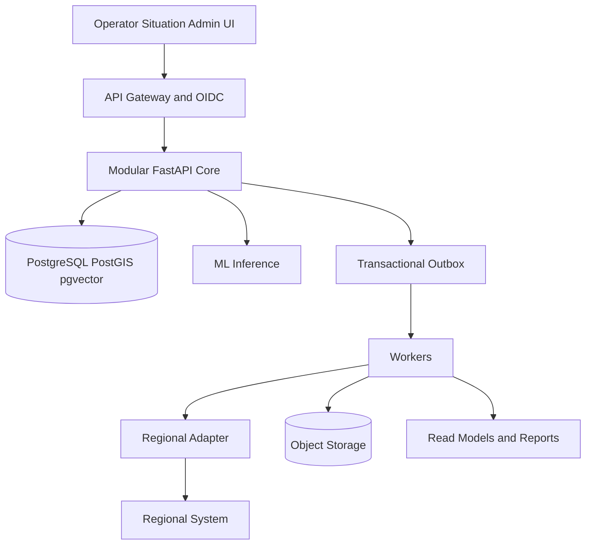

[Русский](CODEX_IMPLEMENTATION_HANDOFF.md) · [English](CODEX_IMPLEMENTATION_HANDOFF.en.md) · [Қазақша](CODEX_IMPLEMENTATION_HANDOFF.kk.md)

> Исторический документ. Не является источником текущего состояния проекта.

# Pulse 109 Передача реализации Кодекса

## 1 Цель

Этот файл преобразует спецификацию Pulse 109 в последовательность реализации для агента кодирования. Предполагаемый результат — пилотный проект промышленного уровня за один месяц, а не национальное внедрение, замаскированное под демо-версию. Пилотный проект должен реализовать реальный, проверяемый вертикальный срез с одной региональной интеграцией, когда доступ доступен, и идентичным контракту адаптером воспроизведения, когда он отсутствует.

Полная система по-прежнему рассчитана на двадцать регионов. Текущие данные охватывают семь регионов, необработанный текст обращения по большей части недоступен, а некоторые интеграционные и политические решения остаются внешними блокирующими факторами. Реализация должна выявить эти ограничения, а не заполнять их придуманными данными или протоколами.

## 2 Целевой результат

На релиз-кандидате представительное обращение должно завершить этот путь:

1. Исходный канал идемпотентно создает обращение.
2. Система сохраняет происхождение и неизменяемую ссылку на источник перед ML.
3. Обработка конфиденциальности создает утвержденное отредактированное представление.
4. Маршрутизация возвращает три основных темы и кандидата на услуги, достоверность, состояние и версию OOD.
5. Поиск возвращает аналогичные решенные дела с доказательствами.
6. Обнаружение дубликатов предлагает связанные обращения с использованием текста, географии, времени и услуг.
7. Оператор подтверждает или корректирует маршрут и может подтвердить принадлежность к инциденту.
8. Решение, событие аудита и запись исходящих сообщений фиксируются атомарно.
9. Адаптер доставляет задание или записывает видимое состояние ожидания.
10. Внешние статусы идемпотентно обновляют сроки обращения.
11. Ситуационный центр показывает покрытие, актуальность, тенденции, SLA и утвержденные оповещения.
12. Одно и то же определение управляемой метрики создает значения пользовательского интерфейса, PDF и электронной таблицы.

Поток все равно должен принимать, маршрутизировать вручную, проверять и синхронизировать позже, когда ML или внешняя система недоступна.

## 3 Базовый уровень архитектуры



### 3.1 Развертываемые процессы

| Процесс | Ответственность | Масштабирование и граница отказа |
| Процесс | Ответственность | Масштабирование и граница отказа |
| `web` | Пользовательский интерфейс оператора, ситуационного центра и администрации | Горизонтальные реплики без сохранения состояния |
| `web` | Пользовательский интерфейс оператора, ситуационного центра и администрирования | Горизонтальные реплики без сохранения состояния |
| `core-api` | Обращения, решения по triage, инциденты, каталог, аудит и составление отчетов | Критический транзакционный путь |
| `worker` | Доставка исходящих сообщений, сверка, отчеты, прогнозы и запланированные задания | Пулы, разделенные по рабочей нагрузке |
| `ml-inference` | Маршрутизация, эмбеддинг, изменение ранжирования, OOD и дополнительные черновики | GPU реплик с CPU резервным вариантом |
| `adapter-runtime` | Протокол, зависящий от источника, сопоставление и контрольные точки | Изолирован по источнику и разделу |
| `ml-training` | Создание, обучение и оценка автономного набора данных | Никогда на критическом пути производства |
### 3.2 Бизнес-модули в ядре

| Модуль | Владеет | Операции с общедоступными приложениями |
| Модуль | Владеет | Операции с общедоступными приложениями |
| `appeals` | Обращение к моментальным снимкам и событиям жизненного цикла, предназначенным только для добавления | Создание, чтение и добавление исходного события |
| `appeals` | Обращение к моментальным снимкам и событиям жизненного цикла только для добавления | Создание, чтение и добавление исходного события |
| `triage` | Ссылки на рекомендации и человеческие решения | Классифицировать, подтвердить, исправить и переназначить |
| `catalog` | Версионные темы, услуги, обязательные поля и политики SLA. | Разработать действующий каталог и опубликовать утвержденную версию |
| `incidents` | Запись об инцидентах и ​​версионные решения о членстве | Предлагать, подтверждать, отклонять и удалять членство |
| `integration` | Исходный реестр, исходящие сообщения, попытки, контрольные точки и сопоставления | Доставить, согласовать, воспроизвести и проверить работоспособность |
| `analytics` | Определения метрик, управляемые запросы и материализованные модели чтения | Запрос по идентификатору метрики и пороговому значению |
| `reports` | Шаблоны отчетов, задания, артефакты и хеши | Создание, проверка и загрузка экспорта |
| `audit` | Неизменяемая безопасность и история решений | Добавить для внутреннего использования и прочитать уполномоченными аудиторами |
Каждый модуль имеет схему PostgreSQL и интерфейс репозитория. Ни один модуль не осуществляет запись напрямую в таблицы другого модуля.

## 4 Схема репозитория

Создайте этот макет, если существующий репозиторий еще не имеет эквивалентного соглашения:

```text
.
├── AGENTS.md
├── Makefile
├── README.md
├── IMPLEMENTATION_STATUS.md
├── pyproject.toml
├── pnpm-workspace.yaml
├── package.json
├── uv.lock
├── pnpm-lock.yaml
├── apps/
│   └── web/
├── services/
│   ├── core/
│   │   ├── src/pulse109/
│   │   │   ├── appeals/
│   │   │   ├── triage/
│   │   │   ├── catalog/
│   │   │   ├── incidents/
│   │   │   ├── integration/
│   │   │   ├── analytics/
│   │   │   ├── reports/
│   │   │   └── audit/
│   │   ├── migrations/
│   │   └── tests/
│   ├── inference/
│   │   ├── src/pulse109_inference/
│   │   ├── models/
│   │   └── tests/
│   └── worker/
├── adapters/
│   ├── sdk/
│   ├── replay/
│   └── first_region/
├── contracts/
│   ├── openapi.yaml
│   ├── canonical_request.schema.json
│   ├── event_catalog.md
│   └── adr/
├── data/
│   ├── README.md
│   ├── manifests/
│   ├── fixtures/
│   └── schemas/
├── ml/
│   ├── datasets/
│   ├── training/
│   ├── evaluation/
│   ├── model_cards/
│   └── registry/
├── infra/
│   ├── compose/
│   ├── helm/
│   ├── dashboards/
│   └── runbooks/
├── tests/
│   ├── contract/
│   ├── e2e/
│   ├── load/
│   └── resilience/
└── docs/
    ├── architecture/
    ├── DECISION_LOG.md
    └── security/
```

Используйте файлы блокировки Python и файлы блокировки Node. Не полагайтесь на плавающие теги контейнеров или незакрепленные версии модели. Если существующий репозиторий уже выбирает версии, сохраните их, если только измеренная несовместимость не потребует обновления.

## 5 Базовый уровень технологии

### 5.1 Применение

- Серверная часть: Python, FastAPI, Pydantic v2, SQLAlchemy 2 и Alembic.
- Интерфейс: Next.js App Router, React и TypeScript с доступными формами, поддерживаемыми сервером, и небольшим слоем состояния клиента только там, где это необходимо.
- База данных: PostgreSQL с расширениями PostGIS и pgvector.
- Хранилище объектов: S3-совместимое API с зашифрованными сегментами и неизменяемым именованием артефактов.
- Фоновая работа: выделенный работник Python над ящиком исходящих сообщений PostgreSQL и таблицами заданий. Не вводите Kafka, Celery или другой брокер в M0, если репозиторий уже не зависит от него.
- Локальная среда выполнения: Docker Compose.
- Целевая среда выполнения: образы OCI и значения Helm для Kubernetes или развёртывания, совместимого с OpenShift.
- Наблюдение: трассировки и метрики OpenTelemetry, метрики, совместимые с Prometheus, и структурированные журналы JSON без тел запросов.
- Аутентификация: OIDC JWT проверка в нелокальных средах. Локальная поддельная личность разрешена только при наличии явного профиля разработки.

### 5.2 Машинное обучение

- Кандидат на маршрутизацию: настроенная база XLM-RoBERTa с иерархическими головками с несколькими метками.
- Базовая линия маршрутизации: символ TF-IDF плюс калиброванный линейный классификатор.
- Поиск: эмбеддинги BGE-M3 с гибридным поиском BM25 и pgvector.
- Реранкинг: реранкер BGE v2 м3.
- Дубликаты: калиброванная парная модель с использованием показателей поиска, географии, времени, темы и услуги; правила высокой точности остаются доступными.
- Анализ черновика и управляемого намерения: Qwen3 8B в четырехбитной форме на GPU 1. Он не может выполнить произвольный SQL или отправить ответ.
- Транскрипция вызовов: Whisper big v3 Turbo, асинхронная и отключенная до тех пор, пока не будет одобрена обработка звука.
- PII: сначала детерминированные шаблоны и утвержденные словари, дообучение XLM-R NER в качестве дополнительного детектора.
- Прогноз: сезонный базовый уровень плюс кандидат CatBoost или LightGBM.

Служба вывода должна предоставлять контракты, не зависящие от модели. Имена моделей и библиотеки исполняемого контура — это конфигурация, а не зависимости домена.

## 6 Инварианты предметной области и владение данными

### 6.1 Обращение и инцидент

- `appeal_id` — это UUID Pulse, который никогда не меняется.
- `source_system`, `source_request_id` и `source_payload_hash` обеспечивают идемпотентность и происхождение.
- Инцидент — это отдельная совокупность. Членство является версионным и требует действующего лица, причины и доказательств.
- Привязка обращений к инциденту никогда не разрушает записи, истории, задания или часы SLA.
- Текущее состояние — это проекция, полученная на основе событий, доступных только для добавления. Исправления добавляют новое событие.

### 6.2 Время

Храните как минимум:

- `occurred_at`: рабочее время, заявленное источником; обнуляемый;
- `observed_at`: время Pulse 109 получило запись; требуется UTC;
- `source_timezone`: часовой пояс источника или ноль;
- `time_quality`: `exact`, `source_tz_assumed`, `date_only`, `missing` или утвержденное расширение;
- `effective_from` и `effective_to`: для версий каталога и политики;
- `data_cutoff`: для каждого результата анализа и экспорта.

Если `occurred_at` невозможно установить, оставьте его нулевым. Операционные списки могут сортироваться по `observed_at` с видимой маркировкой источника времени. Временное обучение, валидация и бэктестирование должны исключать события, порядок которых не может быть безопасно восстановлен.

### 6.3 Рекомендуемые схемы PostgreSQL

| Схема | Ключевые таблицы |
| Схема | Ключевые таблицы |
| `appeals` | `appeal`, `appeal_event`, `source_record`, `attachment_ref` |
| `appeals` | `appeal`, `appeal_event`, `source_record`, `attachment_ref` |
| `triage` | `recommendation`, `recommendation_candidate`, `operator_decision`, `reassignment` |
| `catalog` | `topic_version`, `service_version`, `service_topic`, `required_field`, `sla_policy_version` |
| `incidents` | `incident`, `incident_member_version`, `duplicate_candidate`, `membership_decision` |
| `integration` | `source_system`, `source_schema_version`, `status_mapping`, `outbox`, `delivery_attempt`, `checkpoint`, `dead_letter` |
| `analytics` | `metric_definition`, `metric_result`, `alert`, `alert_review`, модели материализованного чтения |
| `reports` | `report_job`, `report_artifact` |
| `audit` | `audit_event` только для добавления, ограниченное хранилище |
| `privacy` | хранилище идентификаторов или карта токенов при утверждении; никогда не сталкивался с обычной аналитикой |
Важные индексы включают уникальный идентификатор источника, идентификатор события, ключ идемпотентности, статус и доступность исходящих сообщений, регион и состояние обращения, действующие окна каталога, геометрию PostGIS, векторный HNSW после эталонного индекса и полнотекстовые индексы GIN.

## 7 Правила контракта

Реализуйте `contracts/openapi.yaml` в качестве базового алгоритма. Не изменяйте семантику запроса или ответа молча.

- В версии API используется `/v1`; Дополнительные изменения остаются совместимыми, а критические изменения требуют новой основной версии.
- Для всех операций создания требуется ключ идемпотентности или идентификатор исходного события.
- Для каждой ошибки используется стабильный машинный код, безопасное для человека сообщение и идентификатор трассировки. Никогда не раскрывайте следы стека или секреты.
- Используйте временные метки RFC 3339 с явным смещением в API и UTC внутри, сохраняя метаданные часового пояса источника.
- Для изменения коллекций нумерация страниц должна быть ограничена и основана на курсоре.
- Оптимистический параллелизм необходим для человеческих решений, назначений и смены статусов.
- Каждая рекомендация включает `model_version`, `preprocess_version`, `taxonomy_version`, достоверность, состояние ООД и ссылки на доказательства.
- Analytics принимает идентификаторы метрик из белого списка и типизированные фильтры. LLM может создавать объект с ограниченным намерением, который необходимо проверить перед выполнением.

Доставка события осуществляется хотя бы один раз; бизнес-эффекты должны быть эффективными один раз. Потребители выполняют дедупликацию по идентификатору события или команды. Адаптер никогда не должен подтверждать успех до тех пор, пока исходная система не предоставит необходимое подтверждение.

## 8 конвейер данных

### 8.1 Слои

1. `raw`: неизменяемая ссылка на файл или полезную нагрузку, байтовый хэш, исходная схема и метаданные получения.
2. `private`: отдельные прямые идентификаторы, полный адрес, необработанный голос и утвержденные средства управления доступом.
3. `silver`: канонические обращения и события жизненного цикла после проверки схемы; отклоненные строки отправляются в карантин.
4. `gold`: утвержденные метрики, помеченные представления обучения, корпус поиска и снимки функций.
5. `registry`: манифесты наборов данных, артефакты моделей, оценки и утверждения.

### 8.2 Поведение импорта

Каждый запуск импорта записывает источник, регион, идентификатор файла или потока, версию схемы, количество строк, количество принятых, количество помещенных в карантин, количество дубликатов, хэш, версию анализатора и ограничение.

Ворота качества данных должны обнаруживать:

- дублирующиеся исходные идентификаторы с конфликтующими хэшами;
- неизвестные или смещенные столбцы;
- смешанный статус или семейства каналов;
- невозможно упорядочить время и отсутствует часовой пояс;
- неожиданный PII в журналах, экспорте или представлениях объектов;
- устаревшие источники и отсутствующие регионы;
- поля, которые появляются только после маршрутизации или выполнения.

Карантин — это первоклассное состояние со ссылкой на исходную строку, кодом ошибки и результатом проверки. Никогда не отказывайтесь молча от искаженной записи.

### 8.3 Манифест обучения

Каждый тренировочный забег должен обязательно включать:

- версии источника и набора данных;
- точная обрезка;
- список разрешенных функций;
- политика маркировки;
- аудит исключений и утечек;
- политика разделения и случайное начальное число;
- предварительная обработка хешей;
- юридическая ссылка или ссылка на одобрение;
- фиксация кода и хэш блокировки зависимостей.

Храните все снимки одного и того же исходного обращения, повторяющейся группы и кластера инцидентов в одном разделении. Отдавайте предпочтение временным окнам тестирования и добавляйте оценку с исключением одной области. Не позволяйте объему Павлодара доминировать над сообщаемым результатом; публиковать макросы и фрагменты по регионам.

## 9 ML подача и оценка

### 9.1 GPU размещение

- GPU 0: маршрутизация XLM-R, эмбеддинг BGE-M3 и переранжирование BGE с ограниченной пакетной обработкой.
- GPU 1: Qwen3 8B и Whisper по требованию, тренировка претендентов вне пиковой нагрузки, режим горячего резервирования, когда это практически возможно.
- CPU: API, правила, разрешение адресов, отчеты, прогноз, лексический поиск и резервная маршрутизация ONNX.

### 9.2 Обслуживание ответа

Каждый вывод возвращает отслеживаемый конверт, содержащий задачу, псевдоним модели, версию неизменяемого артефакта, версию входного контракта, версию предварительной обработки, выходные данные, оценку или калиброванную достоверность, состояние OOD, задержку и идентификатор трассировки. Не возвращайте необработанные внутренние данные модели в пользовательский интерфейс оператора.

### 9.3 Ворота продвижения

Кандидат может стать чемпионом только после:

1. Воспроизводимое обучение на основе неизменяемого манифеста.
2. Утечка и раздельный аудит.
3. Сравнение с простым утвержденным базовым уровнем.
4. Оценка по языку, региону, теме, каналу, длине, редкому классу и классу безопасности.
5. Калибровка на наборе, отдельном от окончательного испытательного набора.
6. Карточка модели, проверка лицензии и утверждение безопасности.
7. Теневая оценка, за которой следует ограниченная канарейка.
8. Протестированный псевдоним отката.

Предложенные пилотные шлюзы остаются предварительными до тех пор, пока владелец процесса их не одобрит: маршрутизация должна существенно превосходить линейный базовый уровень, критический отзыв не должен регрессировать, предложения дублирования должны иметь приоритет высокой точности, извлечение должно сообщать об отзыве на уровне 10 и задержке, а генерация должна выдавать нулевые неподтвержденные фактические утверждения в наборе релизов.

## 10 Требования к интерфейсу

### 10.1 Рабочее место оператора

На основном экране должно отображаться:

- идентичность обращения, источник, регион, канал и явное качество времени;
- текст обращения гражданина или стенограмма только для авторизованных ролей;
- обязательные недостающие поля и одно целевое уточнение за раз;
- три лучших кандидата на темы и услуги с краткими доказательствами;
- ООД или состояние с низкой степенью достоверности и доступ к каталогу вручную;
- похожие решенные обращения и почему каждая из них актуальна;
- дублировать кандидатов с указанием текста, расстояния, времени и служебных доказательств;
- подтвердить и исправить действия с обязательным указанием причины исправления;
- состояние синхронизации назначения и видимость повторных попыток;
- временная шкала только для добавления.

Обязательные состояния включают загрузку, отсутствие рекомендаций, низкий уровень достоверности, ML недоступен, устаревший каталог, ожидание внешней синхронизации, частичный сбой вложения, запрещенную область и восстановленный сеанс. Завершение с клавиатуры и локализация KZ/RU — P0.

### 10.2 Ситуационный центр

Покажите охват и свежесть раньше, чем оперативные цифры. Отсутствующие регионы отсутствуют, а не ноль. Каждая карточка включает идентификатор метрики, ограничение и доступ к определениям. Оповещения требуют подтверждения, решения и доказательств. Прогнозы показывают базовый уровень, кандидат, диапазон неопределенности и версию.

### 10.3 Администрация

Обеспечьте версионную таксономию и сопоставления, состояние источника, проверку карантина, область действия роли и региона, представление реестра модели, рабочий процесс продвижения, флаги функций и поиск аудита. Изменения производственной конфигурации требуют наличия исполнителя, рецензента, эффективного времени и цели отката.

## 11 Безопасность и конфиденциальность

- Запретить по умолчанию. RBAC определяет действие, а ABAC ограничивает регион, организацию, услугу, цель и класс данных.
- Проверьте эмитента OIDC, аудиторию, срок действия, роли и претензии региона. Используйте mTLS или утвержденный шлюз для межсистемного трафика.
- Шифровать базу данных, хранилище объектов и резервные копии в состоянии покоя; использовать TLS при транзите.
- Храните секреты в утвержденном секретном хранилище, вне источника, изображений и журналов.
- Регистрируйте идентификатор токена субъекта, цель, идентификатор корреляции и измененные поля для конфиденциальных действий без регистрации конфиденциальных значений.
- Считайте текст обращения ненадежными данными. Он не может вызывать инструменты, изменять политику, отображать подсказки, получать доступ к SQL или выбирать область авторизации.
- Создаваемый контент использует утвержденные доказательства и шаблоны. Оператор отправляет.
- Экспорт обеспечивает соблюдение роли, региона, ограничения строк, маскировки, цели, метаданных водяных знаков и аудита.
- Выполните SBOM, сканирование зависимостей, секретное сканирование и сканирование контейнера в CI.
- Хранение и удаление настраиваются по классу данных. Не придумывайте обязательные периоды до юридического одобрения.

## 12 Надежность и наблюдаемость

### 12.1 Поведение при отказе

| Неудача | Поведение системы |
| Отказ | Поведение системы |
| Один GPU не работает | Сохраняйте ядро; используйте оставшуюся маршрутизацию GPU или CPU; сначала отключите черновики |
| Один GPU не работает | Сохраняйте ядро; используйте оставшуюся маршрутизацию GPU или CPU; сначала отключи черновики |
| Все ML терпят неудачу | Сохраняйте прием, ручную маршрутизацию, статус, аудит и существующую аналитику; вывод, подходящий для очереди |
| Региональная система терпит неудачу | Принять местное решение; показать ожидающую синхронизацию; повторите попытку и согласуйте |
| Сбой в хранилище объектов | Сохраняйте метаданные и состояние ожидающего вложения только в том случае, если это разрешено политикой. |
| Прибывает неизвестная схема | Карантин и тревога; сохранить необработанную ссылку |
| Плохой релиз модели | Сменить псевдоним чемпиона на утвержденную предыдущую версию |
| Плохая SLA политика | Остановить новую версию политики и восстановить предыдущее эффективное сопоставление |
### 12.2 Телеметрия

Записывайте стабильные показатели скорости и задержки API, насыщенности базы данных, задержки исходящих сообщений, повторных попыток адаптера, недоставленных писем, задержки и ошибок вывода, доверительного покрытия, OOD, актуальности источника, сбоев схемы и частоты исправлений оператора. Не используйте необработанный текст или неограниченные идентификаторы в качестве меток показателей.

Каждый запрос передает идентификатор корреляции по ядру, рабочему процессу, адаптеру и выводу. Журналы должны быть структурированы и отредактированы. Трассировки должны выполнять безопасную выборку и по умолчанию никогда не включать тела запросов.

## 13 этапов реализации

### Фонд репозитория M0

Доставьте дерево репозитория, блокировки зависимостей, корневые команды, службы Compose, проверки работоспособности, CI, модель конфигурации и граничные тесты архитектуры. Локальная система должна начинаться с синтетических устройств и без внешних учетных данных.

### Контракты M1 и база данных

Подключите OpenAPI и проверку схемы JSON, создайте схемы модулей и первоначальные миграции, реализуйте необработанные ссылки, реестр источников, запуски импорта, канонизацию, карантин, обработку качества времени и исправления исходных данных. Создайте воспроизводимый отчет DQ.

### M2 Ручной критический путь

Внедрите создание обращений, идемпотентность, карточку оператора, каталог с версиями, ручное решение, жизненный цикл только для добавления, аудит и исходящие транзакционные сообщения. Добавьте первый полноценный браузер E2E с отключенным ML.

### M3 Помощь в маршрутизации

Реализуйте контракт вывода, линейный базовый алгоритм, манифест набора данных, сбор обратной связи и макет модели. Выполняйте дообучение XLM-R только при наличии утвержденного необработанного текста и меток. Добавьте калибровку уверенности и поведение OOD, прежде чем предлагать действенные рекомендации.

### M4 Поиск и дублирование предложений

Реализуйте PostgreSQL FTS, pgvector хранилище, эмбеддинги BGE-M3, гибридное слияние рангов и дополнительное переранжирование. Создайте рабочий процесс с оцененным набором. Добавляйте повторяющиеся предложения и подтверждайте или отклоняйте их вручную, сохраняя при этом идентичность обращения.

### Инциденты M5 и первый адаптер

Внедрите членство в инцидентах, отображение статуса источника, адаптер SDK, адаптер воспроизведения, повторные попытки, недоставленные сообщения и сверку. Заменять или дополнять реплей первым реальным адаптером только после подтверждения исходного контракта.

### М6 Ситуационный центр и отчеты

Внедряйте каталог метрик, читайте модели, охват, актуальность, тенденции, SLA, оповещения, базовый прогноз, управляемое намерение NL и последовательный экспорт PDF или электронных таблиц. Никаких произвольных SQL.

### M7 Упрочнение разделителя

Полная интеграция удостоверений, тесты авторизации, нагрузочные тесты, тесты устойчивости, резервное копирование и восстановление, откат модели, информационные панели, модули Runbook, специальные возможности и автономная демонстрация. Заморозьте контракты, псевдонимы моделей и демонстрационные данные перед генеральной репетицией.

## 14 Границы параллельной работы

Распараллеливайте только по границам, которые минимизируют конфликтующие записи:

- Поток А: контракты, база данных и основные модули.
- Поток B: прием данных, наборы данных DQ и ML.
- Поток C: выводы и оценка.
- Поток D: пользовательский интерфейс оператора и ситуации.
- Поток E: адаптер SDK и интеграция повторов.
- Поток F: инфраструктура, CI, тесты на наблюдаемость и безопасность.

Корневой агент владеет общими контрактами, порядком интеграции и окончательной проверкой. Ни одна подзадача не может изменять OpenAPI, каноническую схему или общую миграцию без координации с корневым планом.

## 15 Условия остановки агента

Продолжайте автономно выполнять рутинную обратимую реализацию. Остановитесь и спросите о решении только тогда, когда:

- запрошенное поведение требует реального PII или учетных данных, которые недоступны;
- два авторитетных контракта конфликтуют в общедоступном или хранимом поле;
- требуется деструктивная миграция или необратимая внешняя запись;
- должна быть выбрана первая реальная региональная система;
- Должна быть установлена юридическая политика, политика хранения, SLA или политика автоматического принятия решений;
- существующее изменение пользователя не может быть безопасно сохранено.

Прежде чем спрашивать, завершите всю незатронутую работу и представьте точные варианты, влияние и рекомендуемый безопасный выбор.

## 16 Ожидается передача от Кодекса после каждого этапа

Последнее сообщение и `IMPLEMENTATION_STATUS.md` должны содержать:

- достигнутый результат;
- файлы и контракты изменены;
- добавлены миграции;
- команды выполняются и прошли ли они;
- данные испытаний и контрольных показателей;
- остальные внешние блокировщики;
- отработанные резервные меры безопасности;
- следующая веха и первая выполняемая задача.

Не объявляйте платформу завершенной, пока необработанный текст, тринадцать регионов, первый настоящий API, целевая идентичность или разрешения на производство остаются неразрешенными. Укажите, какие именно пилотные возможности реализованы и проверены.
