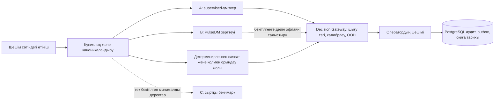

[Русский](MODEL_STRATEGY.md) · [English](MODEL_STRATEGY.en.md) · [Қазақша](MODEL_STRATEGY.kk.md)

# Модельдер стратегиясы

**Күйі: үміткерлер архитектурасы, өндірістік модельдерді таңдау емес.** Жұмыс істеп тұрған кодта CPU-дегі детерминирленген лексикалық ұсыныстар, типтелген инференс шекарасы, адам басқаратын Decision Gateway, PostgreSQL FTS/іздеу механизмдері, оқиғалар ережелері және Replay Lab бар. Қолданыстағы char-TF-IDF/LogReg бағалаушысы — синтетикалық зерттеу базалық алгоритмі. Төмендегі модельдерді таңдау немесе оқыту үшін қажет бекітілген KK/RU/mixed мәтіндері, белгілер, таксономия және орналастыру профилі қолжетімсіз.

Қолмен орындалатын резервтік жол, PostgreSQL, аудит журналы, транзакциялық outbox және worker ML-ге тәуелді емес. PulseDM де, сыртқы модель де жауапкершілікті бекіту, SLA, тағайындау, оқиға құрамы немесе жабу туралы түпкілікті шешім қабылдамайды.

| Міндет | Ағымдағы орындалатын жол | Консервативті үміткер A | PulseDM B зерттеуі | Эталон C |
| --- | --- | --- | --- | --- |
| Тақырыпты/қызметті ұсыну | CPU-дегі лексикалық резервтік жол; адамның шешімі | TF-IDF+LR базалық алгоритмі, кейін расталған жағдайда fine-tuned XLM-R-base | Динамикалық Choice сұрағы, тек кеңес беру | Егер деректер ережелері рұқсат берсе, Jev/құрылымдалған көптілді LLM |
| Ұқсас өтініштер | Іздеудің қолданыстағы келісімшарты және синтетикалық бағалау | PostgreSQL FTS + тексерілген Qwen3/BGE/E5 эмбеддингтері; қосымша rerank | Іздеуді алмастырмайды | Сол бекітілген бағаланған жұптар |
| Дубльді/оқиғаны ұсыну | Ережелер және оператордың растауы | Жұп белгілері + LogReg; бөлек іріктемеде жақсарған жағдайда ғана XGBoost | Жұптың бір қосымша белгісі | Тек бенчмарк үшін |
| Аномалия/қайталану | Детерминирленген/статистикалық детекторы | Сырғымалы базалық алгоритмдер, EWMA/робастты статистика | Өкілеттігі жоқ | Негізгі жол үшін қажет емес |
| Түсіндіру/жауап жобасы | Үлгілер/қолмен енгізу | Тексеруден кейін қосымша жергілікті генерация | Мәтін генераторы емес | Тек құрылымдалған LLM базалық алгоритмі |

Біз A/B/C нұсқаларын ашық leaderboard бойынша емес, **бірдей** алдын ала бекітілген жағдайлар мен уақытша кесінділерде салыстырамыз. Үміткер C ешқашан сыни жол үшін қажет емес. Тақырып пен қызмет ұсыныстар болып қала береді; бекітілген анықтамалықтар мен саясат оларды шектейді. Қосымша Qwen класындағы генерация түсіндіру немесе жауап жобасын дайындай алады, бірақ ұйымды тағайындай алмайды, SLA өзгерте алмайды, өтініштерді біріктіре немесе жаба алмайды.

CPU-дегі резервтік жол және қолмен орындау қолжетімділіктің базалық кепілі болып қала береді. Келешекте өлшенген кідіріс пен жадыны ескере отырып, GPU 0 эмбеддингтер мен қайта саралауға, ал GPU 1 қосымша генераторға немесе зерттеу PulseDM қызметіне қызмет етуі мүмкін. Бұл есептеу ресурстары туралы гипотеза, орналастыру міндеттемесі емес. Үміткерді таңдау [бағалау хаттамасын](EVALUATION_PROTOCOL.kk.md) және [модельдерді басқару](MODEL_GOVERNANCE.kk.md) қақпаларын орындауды талап етеді.
