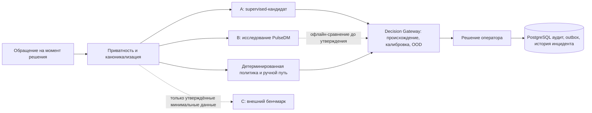

[Русский](MODEL_STRATEGY.md) · [English](MODEL_STRATEGY.en.md) · [Қазақша](MODEL_STRATEGY.kk.md)

# Стратегия моделей

**Статус: архитектура кандидатов, а не выбор production-моделей.** В работающем коде есть детерминированные лексические рекомендации на CPU, типизированная граница инференса, контролируемый человеком Decision Gateway, механизмы FTS/поиска PostgreSQL, правила инцидентов и Replay Lab. Существующий оценщик char-TF-IDF/LogReg — это синтетический исследовательский базовый алгоритм. Утверждённые тексты KK/RU/mixed, метки, таксономия и профиль развёртывания, необходимые для выбора или обучения моделей ниже, отсутствуют.

Ручной резервный путь, PostgreSQL, журнал аудита, транзакционный outbox и worker не зависят от ML. Ни PulseDM, ни внешняя модель не принимают окончательных решений о закреплении ответственности, SLA, назначении, составе инцидента или закрытии.

| Задача | Текущий исполняемый путь | Консервативный кандидат A | Исследование PulseDM B | Эталон C |
| --- | --- | --- | --- | --- |
| Предложение темы/службы | Резервный лексический путь на CPU; решение человека | Базовый алгоритм TF-IDF+LR, затем fine-tuned XLM-R-base при подтверждении | Динамический вопрос Choice, только рекомендация | Jev/структурированная мультиязычная LLM, если разрешают правила по данным |
| Похожие обращения | Текущий контракт поиска и синтетическая оценка | PostgreSQL FTS + проверенные эмбеддинги Qwen3/BGE/E5; опциональный rerank | Не заменяет поиск | Те же зафиксированные размеченные пары |
| Предложение дубликата/инцидента | Правила и подтверждение оператором | Признаки пар + LogReg; XGBoost только при улучшении на отложенной выборке | Один опциональный признак пары | Только для бенчмарка |
| Аномалия/повторяемость | Детерминированные/статистические детекторы | Скользящие базовые алгоритмы, EWMA/робастная статистика | Без полномочий | Не требуется для критического пути |
| Объяснение/черновик ответа | Шаблоны/ручной ввод | Опциональная локальная генерация после валидации | Не является генератором текста | Только базовый алгоритм структурированной LLM |

Сравниваем A/B/C на **одних и тех же** заранее закреплённых случаях и временных срезах, а не по публичным leaderboard. Кандидат C никогда не нужен критическому пути. Тема и служба остаются рекомендациями; утверждённые справочники и политика ограничивают их. Опциональная генерация класса Qwen может готовить объяснение или черновик ответа, но не назначать организацию, менять SLA, объединять или закрывать обращения.

Резервный путь на CPU и ручной режим остаются базовой гарантией доступности. В будущем GPU 0 может обслуживать эмбеддинги и переранжирование, а GPU 1 — опциональный генератор или исследовательский сервис PulseDM с учётом измеренной задержки и памяти. Это гипотеза о вычислительных ресурсах, а не обязательство по развёртыванию. Выбор кандидата требует соблюдения [протокола оценки](EVALUATION_PROTOCOL.md) и [правил управления моделями](MODEL_GOVERNANCE.md).
