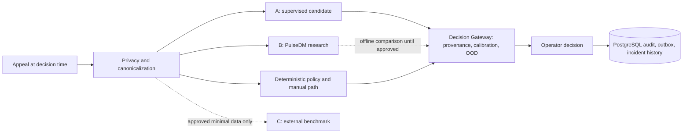

# Model strategy / Стратегия моделей

**Status: candidate architecture, not production model selection.** Currently running code has a deterministic lexical CPU recommendation, a typed inference boundary, human-governed Decision Gateway, PostgreSQL FTS/retrieval mechanisms, incident rules and Replay Lab. The existing char-TF-IDF/LogReg evaluator is a synthetic research baseline. The approved KK/RU/mixed text, labels, taxonomy and deployment profile needed to choose or train the models below are unavailable.

**Статус: архитектура кандидатов, а не выбор production-моделей.** Ручной путь, PostgreSQL, аудит, outbox и worker не зависят от ML. Ни PulseDM, ни внешняя модель не принимают окончательных решений о принадлежности, SLA, назначении, составе инцидента или закрытии.

| Task | Current executable path | Conservative candidate A | PulseDM research B | Reference C |
| --- | --- | --- | --- | --- |
| Topic/service suggestion | Lexical CPU fallback; human decision | TF-IDF+LR baseline, then fine-tuned XLM-R-base if validated | Dynamic Choice question, advisory only | Jev/structured multilingual LLM where data rules allow |
| Similar appeals | Existing retrieval contract and synthetic evaluation | PostgreSQL FTS + benchmarked Qwen3/BGE/E5 embeddings; optional rerank | Does not replace retrieval | Same frozen judged pairs |
| Duplicate/incident proposal | Rules and operator confirmation | Pair features + LogReg; XGBoost only if it improves held-out results | One optional pair feature | Benchmark only |
| Anomaly/recurrence | Deterministic/statistical detectors | Rolling baselines, EWMA/robust statistics | No authority | Not needed for core path |
| Explanation/reply draft | Templates/manual | Optional local generation after validation | Not a text generator | Structured LLM baseline only |

RU: сравниваем A/B/C на **одних и тех же** заранее закреплённых случаях и временных срезах, а не по публичным leaderboard. C никогда не нужен критическому пути. Topic и service остаются рекомендациями; утверждённые справочники и policy ограничивают их. Optional Qwen-class генерация может готовить объяснение/черновик, но не назначать организацию, менять SLA, объединять или закрывать обращения.

EN: CPU/manual fallback remains the availability baseline. GPU 0 could eventually serve embeddings/reranking and GPU 1 an optional generator or a research PulseDM service, subject to measured latency and memory. This is a capacity hypothesis, not a deployment commitment. Candidate selection requires the [evaluation protocol](EVALUATION_PROTOCOL.md) and [governance gates](MODEL_GOVERNANCE.md).
